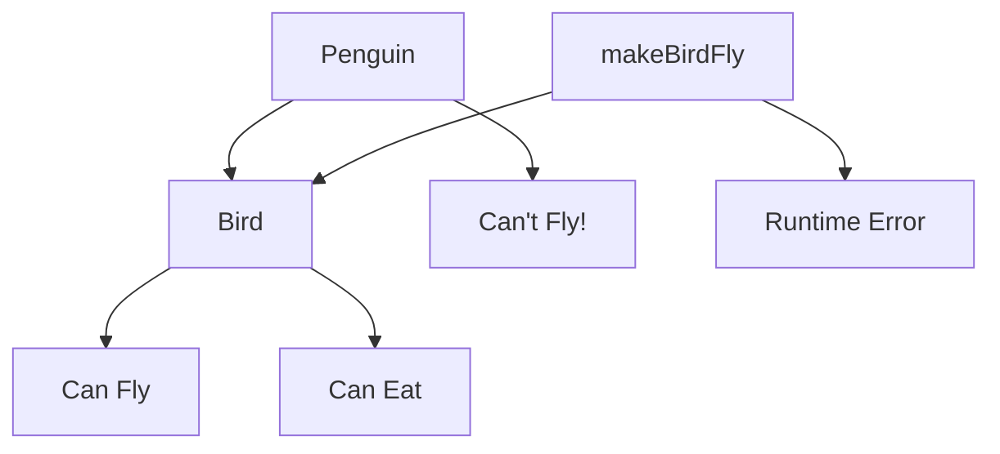
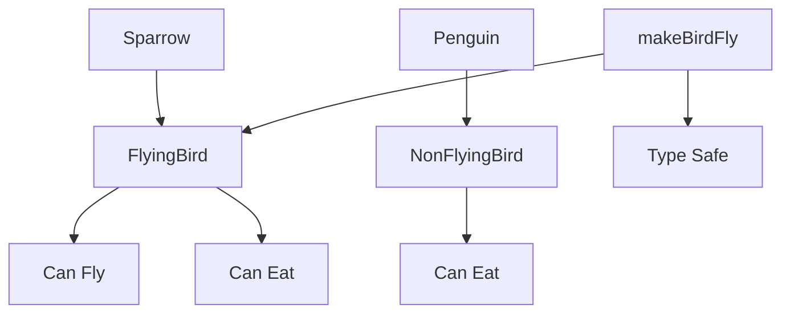

# Liskov Substitution Principle (LSP)

## Introduction
The Liskov Substitution Principle states that objects of a superclass should be replaceable with objects of its subclasses without breaking the application. In other words, derived classes must be substitutable for their base classes.

## Why LSP?
- Ensures type safety
- Maintains behavioral compatibility
- Enables polymorphism
- Prevents runtime errors
- Makes code more maintainable

## Violation Example
```cpp
class Bird {
public:
    virtual void fly() {
        cout << "Bird is flying" << endl;
    }
    
    virtual void eat() {
        cout << "Bird is eating" << endl;
    }
};

class Penguin : public Bird {
public:
    void fly() override {
        // Violation: Penguins can't fly!
        throw runtime_error("Penguins can't fly!");
    }
    
    void eat() override {
        cout << "Penguin is eating fish" << endl;
    }
};

void makeBirdFly(Bird& bird) {
    // This will break when a Penguin is passed!
    bird.fly();
}
```

## Problem with the Above Design


## Solution: Applying LSP
```cpp
// Base class for flying birds
class FlyingBird {
public:
    virtual void fly() {
        cout << "Bird is flying" << endl;
    }
    
    virtual void eat() {
        cout << "Bird is eating" << endl;
    }
    
    virtual ~FlyingBird() = default;
};

// Base class for non-flying birds
class NonFlyingBird {
public:
    virtual void eat() {
        cout << "Bird is eating" << endl;
    }
    
    virtual ~NonFlyingBird() = default;
};

class Sparrow : public FlyingBird {
public:
    void fly() override {
        cout << "Sparrow is flying" << endl;
    }
    
    void eat() override {
        cout << "Sparrow is eating seeds" << endl;
    }
};

class Penguin : public NonFlyingBird {
public:
    void eat() override {
        cout << "Penguin is eating fish" << endl;
    }
};

void makeBirdFly(FlyingBird& bird) {
    // This is now type-safe
    bird.fly();
}
```

## Benefits of the New Design


## Best Practices
1. Design by contract
2. Ensure behavioral compatibility
3. Use proper inheritance hierarchies
4. Follow the "is-a" relationship
5. Consider using composition over inheritance

## Common Pitfalls
1. Violating the contract of the base class
2. Throwing exceptions in overridden methods
3. Changing the behavior of inherited methods
4. Using improper inheritance relationships
5. Not considering all use cases

## Practice Problems
1. Design a shape hierarchy that maintains LSP
2. Create a file system hierarchy that follows LSP
3. Implement a vehicle hierarchy that adheres to LSP

## Interview Questions
1. What is the Liskov Substitution Principle?
2. How do you ensure LSP compliance?
3. What are the consequences of violating LSP?
4. When should you use inheritance vs. composition?
5. How do you handle cases where LSP seems difficult to maintain?

## Code Example: Shape Hierarchy
```cpp
class Shape {
public:
    virtual double getArea() const = 0;
    virtual double getPerimeter() const = 0;
    virtual ~Shape() = default;
};

class Rectangle : public Shape {
protected:
    double width;
    double height;
    
public:
    Rectangle(double width, double height) : width(width), height(height) {}
    
    double getArea() const override {
        return width * height;
    }
    
    double getPerimeter() const override {
        return 2 * (width + height);
    }
    
    void setWidth(double newWidth) {
        width = newWidth;
    }
    
    void setHeight(double newHeight) {
        height = newHeight;
    }
};

class Square : public Rectangle {
public:
    Square(double side) : Rectangle(side, side) {}
    
    // Override setters to maintain square properties
    void setWidth(double newWidth) override {
        width = height = newWidth;
    }
    
    void setHeight(double newHeight) override {
        width = height = newHeight;
    }
};

// Function that works with any shape
void printShapeInfo(const Shape& shape) {
    cout << "Area: " << shape.getArea() << endl;
    cout << "Perimeter: " << shape.getPerimeter() << endl;
}

// Usage example
void demonstrateLSP() {
    Rectangle rect(4, 5);
    Square square(4);
    
    // Both can be used interchangeably
    printShapeInfo(rect);
    printShapeInfo(square);
    
    // Modifying dimensions maintains LSP
    rect.setWidth(6);
    square.setWidth(6); // Also sets height to maintain square properties
}
```

## Summary
- Derived classes must be substitutable for their base classes
- Maintain behavioral compatibility
- Design by contract
- Use proper inheritance hierarchies
- Consider composition as an alternative 