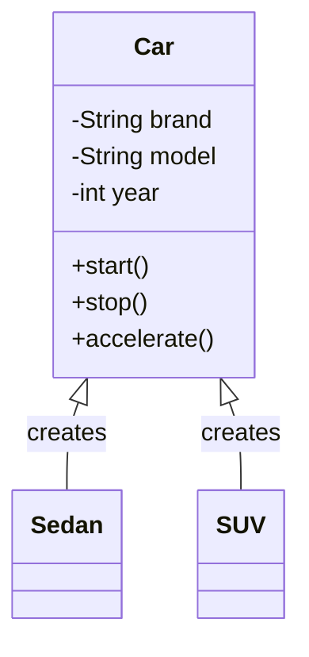
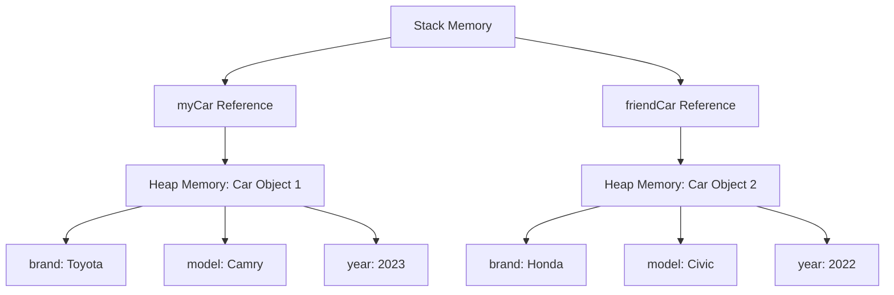

# Classes and Objects

## Introduction
Classes and Objects are the fundamental building blocks of Object-Oriented Programming (OOP). They help us model real-world entities and their behaviors in our code.

## What is a Class?
A class is a blueprint or template that defines the structure and behavior of objects. It contains:
- Attributes (data members)
- Methods (member functions)
- Constructors
- Access modifiers

## What is an Object?
An object is an instance of a class. It represents a specific entity with its own state and behavior.

## Class vs Object Relationship


## Key Concepts

### 1. Class Declaration
```java
public class Car {
    // Attributes
    private String brand;
    private String model;
    private int year;
    
    // Constructor
    public Car(String brand, String model, int year) {
        this.brand = brand;
        this.model = model;
        this.year = year;
    }
    
    // Methods
    public void start() {
        System.out.println("Car is starting...");
    }
    
    public void stop() {
        System.out.println("Car is stopping...");
    }
}
```

### 2. Object Creation
```java
// Creating objects
Car myCar = new Car("Toyota", "Camry", 2023);
Car friendCar = new Car("Honda", "Civic", 2022);
```

## Memory Representation


## Best Practices
1. **Encapsulation**: Keep attributes private and provide public methods to access them
2. **Single Responsibility**: Each class should have one primary responsibility
3. **Meaningful Names**: Use clear and descriptive names for classes and methods
4. **Proper Access Modifiers**: Use appropriate access modifiers (public, private, protected)

## Common Pitfalls
1. Creating classes that are too large or have too many responsibilities
2. Exposing internal implementation details
3. Not properly initializing objects
4. Creating unnecessary objects

## Practice Problems
1. Create a `Student` class with attributes like name, roll number, and grades
2. Implement a `BankAccount` class with methods for deposit and withdrawal
3. Design a `Rectangle` class with methods to calculate area and perimeter

## Interview Questions
1. What is the difference between a class and an object?
2. How are objects stored in memory?
3. What is the purpose of constructors?
4. Explain the concept of object instantiation.
5. How do you ensure proper encapsulation in a class?

## Code Example: Student Management System
```java
public class Student {
    private String name;
    private int rollNumber;
    private Map<String, Double> grades;
    
    public Student(String name, int rollNumber) {
        this.name = name;
        this.rollNumber = rollNumber;
        this.grades = new HashMap<>();
    }
    
    public void addGrade(String subject, double grade) {
        grades.put(subject, grade);
    }
    
    public double getAverageGrade() {
        return grades.values().stream()
                    .mapToDouble(Double::doubleValue)
                    .average()
                    .orElse(0.0);
    }
}
```

## Summary
- Classes are blueprints for objects
- Objects are instances of classes
- Classes contain attributes and methods
- Objects have their own state and behavior
- Proper class design is crucial for maintainable code 