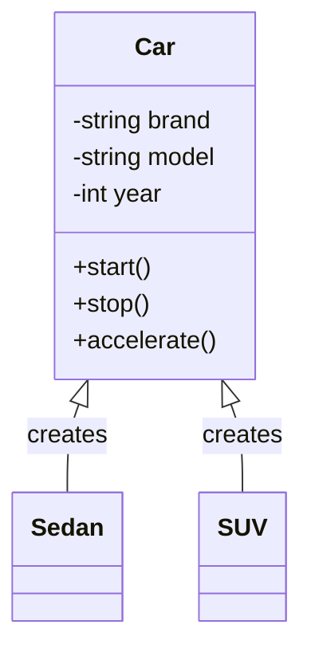
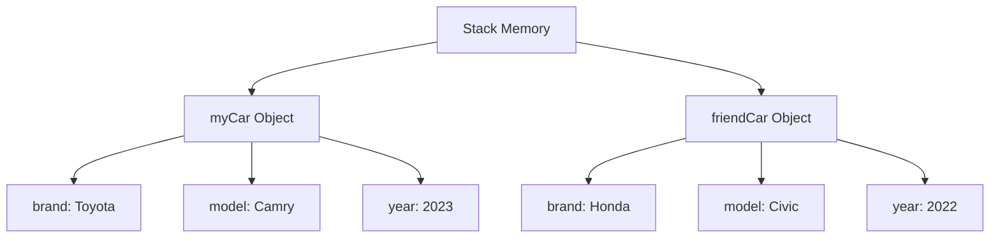

# Classes and Objects

## Introduction
Classes and Objects are the fundamental building blocks of Object-Oriented Programming (OOP). They help us model real-world entities and their behaviors in our code.

## What is a Class?
A class is a blueprint or template that defines the structure and behavior of objects. It contains:
- Attributes (data members)
- Methods (member functions)
- Constructors
- Access modifiers

## What is an Object?
An object is an instance of a class. It represents a specific entity with its own state and behavior.

## Class vs Object Relationship


## Key Concepts

### 1. Class Declaration
```cpp
class Car {
private:
    // Attributes
    string brand;
    string model;
    int year;
    
public:
    // Constructor
    Car(const string& brand, const string& model, int year) 
        : brand(brand), model(model), year(year) {}
    
    // Methods
    void start() {
        cout << "Car is starting..." << endl;
    }
    
    void stop() {
        cout << "Car is stopping..." << endl;
    }
};
```

### 2. Object Creation
```cpp
// Creating objects
Car myCar("Toyota", "Camry", 2023);
Car friendCar("Honda", "Civic", 2022);
```

## Memory Representation


## Best Practices
1. **Encapsulation**: Keep attributes private and provide public methods to access them
2. **Single Responsibility**: Each class should have one primary responsibility
3. **Meaningful Names**: Use clear and descriptive names for classes and methods
4. **Proper Access Modifiers**: Use appropriate access modifiers (public, private, protected)

## Common Pitfalls
1. Creating classes that are too large or have too many responsibilities
2. Exposing internal implementation details
3. Not properly initializing objects
4. Creating unnecessary objects

## Practice Problems
1. Create a `Student` class with attributes like name, roll number, and grades
2. Implement a `BankAccount` class with methods for deposit and withdrawal
3. Design a `Rectangle` class with methods to calculate area and perimeter

## Interview Questions
1. What is the difference between a class and an object?
2. How are objects stored in memory?
3. What is the purpose of constructors?
4. Explain the concept of object instantiation.
5. How do you ensure proper encapsulation in a class?

## Code Example: Student Management System
```cpp
#include <string>
#include <map>
#include <vector>
#include <numeric>

class Student {
private:
    string name;
    int rollNumber;
    map<string, double> grades;
    
public:
    Student(const string& name, int rollNumber) 
        : name(name), rollNumber(rollNumber) {}
    
    void addGrade(const string& subject, double grade) {
        grades[subject] = grade;
    }
    
    double getAverageGrade() const {
        if (grades.empty()) return 0.0;
        
        double sum = 0.0;
        for (const auto& grade : grades) {
            sum += grade.second;
        }
        return sum / grades.size();
    }
};
```

## Summary
- Classes are blueprints for objects
- Objects are instances of classes
- Classes contain attributes and methods
- Objects have their own state and behavior
- Proper class design is crucial for maintainable code 