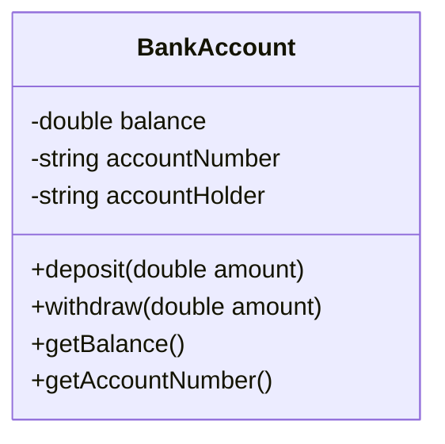
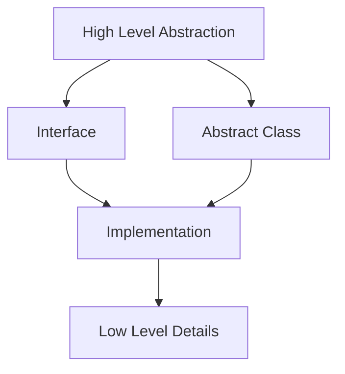

# Encapsulation and Abstraction

## Introduction
Encapsulation and Abstraction are two fundamental principles of Object-Oriented Programming that help in creating maintainable and secure code.

## Encapsulation
Encapsulation is the bundling of data and methods that operate on that data within a single unit (class), hiding the internal implementation details.

### Encapsulation Diagram


### Example of Encapsulation
```cpp
class BankAccount {
private:
    // Private fields (data hiding)
    double balance;
    string accountNumber;
    string accountHolder;
    
public:
    // Constructor
    BankAccount(const string& accountNumber, const string& accountHolder)
        : accountNumber(accountNumber), accountHolder(accountHolder), balance(0.0) {}
    
    // Public methods (interface)
    void deposit(double amount) {
        if (amount > 0) {
            balance += amount;
        }
    }
    
    bool withdraw(double amount) {
        if (amount > 0 && amount <= balance) {
            balance -= amount;
            return true;
        }
        return false;
    }
    
    double getBalance() const {
        return balance;
    }
    
    string getAccountNumber() const {
        return accountNumber;
    }
};
```

## Abstraction
Abstraction is the concept of hiding the complex implementation details and showing only the necessary features of an object.

### Abstraction Levels


### Abstract Class Example
```cpp
class Vehicle {
protected:
    string brand;
    string model;
    
public:
    Vehicle(const string& brand, const string& model)
        : brand(brand), model(model) {}
    
    // Pure virtual method
    virtual void start() = 0;
    
    // Concrete method
    void displayInfo() const {
        cout << "Brand: " << brand << endl;
        cout << "Model: " << model << endl;
    }
    
    virtual ~Vehicle() = default;
};

class Car : public Vehicle {
public:
    Car(const string& brand, const string& model)
        : Vehicle(brand, model) {}
    
    void start() override {
        cout << "Car is starting..." << endl;
    }
};
```

### Interface Example
```cpp
class PaymentProcessor {
public:
    virtual bool processPayment(double amount) = 0;
    virtual void refund(double amount) = 0;
    virtual string getTransactionId() = 0;
    virtual ~PaymentProcessor() = default;
};

class CreditCardProcessor : public PaymentProcessor {
public:
    bool processPayment(double amount) override {
        // Implementation details
        return true;
    }
    
    void refund(double amount) override {
        // Implementation details
    }
    
    string getTransactionId() override {
        // Implementation details
        return "TXN123";
    }
};
```

## Best Practices

### Encapsulation Best Practices
1. Make fields private
2. Provide public getters and setters
3. Validate data in setters
4. Use meaningful names for methods
5. Keep related data and methods together

### Abstraction Best Practices
1. Use interfaces for defining contracts
2. Use abstract classes for shared implementation
3. Keep abstractions focused and cohesive
4. Hide implementation details
5. Provide clear and simple interfaces

## Common Pitfalls
1. Exposing internal implementation details
2. Creating leaky abstractions
3. Over-abstracting simple concepts
4. Not properly encapsulating data
5. Mixing abstraction levels

## Practice Problems
1. Create a `Student` class with encapsulated grade information
2. Design an abstract `Shape` class with concrete implementations
3. Implement a `DatabaseConnection` interface with different database implementations

## Interview Questions
1. What is the difference between encapsulation and abstraction?
2. Why is encapsulation important in OOP?
3. When should you use an abstract class vs. an interface?
4. How does abstraction help in maintaining code?
5. What are the benefits of data hiding?

## Code Example: Temperature Converter
```cpp
class TemperatureConverter {
private:
    double celsius;
    
public:
    TemperatureConverter(double celsius) : celsius(celsius) {}
    
    double getCelsius() const {
        return celsius;
    }
    
    void setCelsius(double celsius) {
        if (celsius >= -273.15) { // Absolute zero
            this->celsius = celsius;
        } else {
            throw invalid_argument("Temperature cannot be below absolute zero");
        }
    }
    
    double getFahrenheit() const {
        return (celsius * 9/5) + 32;
    }
    
    double getKelvin() const {
        return celsius + 273.15;
    }
};
```

## Summary
- Encapsulation bundles data and methods, hiding implementation details
- Abstraction focuses on essential features, hiding complexity
- Both principles help in creating maintainable and secure code
- Proper use leads to better code organization and reusability
- These principles are fundamental to good object-oriented design 