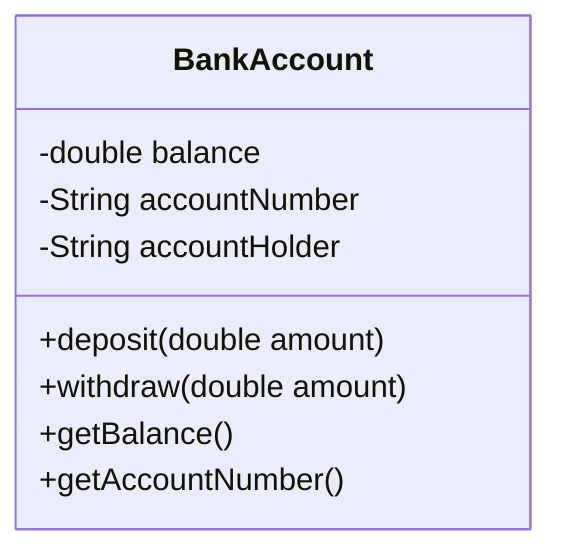
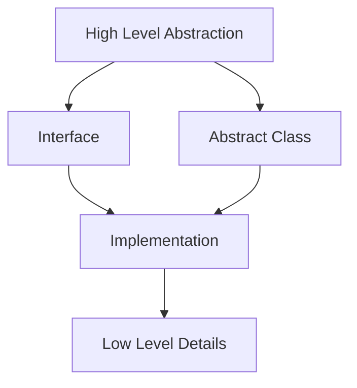

# Encapsulation and Abstraction

## Introduction
Encapsulation and Abstraction are two fundamental principles of Object-Oriented Programming that help in creating maintainable and secure code.

## Encapsulation
Encapsulation is the bundling of data and methods that operate on that data within a single unit (class), hiding the internal implementation details.

### Encapsulation Diagram


### Example of Encapsulation
```java
public class BankAccount {
    // Private fields (data hiding)
    private double balance;
    private String accountNumber;
    private String accountHolder;
    
    // Constructor
    public BankAccount(String accountNumber, String accountHolder) {
        this.accountNumber = accountNumber;
        this.accountHolder = accountHolder;
        this.balance = 0.0;
    }
    
    // Public methods (interface)
    public void deposit(double amount) {
        if (amount > 0) {
            balance += amount;
        }
    }
    
    public boolean withdraw(double amount) {
        if (amount > 0 && amount <= balance) {
            balance -= amount;
            return true;
        }
        return false;
    }
    
    public double getBalance() {
        return balance;
    }
    
    public String getAccountNumber() {
        return accountNumber;
    }
}
```

## Abstraction
Abstraction is the concept of hiding the complex implementation details and showing only the necessary features of an object.

### Abstraction Levels


### Abstract Class Example
```java
public abstract class Vehicle {
    protected String brand;
    protected String model;
    
    public Vehicle(String brand, String model) {
        this.brand = brand;
        this.model = model;
    }
    
    // Abstract method
    public abstract void start();
    
    // Concrete method
    public void displayInfo() {
        System.out.println("Brand: " + brand);
        System.out.println("Model: " + model);
    }
}

public class Car extends Vehicle {
    public Car(String brand, String model) {
        super(brand, model);
    }
    
    @Override
    public void start() {
        System.out.println("Car is starting...");
    }
}
```

### Interface Example
```java
public interface PaymentProcessor {
    boolean processPayment(double amount);
    void refund(double amount);
    String getTransactionId();
}

public class CreditCardProcessor implements PaymentProcessor {
    @Override
    public boolean processPayment(double amount) {
        // Implementation details
        return true;
    }
    
    @Override
    public void refund(double amount) {
        // Implementation details
    }
    
    @Override
    public String getTransactionId() {
        // Implementation details
        return "TXN123";
    }
}
```

## Best Practices

### Encapsulation Best Practices
1. Make fields private
2. Provide public getters and setters
3. Validate data in setters
4. Use meaningful names for methods
5. Keep related data and methods together

### Abstraction Best Practices
1. Use interfaces for defining contracts
2. Use abstract classes for shared implementation
3. Keep abstractions focused and cohesive
4. Hide implementation details
5. Provide clear and simple interfaces

## Common Pitfalls
1. Exposing internal implementation details
2. Creating leaky abstractions
3. Over-abstracting simple concepts
4. Not properly encapsulating data
5. Mixing abstraction levels

## Practice Problems
1. Create a `Student` class with encapsulated grade information
2. Design an abstract `Shape` class with concrete implementations
3. Implement a `DatabaseConnection` interface with different database implementations

## Interview Questions
1. What is the difference between encapsulation and abstraction?
2. Why is encapsulation important in OOP?
3. When should you use an abstract class vs. an interface?
4. How does abstraction help in maintaining code?
5. What are the benefits of data hiding?

## Code Example: Temperature Converter
```java
public class TemperatureConverter {
    private double celsius;
    
    public TemperatureConverter(double celsius) {
        this.celsius = celsius;
    }
    
    public double getCelsius() {
        return celsius;
    }
    
    public void setCelsius(double celsius) {
        if (celsius >= -273.15) { // Absolute zero
            this.celsius = celsius;
        } else {
            throw new IllegalArgumentException("Temperature cannot be below absolute zero");
        }
    }
    
    public double getFahrenheit() {
        return (celsius * 9/5) + 32;
    }
    
    public double getKelvin() {
        return celsius + 273.15;
    }
}
```

## Summary
- Encapsulation bundles data and methods, hiding implementation details
- Abstraction focuses on essential features, hiding complexity
- Both principles help in creating maintainable and secure code
- Proper use leads to better code organization and reusability
- These principles are fundamental to good object-oriented design 