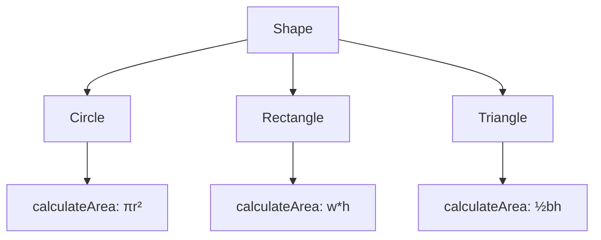

# Inheritance and Polymorphism

## Introduction
Inheritance and Polymorphism are two fundamental concepts in Object-Oriented Programming that enable code reuse and flexibility.

## Inheritance
Inheritance is a mechanism that allows a class to inherit properties and methods from another class.

### Types of Inheritance


### Single Inheritance Example
```cpp
class Animal {
protected:
    string name;
    
public:
    Animal(const string& name) : name(name) {}
    
    virtual void makeSound() {
        cout << "Some sound" << endl;
    }
    
    virtual ~Animal() = default;
};

class Dog : public Animal {
public:
    Dog(const string& name) : Animal(name) {}
    
    void makeSound() override {
        cout << "Woof!" << endl;
    }
    
    void fetch() {
        cout << name << " is fetching the ball" << endl;
    }
};
```

## Polymorphism
Polymorphism allows objects of different classes to be treated as objects of a common superclass.

### Types of Polymorphism
1. **Compile-time Polymorphism (Function Overloading)**
2. **Runtime Polymorphism (Virtual Functions)**

### Function Overloading
```cpp
class Calculator {
public:
    int add(int a, int b) {
        return a + b;
    }
    
    double add(double a, double b) {
        return a + b;
    }
    
    int add(int a, int b, int c) {
        return a + b + c;
    }
};
```

### Virtual Functions
```cpp
class Shape {
public:
    virtual double calculateArea() const {
        return 0;
    }
    
    virtual ~Shape() = default;
};

class Circle : public Shape {
private:
    double radius;
    
public:
    Circle(double radius) : radius(radius) {}
    
    double calculateArea() const override {
        return M_PI * radius * radius;
    }
};

class Rectangle : public Shape {
private:
    double width;
    double height;
    
public:
    Rectangle(double width, double height) 
        : width(width), height(height) {}
    
    double calculateArea() const override {
        return width * height;
    }
};
```

## Polymorphism in Action


## Best Practices
1. **Favor Composition over Inheritance**: Use inheritance only when there's a clear "is-a" relationship
2. **Keep Inheritance Hierarchy Shallow**: Deep inheritance hierarchies can be hard to maintain
3. **Use Abstract Classes and Interfaces**: They provide better abstraction and flexibility
4. **Follow Liskov Substitution Principle**: Subtypes should be substitutable for their base types

## Common Pitfalls
1. Creating deep inheritance hierarchies
2. Using inheritance for code reuse without proper "is-a" relationship
3. Not properly overriding methods
4. Breaking the contract of the parent class

## Practice Problems
1. Create a `Vehicle` hierarchy with different types of vehicles
2. Implement a `Payment` system with different payment methods
3. Design a `MediaPlayer` with support for different file formats

## Interview Questions
1. What is the difference between function overloading and overriding?
2. How does polymorphism work in C++?
3. What is the purpose of the `virtual` keyword?
4. Explain the concept of dynamic binding.
5. When should you use inheritance vs. composition?

## Code Example: Payment System
```cpp
class Payment {
protected:
    double amount;
    
public:
    Payment(double amount) : amount(amount) {}
    virtual ~Payment() = default;
    
    virtual void process() = 0;
};

class CreditCardPayment : public Payment {
private:
    string cardNumber;
    
public:
    CreditCardPayment(double amount, const string& cardNumber)
        : Payment(amount), cardNumber(cardNumber) {}
    
    void process() override {
        cout << "Processing credit card payment of $" << amount << endl;
    }
};

class PayPalPayment : public Payment {
private:
    string email;
    
public:
    PayPalPayment(double amount, const string& email)
        : Payment(amount), email(email) {}
    
    void process() override {
        cout << "Processing PayPal payment of $" << amount << endl;
    }
};
```

## Summary
- Inheritance enables code reuse through parent-child relationships
- Polymorphism allows different objects to be treated uniformly
- Function overloading provides multiple ways to call a function
- Virtual functions allow derived classes to provide specific implementations
- Proper use of inheritance and polymorphism leads to flexible and maintainable code 