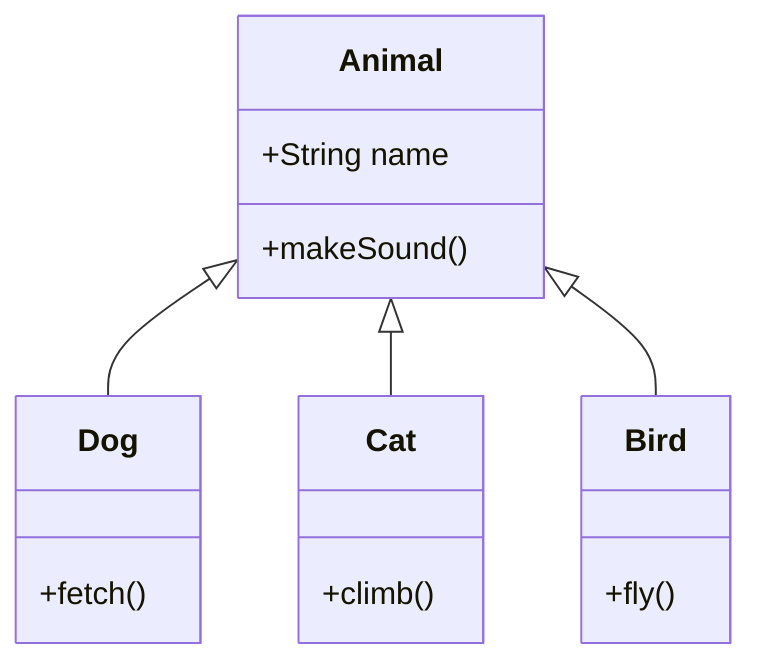
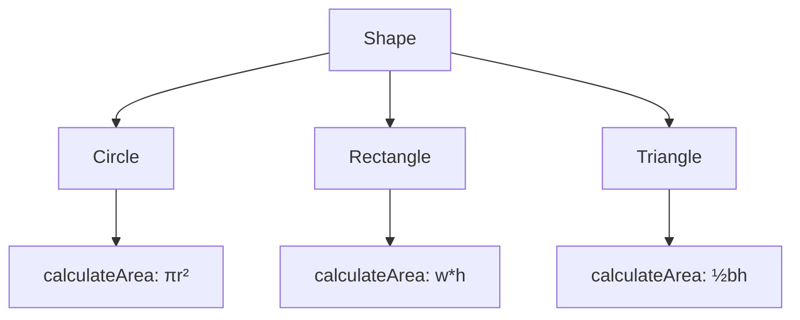

# Inheritance and Polymorphism

## Introduction
Inheritance and Polymorphism are two fundamental concepts in Object-Oriented Programming that enable code reuse and flexibility.

## Inheritance
Inheritance is a mechanism that allows a class to inherit properties and methods from another class.

### Types of Inheritance


### Single Inheritance Example
```java
public class Animal {
    protected String name;
    
    public Animal(String name) {
        this.name = name;
    }
    
    public void makeSound() {
        System.out.println("Some sound");
    }
}

public class Dog extends Animal {
    public Dog(String name) {
        super(name);
    }
    
    @Override
    public void makeSound() {
        System.out.println("Woof!");
    }
    
    public void fetch() {
        System.out.println(name + " is fetching the ball");
    }
}
```

## Polymorphism
Polymorphism allows objects of different classes to be treated as objects of a common superclass.

### Types of Polymorphism
1. **Compile-time Polymorphism (Method Overloading)**
2. **Runtime Polymorphism (Method Overriding)**

### Method Overloading
```java
public class Calculator {
    public int add(int a, int b) {
        return a + b;
    }
    
    public double add(double a, double b) {
        return a + b;
    }
    
    public int add(int a, int b, int c) {
        return a + b + c;
    }
}
```

### Method Overriding
```java
public class Shape {
    public double calculateArea() {
        return 0;
    }
}

public class Circle extends Shape {
    private double radius;
    
    public Circle(double radius) {
        this.radius = radius;
    }
    
    @Override
    public double calculateArea() {
        return Math.PI * radius * radius;
    }
}

public class Rectangle extends Shape {
    private double width;
    private double height;
    
    public Rectangle(double width, double height) {
        this.width = width;
        this.height = height;
    }
    
    @Override
    public double calculateArea() {
        return width * height;
    }
}
```

## Polymorphism in Action


## Best Practices
1. **Favor Composition over Inheritance**: Use inheritance only when there's a clear "is-a" relationship
2. **Keep Inheritance Hierarchy Shallow**: Deep inheritance hierarchies can be hard to maintain
3. **Use Abstract Classes and Interfaces**: They provide better abstraction and flexibility
4. **Follow Liskov Substitution Principle**: Subtypes should be substitutable for their base types

## Common Pitfalls
1. Creating deep inheritance hierarchies
2. Using inheritance for code reuse without proper "is-a" relationship
3. Not properly overriding methods
4. Breaking the contract of the parent class

## Practice Problems
1. Create a `Vehicle` hierarchy with different types of vehicles
2. Implement a `Payment` system with different payment methods
3. Design a `MediaPlayer` with support for different file formats

## Interview Questions
1. What is the difference between method overloading and overriding?
2. How does polymorphism work in Java?
3. What is the purpose of the `super` keyword?
4. Explain the concept of dynamic method dispatch.
5. When should you use inheritance vs. composition?

## Code Example: Payment System
```java
public abstract class Payment {
    protected double amount;
    
    public Payment(double amount) {
        this.amount = amount;
    }
    
    public abstract void process();
}

public class CreditCardPayment extends Payment {
    private String cardNumber;
    
    public CreditCardPayment(double amount, String cardNumber) {
        super(amount);
        this.cardNumber = cardNumber;
    }
    
    @Override
    public void process() {
        System.out.println("Processing credit card payment of $" + amount);
    }
}

public class PayPalPayment extends Payment {
    private String email;
    
    public PayPalPayment(double amount, String email) {
        super(amount);
        this.email = email;
    }
    
    @Override
    public void process() {
        System.out.println("Processing PayPal payment of $" + amount);
    }
}
```

## Summary
- Inheritance enables code reuse through parent-child relationships
- Polymorphism allows different objects to be treated uniformly
- Method overloading provides multiple ways to call a method
- Method overriding allows subclasses to provide specific implementations
- Proper use of inheritance and polymorphism leads to flexible and maintainable code 