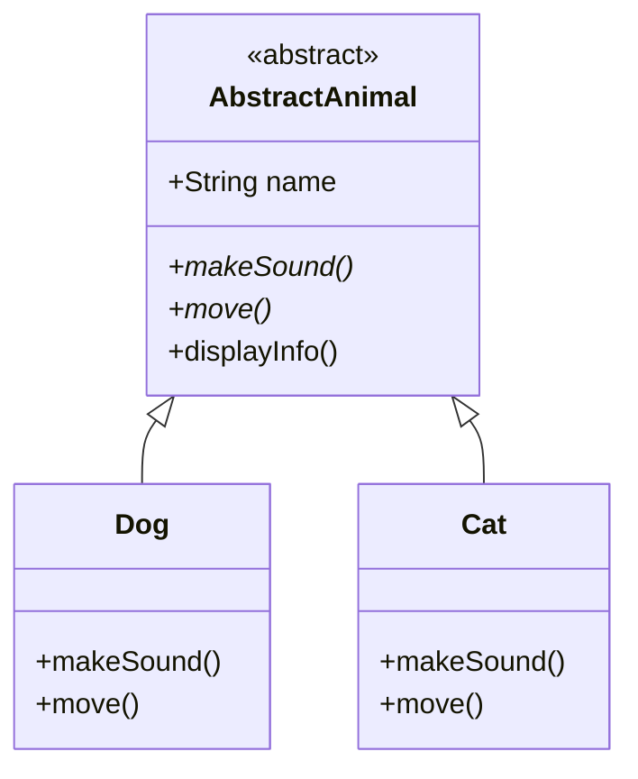
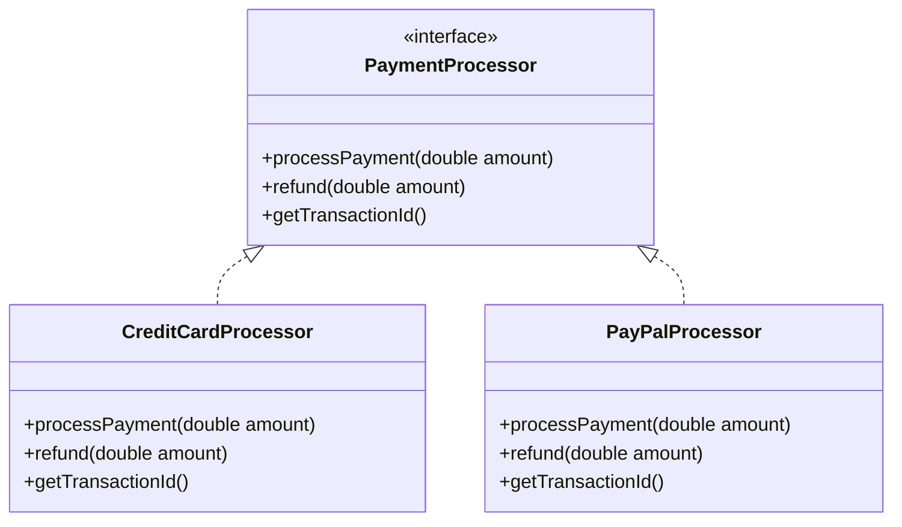
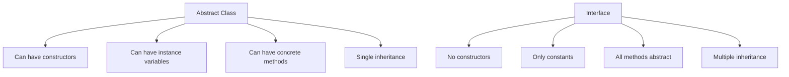

# Interfaces and Abstract Classes

## Introduction
Interfaces and Abstract Classes are two important mechanisms in Object-Oriented Programming that enable abstraction and polymorphism.

## Abstract Classes
An abstract class is a class that cannot be instantiated and may contain both abstract and concrete methods.

### Abstract Class Diagram


### Abstract Class Example
```java
public abstract class AbstractAnimal {
    protected String name;
    
    public AbstractAnimal(String name) {
        this.name = name;
    }
    
    // Abstract methods
    public abstract void makeSound();
    public abstract void move();
    
    // Concrete method
    public void displayInfo() {
        System.out.println("Name: " + name);
    }
}

public class Dog extends AbstractAnimal {
    public Dog(String name) {
        super(name);
    }
    
    @Override
    public void makeSound() {
        System.out.println("Woof!");
    }
    
    @Override
    public void move() {
        System.out.println("Dog is running");
    }
}
```

## Interfaces
An interface is a contract that defines a set of methods that implementing classes must provide.

### Interface Diagram


### Interface Example
```java
public interface PaymentProcessor {
    boolean processPayment(double amount);
    void refund(double amount);
    String getTransactionId();
}

public class CreditCardProcessor implements PaymentProcessor {
    @Override
    public boolean processPayment(double amount) {
        // Implementation
        return true;
    }
    
    @Override
    public void refund(double amount) {
        // Implementation
    }
    
    @Override
    public String getTransactionId() {
        return "CC-" + System.currentTimeMillis();
    }
}
```

## Comparison

### Abstract Class vs Interface


## When to Use What?

### Use Abstract Classes When:
1. You want to share code among several related classes
2. You have some common implementation
3. You want to provide a base class with some default behavior
4. You need to declare non-public members

### Use Interfaces When:
1. You want to define a contract
2. You want to specify the behavior of a particular data type
3. You want to separate the definition of a service from its implementation
4. You want to support multiple inheritance

## Best Practices
1. Keep interfaces focused and cohesive
2. Use abstract classes for shared implementation
3. Follow the Interface Segregation Principle
4. Use meaningful names for interfaces and abstract classes
5. Document the purpose and usage of interfaces and abstract classes

## Common Pitfalls
1. Creating too many abstract methods
2. Mixing interface and abstract class responsibilities
3. Not properly documenting the contract
4. Creating interfaces that are too large
5. Using abstract classes when interfaces would be more appropriate

## Practice Problems
1. Create an abstract `Shape` class with concrete implementations
2. Design a `Logger` interface with different logging implementations
3. Implement a `DatabaseConnection` abstract class with specific database implementations

## Interview Questions
1. What is the difference between an abstract class and an interface?
2. When would you use an abstract class over an interface?
3. Can an interface extend another interface?
4. Can an abstract class implement an interface?
5. What is the purpose of default methods in interfaces?

## Code Example: Logger Implementation
```java
public interface Logger {
    void log(String message);
    void error(String message);
    void warn(String message);
}

public abstract class AbstractLogger implements Logger {
    protected String formatMessage(String level, String message) {
        return String.format("[%s] %s: %s", 
            new java.util.Date(), level, message);
    }
}

public class FileLogger extends AbstractLogger {
    private String filePath;
    
    public FileLogger(String filePath) {
        this.filePath = filePath;
    }
    
    @Override
    public void log(String message) {
        // Write to file
        System.out.println(formatMessage("INFO", message));
    }
    
    @Override
    public void error(String message) {
        // Write to file
        System.out.println(formatMessage("ERROR", message));
    }
    
    @Override
    public void warn(String message) {
        // Write to file
        System.out.println(formatMessage("WARN", message));
    }
}
```

## Summary
- Abstract classes provide a base implementation and can have both abstract and concrete methods
- Interfaces define a contract that implementing classes must follow
- Abstract classes are used for code reuse and shared implementation
- Interfaces are used for defining behavior and supporting multiple inheritance
- Both are essential tools for creating flexible and maintainable code 