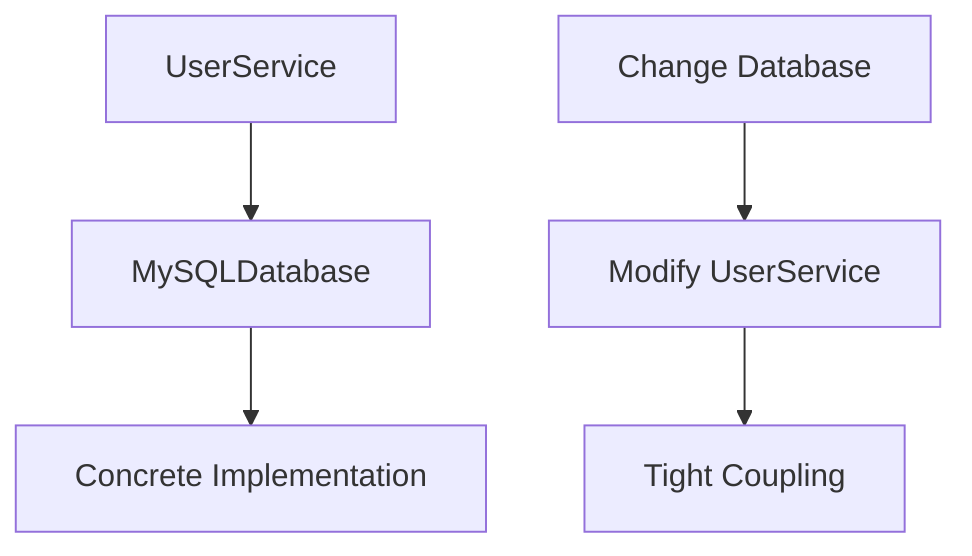
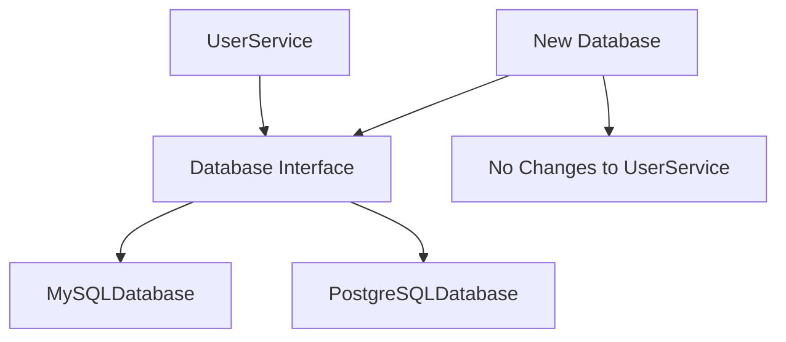

# Dependency Inversion Principle (DIP)

## Introduction
The Dependency Inversion Principle states that high-level modules should not depend on low-level modules. Both should depend on abstractions. Additionally, abstractions should not depend on details. Details should depend on abstractions.

## Why DIP?
- Reduces coupling between modules
- Makes code more maintainable
- Enables easier testing
- Facilitates code reuse
- Supports the Open/Closed Principle

## Violation Example
```cpp
// Low-level module
class MySQLDatabase {
public:
    void connect() {
        cout << "Connecting to MySQL database..." << endl;
    }
    
    void query(const string& sql) {
        cout << "Executing MySQL query: " << sql << endl;
    }
};

// High-level module directly depends on low-level module
class UserService {
private:
    MySQLDatabase database;
    
public:
    UserService() {
        database.connect();
    }
    
    void getUser(int userId) {
        database.query("SELECT * FROM users WHERE id = " + to_string(userId));
    }
};
```

## Problem with the Above Design


## Solution: Applying DIP
```cpp
// Abstract interface
class Database {
public:
    virtual void connect() = 0;
    virtual void query(const string& sql) = 0;
    virtual ~Database() = default;
};

// Low-level module implementing the interface
class MySQLDatabase : public Database {
public:
    void connect() override {
        cout << "Connecting to MySQL database..." << endl;
    }
    
    void query(const string& sql) override {
        cout << "Executing MySQL query: " << sql << endl;
    }
};

// Another low-level module
class PostgreSQLDatabase : public Database {
public:
    void connect() override {
        cout << "Connecting to PostgreSQL database..." << endl;
    }
    
    void query(const string& sql) override {
        cout << "Executing PostgreSQL query: " << sql << endl;
    }
};

// High-level module depends on abstraction
class UserService {
private:
    shared_ptr<Database> database;
    
public:
    // Dependency injection through constructor
    UserService(shared_ptr<Database> db) : database(db) {
        database->connect();
    }
    
    void getUser(int userId) {
        database->query("SELECT * FROM users WHERE id = " + to_string(userId));
    }
};
```

## Benefits of the New Design


## Best Practices
1. Use dependency injection
2. Program to interfaces
3. Use abstract base classes
4. Avoid concrete class dependencies
5. Use factory patterns when appropriate

## Common Pitfalls
1. Direct instantiation of concrete classes
2. Hard-coded dependencies
3. Not using dependency injection
4. Mixing abstraction levels
5. Violating the Interface Segregation Principle

## Practice Problems
1. Design a logging system with different output destinations
2. Create a notification system with multiple channels
3. Implement a data storage system with different backends

## Interview Questions
1. What is the Dependency Inversion Principle?
2. How do you implement dependency injection in C++?
3. What are the benefits of following DIP?
4. When should you use abstract classes vs. interfaces?
5. How do you handle dependency management in large projects?

## Code Example: Notification System
```cpp
// Abstract notification interface
class NotificationService {
public:
    virtual void send(const string& message) = 0;
    virtual ~NotificationService() = default;
};

// Concrete notification implementations
class EmailNotification : public NotificationService {
private:
    string emailAddress;
    
public:
    EmailNotification(const string& email) : emailAddress(email) {}
    
    void send(const string& message) override {
        cout << "Sending email to " << emailAddress << ": " << message << endl;
    }
};

class SMSNotification : public NotificationService {
private:
    string phoneNumber;
    
public:
    SMSNotification(const string& phone) : phoneNumber(phone) {}
    
    void send(const string& message) override {
        cout << "Sending SMS to " << phoneNumber << ": " << message << endl;
    }
};

// High-level module
class OrderProcessor {
private:
    shared_ptr<NotificationService> notificationService;
    
public:
    OrderProcessor(shared_ptr<NotificationService> service)
        : notificationService(service) {}
    
    void processOrder(const string& orderId) {
        // Process the order
        cout << "Processing order: " << orderId << endl;
        
        // Send notification
        notificationService->send("Order " + orderId + " has been processed");
    }
};

// Factory for creating notification services
class NotificationFactory {
public:
    static shared_ptr<NotificationService> createNotification(const string& type, const string& recipient) {
        if (type == "email") {
            return make_shared<EmailNotification>(recipient);
        } else if (type == "sms") {
            return make_shared<SMSNotification>(recipient);
        }
        throw runtime_error("Unknown notification type");
    }
};

// Usage example
void demonstrateDIP() {
    // Create notification service
    auto emailService = NotificationFactory::createNotification("email", "user@example.com");
    
    // Create order processor with email notification
    OrderProcessor processor(emailService);
    
    // Process an order
    processor.processOrder("12345");
    
    // Switch to SMS notification
    auto smsService = NotificationFactory::createNotification("sms", "+1234567890");
    OrderProcessor smsProcessor(smsService);
    smsProcessor.processOrder("67890");
}
```

## Summary
- High-level modules should not depend on low-level modules
- Both should depend on abstractions
- Use dependency injection
- Program to interfaces
- Keep abstractions stable 