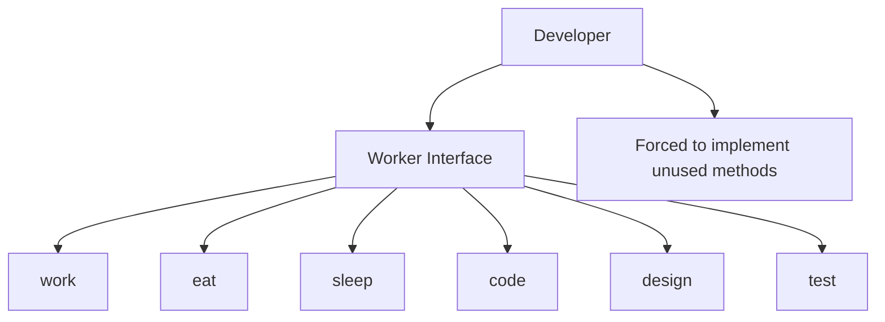
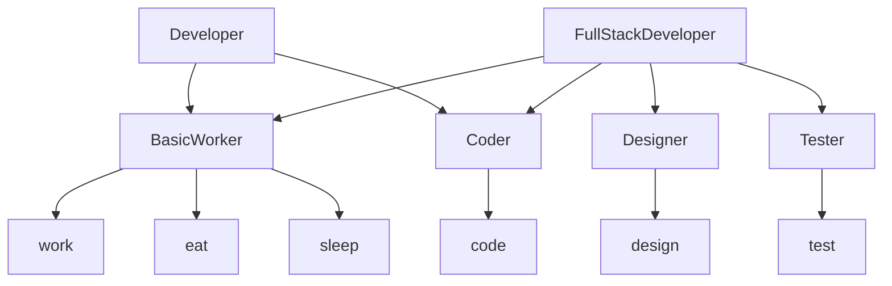

# Interface Segregation Principle (ISP)

## Introduction
The Interface Segregation Principle states that clients should not be forced to depend on interfaces they do not use. In other words, it's better to have many specific interfaces than one general-purpose interface.

## Why ISP?
- Reduces coupling
- Improves code maintainability
- Makes interfaces more focused
- Prevents interface pollution
- Enables better code organization

## Violation Example
```cpp
// A "fat" interface that forces clients to implement methods they don't need
class Worker {
public:
    virtual void work() = 0;
    virtual void eat() = 0;
    virtual void sleep() = 0;
    virtual void code() = 0;
    virtual void design() = 0;
    virtual void test() = 0;
    virtual ~Worker() = default;
};

// Developer must implement all methods, even if they don't use them
class Developer : public Worker {
public:
    void work() override {
        cout << "Developer is working" << endl;
    }
    
    void eat() override {
        cout << "Developer is eating" << endl;
    }
    
    void sleep() override {
        cout << "Developer is sleeping" << endl;
    }
    
    void code() override {
        cout << "Developer is coding" << endl;
    }
    
    // Developer doesn't do design work
    void design() override {
        throw runtime_error("Developer doesn't do design work!");
    }
    
    // Developer doesn't do testing
    void test() override {
        throw runtime_error("Developer doesn't do testing!");
    }
};
```

## Problem with the Above Design


## Solution: Applying ISP
```cpp
// Split into smaller, focused interfaces
class BasicWorker {
public:
    virtual void work() = 0;
    virtual void eat() = 0;
    virtual void sleep() = 0;
    virtual ~BasicWorker() = default;
};

class Coder {
public:
    virtual void code() = 0;
    virtual ~Coder() = default;
};

class Designer {
public:
    virtual void design() = 0;
    virtual ~Designer() = default;
};

class Tester {
public:
    virtual void test() = 0;
    virtual ~Tester() = default;
};

// Developer only implements interfaces they need
class Developer : public BasicWorker, public Coder {
public:
    void work() override {
        cout << "Developer is working" << endl;
    }
    
    void eat() override {
        cout << "Developer is eating" << endl;
    }
    
    void sleep() override {
        cout << "Developer is sleeping" << endl;
    }
    
    void code() override {
        cout << "Developer is coding" << endl;
    }
};

// Full-stack developer implements more interfaces
class FullStackDeveloper : public BasicWorker, public Coder, public Designer, public Tester {
public:
    void work() override {
        cout << "Full-stack developer is working" << endl;
    }
    
    void eat() override {
        cout << "Full-stack developer is eating" << endl;
    }
    
    void sleep() override {
        cout << "Full-stack developer is sleeping" << endl;
    }
    
    void code() override {
        cout << "Full-stack developer is coding" << endl;
    }
    
    void design() override {
        cout << "Full-stack developer is designing" << endl;
    }
    
    void test() override {
        cout << "Full-stack developer is testing" << endl;
    }
};
```

## Benefits of the New Design


## Best Practices
1. Keep interfaces small and focused
2. Split large interfaces into smaller ones
3. Use multiple inheritance when appropriate
4. Design interfaces from the client's perspective
5. Avoid interface pollution

## Common Pitfalls
1. Creating "fat" interfaces
2. Forcing clients to implement unused methods
3. Not considering client needs
4. Over-engineering interfaces
5. Mixing unrelated functionality

## Practice Problems
1. Design a printer interface hierarchy
2. Create a media player interface system
3. Implement a document processing interface set

## Interview Questions
1. What is the Interface Segregation Principle?
2. How do you identify when an interface needs to be split?
3. What are the benefits of following ISP?
4. When is it appropriate to combine interfaces?
5. How do you handle interface evolution?

## Code Example: Printer System
```cpp
// Basic printer operations
class Printer {
public:
    virtual void print(const string& document) = 0;
    virtual ~Printer() = default;
};

// Scanner operations
class Scanner {
public:
    virtual void scan(const string& document) = 0;
    virtual ~Scanner() = default;
};

// Fax operations
class Fax {
public:
    virtual void fax(const string& document) = 0;
    virtual ~Fax() = default;
};

// Simple printer implementation
class SimplePrinter : public Printer {
public:
    void print(const string& document) override {
        cout << "Printing: " << document << endl;
    }
};

// All-in-one printer implementation
class AllInOnePrinter : public Printer, public Scanner, public Fax {
public:
    void print(const string& document) override {
        cout << "Printing: " << document << endl;
    }
    
    void scan(const string& document) override {
        cout << "Scanning: " << document << endl;
    }
    
    void fax(const string& document) override {
        cout << "Faxing: " << document << endl;
    }
};

// Usage example
void processDocument(Printer& printer, const string& document) {
    printer.print(document);
}

void scanDocument(Scanner& scanner, const string& document) {
    scanner.scan(document);
}

void faxDocument(Fax& fax, const string& document) {
    fax.fax(document);
}

void demonstrateISP() {
    SimplePrinter simplePrinter;
    AllInOnePrinter allInOne;
    
    // Simple printer can only print
    processDocument(simplePrinter, "Report");
    
    // All-in-one can do everything
    processDocument(allInOne, "Report");
    scanDocument(allInOne, "Report");
    faxDocument(allInOne, "Report");
}
```

## Summary
- Clients should not be forced to depend on interfaces they don't use
- Split large interfaces into smaller, focused ones
- Design interfaces from the client's perspective
- Use multiple inheritance when appropriate
- Keep interfaces cohesive and minimal 