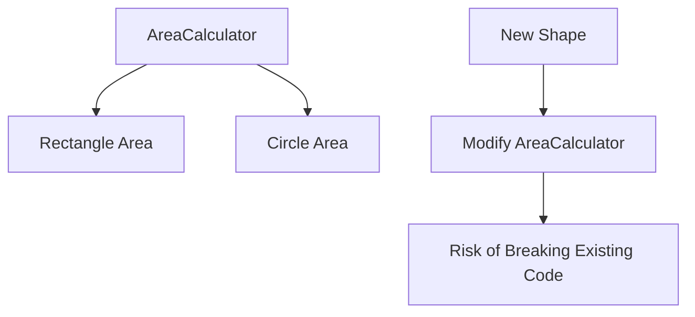
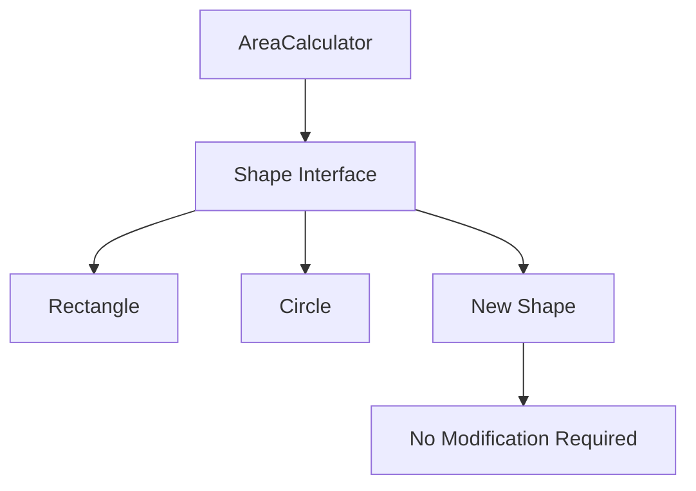

# Open/Closed Principle (OCP)

## Introduction
The Open/Closed Principle states that software entities (classes, modules, functions) should be open for extension but closed for modification. This means you should be able to add new functionality without changing existing code.

## Why OCP?
- Reduces risk of breaking existing functionality
- Makes code more maintainable
- Enables easy addition of new features
- Promotes code reuse
- Supports the "Don't Repeat Yourself" (DRY) principle

## Violation Example
```cpp
class Rectangle {
private:
    double width;
    double height;
    
public:
    Rectangle(double width, double height) : width(width), height(height) {}
    
    double getWidth() const { return width; }
    double getHeight() const { return height; }
};

class Circle {
private:
    double radius;
    
public:
    Circle(double radius) : radius(radius) {}
    
    double getRadius() const { return radius; }
};

class AreaCalculator {
public:
    double calculateArea(const vector<Rectangle>& rectangles) {
        double totalArea = 0;
        for (const auto& rect : rectangles) {
            totalArea += rect.getWidth() * rect.getHeight();
        }
        return totalArea;
    }
    
    // Violation: Modifying existing code to add new functionality
    double calculateArea(const vector<Circle>& circles) {
        double totalArea = 0;
        for (const auto& circle : circles) {
            totalArea += M_PI * circle.getRadius() * circle.getRadius();
        }
        return totalArea;
    }
};
```

## Problem with the Above Design


## Solution: Applying OCP
```cpp
// Abstract base class for shapes
class Shape {
public:
    virtual double calculateArea() const = 0;
    virtual ~Shape() = default;
};

class Rectangle : public Shape {
private:
    double width;
    double height;
    
public:
    Rectangle(double width, double height) : width(width), height(height) {}
    
    double calculateArea() const override {
        return width * height;
    }
};

class Circle : public Shape {
private:
    double radius;
    
public:
    Circle(double radius) : radius(radius) {}
    
    double calculateArea() const override {
        return M_PI * radius * radius;
    }
};

class AreaCalculator {
public:
    double calculateTotalArea(const vector<shared_ptr<Shape>>& shapes) {
        double totalArea = 0;
        for (const auto& shape : shapes) {
            totalArea += shape->calculateArea();
        }
        return totalArea;
    }
};
```

## Benefits of the New Design


## Best Practices
1. Use abstraction to define stable interfaces
2. Favor composition over inheritance
3. Use polymorphism to handle different implementations
4. Design for extension points
5. Keep the base class/interface stable

## Common Pitfalls
1. Modifying existing code to add new features
2. Creating rigid class hierarchies
3. Not using abstraction effectively
4. Over-engineering for future extensions
5. Violating the Liskov Substitution Principle

## Practice Problems
1. Design a payment processing system that can handle different payment methods
2. Create a logging system that supports multiple output formats
3. Implement a notification system that can send messages through different channels

## Interview Questions
1. What is the Open/Closed Principle?
2. How do you make code open for extension but closed for modification?
3. What are the benefits of following OCP?
4. When is it acceptable to modify existing code?
5. How do you handle changes that affect multiple parts of the system?

## Code Example: Payment Processing System
```cpp
// Payment strategy interface
class PaymentStrategy {
public:
    virtual bool processPayment(double amount) = 0;
    virtual ~PaymentStrategy() = default;
};

// Concrete payment strategies
class CreditCardPayment : public PaymentStrategy {
private:
    string cardNumber;
    string cvv;
    
public:
    CreditCardPayment(const string& cardNumber, const string& cvv)
        : cardNumber(cardNumber), cvv(cvv) {}
    
    bool processPayment(double amount) override {
        // Credit card payment processing logic
        cout << "Processing credit card payment of $" << amount << endl;
        return true;
    }
};

class PayPalPayment : public PaymentStrategy {
private:
    string email;
    
public:
    PayPalPayment(const string& email) : email(email) {}
    
    bool processPayment(double amount) override {
        // PayPal payment processing logic
        cout << "Processing PayPal payment of $" << amount << endl;
        return true;
    }
};

// Payment processor that follows OCP
class PaymentProcessor {
private:
    shared_ptr<PaymentStrategy> strategy;
    
public:
    void setPaymentStrategy(shared_ptr<PaymentStrategy> newStrategy) {
        strategy = newStrategy;
    }
    
    bool processPayment(double amount) {
        if (!strategy) {
            throw runtime_error("Payment strategy not set");
        }
        return strategy->processPayment(amount);
    }
};

// Usage example
void processOrder(PaymentProcessor& processor, double amount) {
    // Can easily switch payment strategies without modifying existing code
    processor.setPaymentStrategy(make_shared<CreditCardPayment>("1234", "123"));
    processor.processPayment(amount);
    
    processor.setPaymentStrategy(make_shared<PayPalPayment>("user@example.com"));
    processor.processPayment(amount);
}
```

## Summary
- Software entities should be open for extension but closed for modification
- Use abstraction and polymorphism to enable extension
- Design with future changes in mind
- Keep the core functionality stable
- Use design patterns to implement OCP effectively 