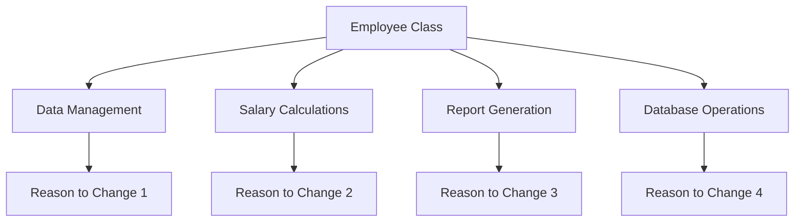
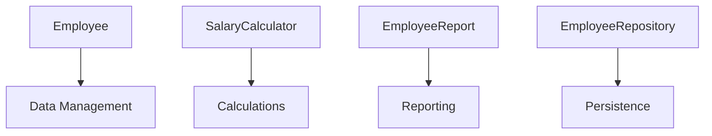

# Single Responsibility Principle (SRP)

## Introduction
The Single Responsibility Principle states that a class should have only one reason to change. In other words, a class should have only one responsibility or job.

## Why SRP?
- Improves maintainability
- Reduces coupling
- Makes code more testable
- Enhances readability
- Makes the system more modular

## Violation Example
```cpp
class Employee {
private:
    string name;
    string id;
    double salary;
    
public:
    Employee(const string& name, const string& id, double salary)
        : name(name), id(id), salary(salary) {}
    
    // Employee data management
    void updateName(const string& newName) {
        name = newName;
    }
    
    void updateSalary(double newSalary) {
        salary = newSalary;
    }
    
    // Salary calculation
    double calculateTax() {
        return salary * 0.2; // 20% tax
    }
    
    double calculateBonus() {
        return salary * 0.1; // 10% bonus
    }
    
    // Report generation
    void generateReport() {
        cout << "Employee Report" << endl;
        cout << "Name: " << name << endl;
        cout << "ID: " << id << endl;
        cout << "Salary: " << salary << endl;
        cout << "Tax: " << calculateTax() << endl;
        cout << "Bonus: " << calculateBonus() << endl;
    }
    
    // Database operations
    void saveToDatabase() {
        // Database connection and save logic
        cout << "Saving to database..." << endl;
    }
    
    void loadFromDatabase() {
        // Database connection and load logic
        cout << "Loading from database..." << endl;
    }
};
```

## Problem with the Above Design


## Solution: Applying SRP
```cpp
// Employee data management
class Employee {
private:
    string name;
    string id;
    double salary;
    
public:
    Employee(const string& name, const string& id, double salary)
        : name(name), id(id), salary(salary) {}
    
    // Getters and setters
    string getName() const { return name; }
    void setName(const string& newName) { name = newName; }
    
    string getId() const { return id; }
    
    double getSalary() const { return salary; }
    void setSalary(double newSalary) { salary = newSalary; }
};

// Salary calculations
class SalaryCalculator {
public:
    static double calculateTax(double salary) {
        return salary * 0.2; // 20% tax
    }
    
    static double calculateBonus(double salary) {
        return salary * 0.1; // 10% bonus
    }
};

// Report generation
class EmployeeReport {
public:
    static void generateReport(const Employee& employee) {
        cout << "Employee Report" << endl;
        cout << "Name: " << employee.getName() << endl;
        cout << "ID: " << employee.getId() << endl;
        cout << "Salary: " << employee.getSalary() << endl;
        cout << "Tax: " << SalaryCalculator::calculateTax(employee.getSalary()) << endl;
        cout << "Bonus: " << SalaryCalculator::calculateBonus(employee.getSalary()) << endl;
    }
};

// Database operations
class EmployeeRepository {
public:
    void save(const Employee& employee) {
        // Database connection and save logic
        cout << "Saving to database..." << endl;
    }
    
    Employee load(const string& id) {
        // Database connection and load logic
        cout << "Loading from database..." << endl;
        return Employee("", id, 0.0); // Simplified for example
    }
};
```

## Benefits of the New Design


## Best Practices
1. Keep classes focused and cohesive
2. Identify responsibilities before creating classes
3. Use meaningful class names that reflect their single responsibility
4. Consider using helper classes for complex operations
5. Regularly review and refactor code to maintain SRP

## Common Pitfalls
1. Creating "god" classes that do too much
2. Mixing business logic with data access
3. Combining UI and business logic
4. Putting multiple responsibilities in utility classes
5. Not properly separating concerns

## Practice Problems
1. Refactor a `FileManager` class that handles both file operations and logging
2. Split a `UserManager` class that handles authentication, profile management, and notifications
3. Separate a `ShoppingCart` class that handles cart operations, pricing, and inventory management

## Interview Questions
1. What is the Single Responsibility Principle?
2. How do you identify if a class has multiple responsibilities?
3. What are the benefits of following SRP?
4. How do you handle classes that seem to have multiple related responsibilities?
5. When is it acceptable to have multiple responsibilities in a single class?

## Code Example: File Processing System
```cpp
// File data structure
class File {
private:
    string name;
    string content;
    string path;
    
public:
    File(const string& name, const string& content, const string& path)
        : name(name), content(content), path(path) {}
    
    string getName() const { return name; }
    string getContent() const { return content; }
    string getPath() const { return path; }
};

// File operations
class FileOperations {
public:
    static void saveToDisk(const File& file) {
        // Implementation for saving file to disk
        cout << "Saving file: " << file.getName() << endl;
    }
    
    static File loadFromDisk(const string& path) {
        // Implementation for loading file from disk
        cout << "Loading file from: " << path << endl;
        return File("", "", path);
    }
};

// File content processing
class FileProcessor {
public:
    static string processContent(const string& content) {
        // Implementation for processing file content
        return "Processed: " + content;
    }
    
    static string validateContent(const string& content) {
        // Implementation for validating file content
        return content.empty() ? "Invalid" : "Valid";
    }
};

// File metadata management
class FileMetadata {
public:
    static string getFileType(const string& filename) {
        // Implementation for getting file type
        return filename.substr(filename.find_last_of(".") + 1);
    }
    
    static size_t getFileSize(const string& content) {
        return content.size();
    }
};
```

## Summary
- Each class should have only one reason to change
- Split large classes into smaller, focused ones
- Keep related functionality together
- Use helper classes for complex operations
- Regularly review and refactor code to maintain SRP 