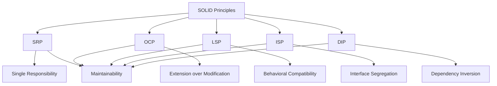

# SOLID Principles Summary

## Overview
SOLID principles are five fundamental principles of object-oriented design that help create maintainable, flexible, and scalable software. These principles were introduced by Robert C. Martin and have become essential guidelines for writing clean code.

## The Five Principles

### 1. Single Responsibility Principle (SRP)
- A class should have only one reason to change
- Each class should have a single, well-defined responsibility
- Helps in maintaining and modifying code
- Reduces coupling between different parts of the system

### 2. Open/Closed Principle (OCP)
- Software entities should be open for extension but closed for modification
- New functionality should be added by extending existing code
- Reduces the risk of breaking existing functionality
- Promotes code reuse and maintainability

### 3. Liskov Substitution Principle (LSP)
- Derived classes must be substitutable for their base classes
- Ensures behavioral compatibility in inheritance hierarchies
- Prevents runtime errors and unexpected behavior
- Maintains the contract between base and derived classes

### 4. Interface Segregation Principle (ISP)
- Clients should not be forced to depend on interfaces they do not use
- Prefer many specific interfaces over one general-purpose interface
- Reduces coupling and improves code organization
- Makes interfaces more focused and maintainable

### 5. Dependency Inversion Principle (DIP)
- High-level modules should not depend on low-level modules
- Both should depend on abstractions
- Promotes loose coupling and testability
- Enables easier maintenance and modification

## Relationships Between Principles

## Practical Applications

### Design Patterns
- Factory Pattern (DIP, OCP)
- Strategy Pattern (DIP, OCP)
- Adapter Pattern (DIP, ISP)
- Template Method Pattern (LSP)
- Command Pattern (SRP, DIP)

### Common Scenarios
1. **Database Operations**
   - SRP: Separate data access from business logic
   - DIP: Use database interfaces
   - ISP: Split into read and write operations

2. **User Interface**
   - SRP: Separate UI from business logic
   - OCP: Extend UI components
   - ISP: Split into different view interfaces

3. **Logging System**
   - SRP: Separate logging from business logic
   - OCP: Add new log formats
   - DIP: Use logging interfaces

## Best Practices

### General Guidelines
1. Start with SRP when designing classes
2. Use OCP when adding new features
3. Ensure LSP compliance in inheritance
4. Apply ISP when creating interfaces
5. Use DIP for module dependencies

### Implementation Tips
1. Use abstract classes and interfaces
2. Implement dependency injection
3. Keep classes focused and cohesive
4. Design for extension
5. Write testable code

## Common Pitfalls

### To Avoid
1. Creating "god" classes (violates SRP)
2. Modifying existing code for new features (violates OCP)
3. Breaking behavioral contracts (violates LSP)
4. Creating "fat" interfaces (violates ISP)
5. Direct dependencies on concrete classes (violates DIP)

## Interview Preparation

### Key Points to Remember
1. Understand each principle's purpose
2. Know how principles relate to each other
3. Be able to identify violations
4. Provide real-world examples
5. Explain benefits and trade-offs

### Common Questions
1. How do SOLID principles improve code quality?
2. When might it be acceptable to violate a SOLID principle?
3. How do you refactor code to follow SOLID principles?
4. What are the trade-offs of following SOLID principles?
5. How do SOLID principles relate to design patterns?

## Summary
SOLID principles provide a foundation for writing maintainable and scalable code. While they may seem like additional work initially, they pay off in the long run by making code easier to maintain, test, and extend. Remember that these principles are guidelines, not strict rules, and should be applied judiciously based on the specific context and requirements of your project. 