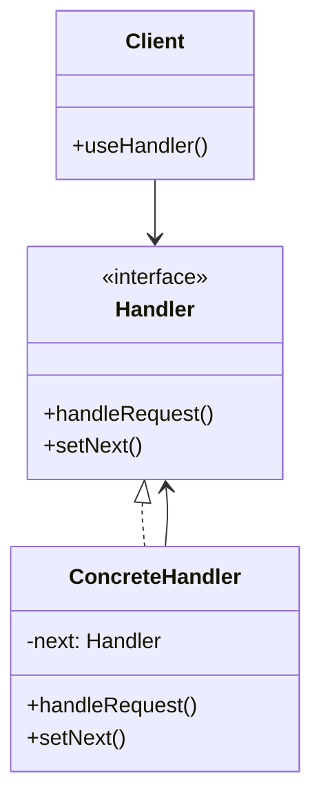

# Chain of Responsibility Pattern

## Introduction
The Chain of Responsibility pattern creates a chain of receiver objects for a request. Each receiver either handles the request or passes it to the next receiver in the chain. This pattern decouples the sender from the receiver and allows multiple objects to handle the request.

## Why Chain of Responsibility?
- Decouples request sender from receiver
- Allows multiple objects to handle a request
- Provides flexibility in assigning responsibilities
- Supports dynamic chain modification
- Simplifies object connections

## Structure


## Implementation Example: Logging System
```cpp
// Handler interface
class Logger {
protected:
    unique_ptr<Logger> next;
    LogLevel level;
    
public:
    Logger(LogLevel level) : level(level) {}
    
    void setNext(unique_ptr<Logger> nextLogger) {
        next = move(nextLogger);
    }
    
    virtual void log(LogLevel level, const string& message) {
        if (this->level <= level) {
            writeMessage(message);
        }
        
        if (next) {
            next->log(level, message);
        }
    }
    
protected:
    virtual void writeMessage(const string& message) = 0;
};

// Concrete handlers
class ConsoleLogger : public Logger {
public:
    ConsoleLogger(LogLevel level) : Logger(level) {}
    
protected:
    void writeMessage(const string& message) override {
        cout << "Console Logger: " << message << endl;
    }
};

class FileLogger : public Logger {
private:
    string filename;
    
public:
    FileLogger(LogLevel level, const string& filename) 
        : Logger(level), filename(filename) {}
    
protected:
    void writeMessage(const string& message) override {
        cout << "File Logger: Writing to " << filename << ": " << message << endl;
    }
};

class EmailLogger : public Logger {
private:
    string email;
    
public:
    EmailLogger(LogLevel level, const string& email) 
        : Logger(level), email(email) {}
    
protected:
    void writeMessage(const string& message) override {
        cout << "Email Logger: Sending to " << email << ": " << message << endl;
    }
};

// Log levels
enum class LogLevel {
    INFO,
    WARNING,
    ERROR
};

// Client
class Application {
private:
    unique_ptr<Logger> logger;
    
public:
    Application() {
        // Create the chain
        auto consoleLogger = make_unique<ConsoleLogger>(LogLevel::INFO);
        auto fileLogger = make_unique<FileLogger>(LogLevel::WARNING, "app.log");
        auto emailLogger = make_unique<EmailLogger>(LogLevel::ERROR, "admin@example.com");
        
        // Set up the chain
        consoleLogger->setNext(move(fileLogger));
        fileLogger->setNext(move(emailLogger));
        
        logger = move(consoleLogger);
    }
    
    void processRequest(const string& message, LogLevel level) {
        logger->log(level, message);
    }
};
```

## Usage Example
```cpp
void demonstrateChainOfResponsibility() {
    Application app;
    
    // Log messages with different levels
    app.processRequest("Application started", LogLevel::INFO);
    app.processRequest("Disk space low", LogLevel::WARNING);
    app.processRequest("Database connection failed", LogLevel::ERROR);
}
```

## Real-World Example: Purchase Approval System
```cpp
// Request class
class PurchaseRequest {
public:
    double amount;
    string purpose;
    
    PurchaseRequest(double amount, const string& purpose)
        : amount(amount), purpose(purpose) {}
};

// Handler interface
class Approver {
protected:
    unique_ptr<Approver> next;
    string name;
    double approvalLimit;
    
public:
    Approver(const string& name, double limit)
        : name(name), approvalLimit(limit) {}
    
    void setNext(unique_ptr<Approver> nextApprover) {
        next = move(nextApprover);
    }
    
    virtual void processRequest(const PurchaseRequest& request) {
        if (request.amount <= approvalLimit) {
            approveRequest(request);
        } else if (next) {
            next->processRequest(request);
        } else {
            rejectRequest(request);
        }
    }
    
protected:
    virtual void approveRequest(const PurchaseRequest& request) {
        cout << name << " approved purchase of $" << request.amount 
             << " for " << request.purpose << endl;
    }
    
    virtual void rejectRequest(const PurchaseRequest& request) {
        cout << "Purchase request for $" << request.amount 
             << " for " << request.purpose << " requires board approval" << endl;
    }
};

// Concrete handlers
class Manager : public Approver {
public:
    Manager(const string& name) : Approver(name, 1000.0) {}
};

class Director : public Approver {
public:
    Director(const string& name) : Approver(name, 5000.0) {}
};

class VP : public Approver {
public:
    VP(const string& name) : Approver(name, 10000.0) {}
};

// Client
class PurchaseSystem {
private:
    unique_ptr<Approver> approver;
    
public:
    PurchaseSystem() {
        // Create the chain
        auto manager = make_unique<Manager>("John");
        auto director = make_unique<Director>("Sarah");
        auto vp = make_unique<VP>("Michael");
        
        // Set up the chain
        manager->setNext(move(director));
        director->setNext(move(vp));
        
        approver = move(manager);
    }
    
    void processPurchase(double amount, const string& purpose) {
        PurchaseRequest request(amount, purpose);
        approver->processRequest(request);
    }
};

// Usage
void demonstratePurchaseSystem() {
    PurchaseSystem system;
    
    // Process different purchase requests
    system.processPurchase(500, "Office supplies");
    system.processPurchase(2000, "New computer");
    system.processPurchase(8000, "Server upgrade");
    system.processPurchase(15000, "New office space");
}
```

## Best Practices
1. Use when multiple objects can handle a request
2. Apply when the handler isn't known a priori
3. Consider when you want to issue a request to one of several objects
4. Use for dynamic chain modification
5. Keep the chain focused and simple

## Common Pitfalls
1. Creating too long chains
2. Violating the Single Responsibility Principle
3. Making handlers too complex
4. Not handling requests properly
5. Over-engineering simple scenarios

## Practice Problems
1. Implement an exception handling system
2. Create a middleware pipeline
3. Design a validation chain

## Interview Questions
1. What is the Chain of Responsibility pattern?
2. When should you use Chain of Responsibility?
3. How does Chain of Responsibility differ from Command?
4. What are the advantages of using Chain of Responsibility?
5. How do you handle chain modification?

## Summary
- Chain of Responsibility decouples request sender from receiver
- It allows multiple objects to handle a request
- Provides flexibility in assigning responsibilities
- Supports dynamic chain modification
- Can be combined with other patterns effectively 