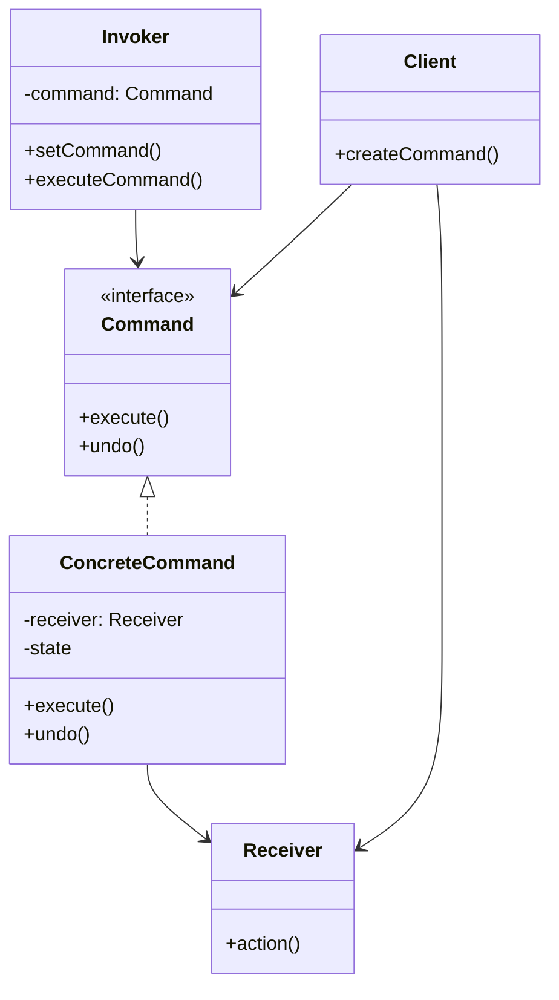

# Command Pattern

## Introduction
The Command pattern encapsulates a request as an object, thereby letting you parameterize clients with different requests, queue or log requests, and support undoable operations. This pattern decouples the requester from the receiver and allows for the parameterization of clients with different requests.

## Why Command?
- Encapsulates a request as an object
- Parameterizes clients with different requests
- Supports queuing and logging of requests
- Enables undoable operations
- Decouples invoker from receiver

## Structure


## Implementation Example: Text Editor
```cpp
// Command interface
class Command {
public:
    virtual void execute() = 0;
    virtual void undo() = 0;
    virtual ~Command() = default;
};

// Receiver
class TextEditor {
private:
    string text;
    
public:
    void insertText(const string& newText, size_t position) {
        text.insert(position, newText);
        cout << "Inserted text: " << newText << endl;
    }
    
    void deleteText(size_t position, size_t length) {
        text.erase(position, length);
        cout << "Deleted text at position " << position << endl;
    }
    
    string getText() const { return text; }
};

// Concrete commands
class InsertCommand : public Command {
private:
    TextEditor& editor;
    string text;
    size_t position;
    
public:
    InsertCommand(TextEditor& editor, const string& text, size_t position)
        : editor(editor), text(text), position(position) {}
    
    void execute() override {
        editor.insertText(text, position);
    }
    
    void undo() override {
        editor.deleteText(position, text.length());
    }
};

class DeleteCommand : public Command {
private:
    TextEditor& editor;
    string deletedText;
    size_t position;
    
public:
    DeleteCommand(TextEditor& editor, size_t position, size_t length)
        : editor(editor), position(position) {
        deletedText = editor.getText().substr(position, length);
    }
    
    void execute() override {
        editor.deleteText(position, deletedText.length());
    }
    
    void undo() override {
        editor.insertText(deletedText, position);
    }
};

// Invoker
class TextEditorInvoker {
private:
    vector<unique_ptr<Command>> commandHistory;
    vector<unique_ptr<Command>> undoHistory;
    
public:
    void executeCommand(unique_ptr<Command> command) {
        command->execute();
        commandHistory.push_back(move(command));
        undoHistory.clear();
    }
    
    void undo() {
        if (!commandHistory.empty()) {
            auto command = move(commandHistory.back());
            commandHistory.pop_back();
            command->undo();
            undoHistory.push_back(move(command));
        }
    }
    
    void redo() {
        if (!undoHistory.empty()) {
            auto command = move(undoHistory.back());
            undoHistory.pop_back();
            command->execute();
            commandHistory.push_back(move(command));
        }
    }
};
```

## Usage Example
```cpp
void demonstrateCommand() {
    TextEditor editor;
    TextEditorInvoker invoker;
    
    // Insert text
    invoker.executeCommand(make_unique<InsertCommand>(editor, "Hello", 0));
    invoker.executeCommand(make_unique<InsertCommand>(editor, " World", 5));
    
    // Delete text
    invoker.executeCommand(make_unique<DeleteCommand>(editor, 0, 5));
    
    // Undo and redo
    invoker.undo();  // Undo delete
    invoker.undo();  // Undo " World" insert
    invoker.redo();  // Redo " World" insert
}
```

## Real-World Example: Smart Home System
```cpp
// Command interface
class SmartHomeCommand {
public:
    virtual void execute() = 0;
    virtual void undo() = 0;
    virtual ~SmartHomeCommand() = default;
};

// Receivers
class Light {
private:
    bool isOn;
    string location;
    
public:
    Light(const string& location) : location(location), isOn(false) {}
    
    void turnOn() {
        isOn = true;
        cout << location << " light is on" << endl;
    }
    
    void turnOff() {
        isOn = false;
        cout << location << " light is off" << endl;
    }
    
    bool getState() const { return isOn; }
};

class Thermostat {
private:
    int temperature;
    
public:
    Thermostat() : temperature(20) {}
    
    void setTemperature(int temp) {
        temperature = temp;
        cout << "Temperature set to " << temp << "°C" << endl;
    }
    
    int getTemperature() const { return temperature; }
};

// Concrete commands
class LightCommand : public SmartHomeCommand {
private:
    Light& light;
    
public:
    LightCommand(Light& light) : light(light) {}
    
    void execute() override {
        if (!light.getState()) {
            light.turnOn();
        }
    }
    
    void undo() override {
        if (light.getState()) {
            light.turnOff();
        }
    }
};

class ThermostatCommand : public SmartHomeCommand {
private:
    Thermostat& thermostat;
    int newTemperature;
    int previousTemperature;
    
public:
    ThermostatCommand(Thermostat& thermostat, int temperature)
        : thermostat(thermostat), newTemperature(temperature) {
        previousTemperature = thermostat.getTemperature();
    }
    
    void execute() override {
        thermostat.setTemperature(newTemperature);
    }
    
    void undo() override {
        thermostat.setTemperature(previousTemperature);
    }
};

// Invoker
class SmartHomeController {
private:
    vector<unique_ptr<SmartHomeCommand>> commandHistory;
    
public:
    void executeCommand(unique_ptr<SmartHomeCommand> command) {
        command->execute();
        commandHistory.push_back(move(command));
    }
    
    void undoLastCommand() {
        if (!commandHistory.empty()) {
            auto command = move(commandHistory.back());
            commandHistory.pop_back();
            command->undo();
        }
    }
};

// Usage
void demonstrateSmartHome() {
    // Create devices
    Light livingRoomLight("Living Room");
    Light kitchenLight("Kitchen");
    Thermostat thermostat;
    
    // Create controller
    SmartHomeController controller;
    
    // Execute commands
    controller.executeCommand(make_unique<LightCommand>(livingRoomLight));
    controller.executeCommand(make_unique<LightCommand>(kitchenLight));
    controller.executeCommand(make_unique<ThermostatCommand>(thermostat, 22));
    
    // Undo last command
    controller.undoLastCommand();
}
```

## Best Practices
1. Use when you need to parameterize objects with operations
2. Apply when you want to queue operations
3. Consider when you need to support undo/redo
4. Use for logging operations
5. Keep commands focused and simple

## Common Pitfalls
1. Creating too many command classes
2. Violating the Single Responsibility Principle
3. Making commands too complex
4. Not handling command state properly
5. Over-engineering simple scenarios

## Practice Problems
1. Implement a calculator with undo/redo
2. Create a drawing application
3. Design a game command system

## Interview Questions
1. What is the Command pattern?
2. When should you use Command?
3. How does Command differ from Strategy?
4. What are the advantages of using Command?
5. How do you handle command state?

## Summary
- Command encapsulates a request as an object
- It parameterizes clients with different requests
- Supports queuing and logging of requests
- Enables undoable operations
- Can be combined with other patterns effectively 