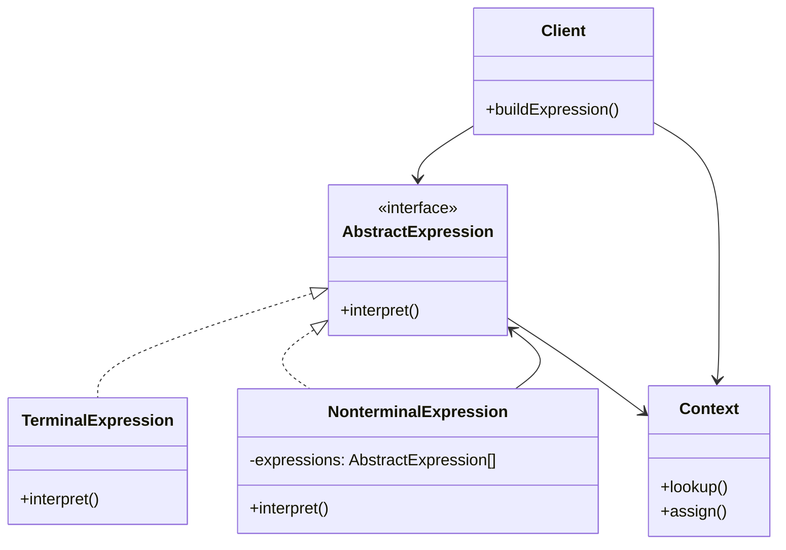

# Interpreter Pattern

## Introduction
The Interpreter pattern defines a grammatical representation for a language and provides an interpreter to deal with this grammar. This pattern is used to define a language, its grammar, and an interpreter that uses the grammar to interpret sentences in the language.

## Why Interpreter?
- Defines a language grammar
- Provides an interpreter for the language
- Makes grammar rules explicit
- Supports language extensions
- Simplifies complex expressions

## Structure


## Implementation Example: Boolean Expression Parser
```cpp
// Context
class Context {
private:
    map<string, bool> variables;
    
public:
    void setVariable(const string& name, bool value) {
        variables[name] = value;
    }
    
    bool getVariable(const string& name) const {
        auto it = variables.find(name);
        return it != variables.end() ? it->second : false;
    }
};

// Abstract expression
class BooleanExpression {
public:
    virtual bool interpret(const Context& context) const = 0;
    virtual ~BooleanExpression() = default;
};

// Terminal expressions
class VariableExpression : public BooleanExpression {
private:
    string name;
    
public:
    VariableExpression(const string& name) : name(name) {}
    
    bool interpret(const Context& context) const override {
        return context.getVariable(name);
    }
};

class ConstantExpression : public BooleanExpression {
private:
    bool value;
    
public:
    ConstantExpression(bool value) : value(value) {}
    
    bool interpret(const Context& context) const override {
        return value;
    }
};

// Non-terminal expressions
class AndExpression : public BooleanExpression {
private:
    unique_ptr<BooleanExpression> left;
    unique_ptr<BooleanExpression> right;
    
public:
    AndExpression(unique_ptr<BooleanExpression> left, 
                 unique_ptr<BooleanExpression> right)
        : left(move(left)), right(move(right)) {}
    
    bool interpret(const Context& context) const override {
        return left->interpret(context) && right->interpret(context);
    }
};

class OrExpression : public BooleanExpression {
private:
    unique_ptr<BooleanExpression> left;
    unique_ptr<BooleanExpression> right;
    
public:
    OrExpression(unique_ptr<BooleanExpression> left,
                unique_ptr<BooleanExpression> right)
        : left(move(left)), right(move(right)) {}
    
    bool interpret(const Context& context) const override {
        return left->interpret(context) || right->interpret(context);
    }
};

class NotExpression : public BooleanExpression {
private:
    unique_ptr<BooleanExpression> expression;
    
public:
    NotExpression(unique_ptr<BooleanExpression> expression)
        : expression(move(expression)) {}
    
    bool interpret(const Context& context) const override {
        return !expression->interpret(context);
    }
};

// Client
class BooleanExpressionParser {
public:
    static unique_ptr<BooleanExpression> parse(const string& expression) {
        // Simple parser for demonstration
        if (expression == "true") {
            return make_unique<ConstantExpression>(true);
        } else if (expression == "false") {
            return make_unique<ConstantExpression>(false);
        } else if (expression[0] == '!') {
            return make_unique<NotExpression>(parse(expression.substr(1)));
        } else if (expression.find("&&") != string::npos) {
            size_t pos = expression.find("&&");
            return make_unique<AndExpression>(
                parse(expression.substr(0, pos)),
                parse(expression.substr(pos + 2))
            );
        } else if (expression.find("||") != string::npos) {
            size_t pos = expression.find("||");
            return make_unique<OrExpression>(
                parse(expression.substr(0, pos)),
                parse(expression.substr(pos + 2))
            );
        } else {
            return make_unique<VariableExpression>(expression);
        }
    }
};
```

## Usage Example
```cpp
void demonstrateInterpreter() {
    Context context;
    context.setVariable("x", true);
    context.setVariable("y", false);
    
    // Parse and evaluate expressions
    auto expr1 = BooleanExpressionParser::parse("x && y");
    cout << "x && y = " << expr1->interpret(context) << endl;
    
    auto expr2 = BooleanExpressionParser::parse("x || y");
    cout << "x || y = " << expr2->interpret(context) << endl;
    
    auto expr3 = BooleanExpressionParser::parse("!x");
    cout << "!x = " << expr3->interpret(context) << endl;
}
```

## Real-World Example: SQL Query Parser
```cpp
// Context
class SQLContext {
private:
    map<string, vector<string>> tables;
    
public:
    void addTable(const string& name, const vector<string>& columns) {
        tables[name] = columns;
    }
    
    vector<string> getColumns(const string& table) const {
        auto it = tables.find(table);
        return it != tables.end() ? it->second : vector<string>();
    }
};

// Abstract expression
class SQLExpression {
public:
    virtual string interpret(const SQLContext& context) const = 0;
    virtual ~SQLExpression() = default;
};

// Terminal expressions
class TableExpression : public SQLExpression {
private:
    string tableName;
    
public:
    TableExpression(const string& name) : tableName(name) {}
    
    string interpret(const SQLContext& context) const override {
        return "FROM " + tableName;
    }
};

class ColumnExpression : public SQLExpression {
private:
    string columnName;
    
public:
    ColumnExpression(const string& name) : columnName(name) {}
    
    string interpret(const SQLContext& context) const override {
        return columnName;
    }
};

// Non-terminal expressions
class SelectExpression : public SQLExpression {
private:
    vector<unique_ptr<SQLExpression>> columns;
    unique_ptr<SQLExpression> table;
    
public:
    SelectExpression(vector<unique_ptr<SQLExpression>> columns,
                    unique_ptr<SQLExpression> table)
        : columns(move(columns)), table(move(table)) {}
    
    string interpret(const SQLContext& context) const override {
        string result = "SELECT ";
        
        // Add columns
        for (size_t i = 0; i < columns.size(); ++i) {
            if (i > 0) result += ", ";
            result += columns[i]->interpret(context);
        }
        
        // Add table
        result += " " + table->interpret(context);
        
        return result;
    }
};

class WhereExpression : public SQLExpression {
private:
    unique_ptr<SQLExpression> query;
    string condition;
    
public:
    WhereExpression(unique_ptr<SQLExpression> query, const string& condition)
        : query(move(query)), condition(condition) {}
    
    string interpret(const SQLContext& context) const override {
        return query->interpret(context) + " WHERE " + condition;
    }
};

// Client
class SQLQueryBuilder {
public:
    static unique_ptr<SQLExpression> buildQuery(
        const vector<string>& columns,
        const string& table,
        const string& condition = "") {
        
        // Build column expressions
        vector<unique_ptr<SQLExpression>> columnExprs;
        for (const auto& col : columns) {
            columnExprs.push_back(make_unique<ColumnExpression>(col));
        }
        
        // Build table expression
        auto tableExpr = make_unique<TableExpression>(table);
        
        // Build select expression
        auto selectExpr = make_unique<SelectExpression>(
            move(columnExprs), move(tableExpr));
        
        // Add where clause if condition exists
        if (!condition.empty()) {
            return make_unique<WhereExpression>(move(selectExpr), condition);
        }
        
        return selectExpr;
    }
};

// Usage
void demonstrateSQLParser() {
    SQLContext context;
    context.addTable("users", {"id", "name", "email"});
    
    // Build and interpret queries
    auto query1 = SQLQueryBuilder::buildQuery(
        {"name", "email"}, "users");
    cout << query1->interpret(context) << endl;
    
    auto query2 = SQLQueryBuilder::buildQuery(
        {"id", "name"}, "users", "id > 100");
    cout << query2->interpret(context) << endl;
}
```

## Best Practices
1. Use when you need to interpret a language
2. Apply when the grammar is simple
3. Consider when you need to extend the language
4. Use for domain-specific languages
5. Keep expressions focused and simple

## Common Pitfalls
1. Creating too complex grammars
2. Violating the Single Responsibility Principle
3. Making expressions too complex
4. Not handling errors properly
5. Over-engineering simple scenarios

## Practice Problems
1. Implement a calculator expression parser
2. Create a regular expression engine
3. Design a configuration file parser

## Interview Questions
1. What is the Interpreter pattern?
2. When should you use Interpreter?
3. How does Interpreter differ from Visitor?
4. What are the advantages of using Interpreter?
5. How do you handle grammar errors?

## Summary
- Interpreter defines a language grammar
- It provides an interpreter for the language
- Makes grammar rules explicit
- Supports language extensions
- Can be combined with other patterns effectively 