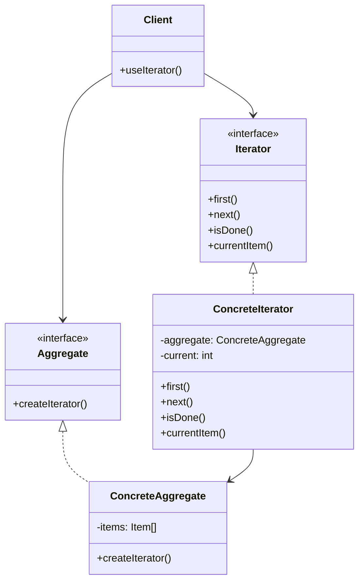

# Iterator Pattern

## Introduction
The Iterator pattern provides a way to access elements of a collection sequentially without exposing its underlying representation. This pattern decouples algorithms from containers and provides a uniform interface for traversing different types of collections.

## Why Iterator?
- Provides a uniform way to traverse collections
- Decouples algorithms from containers
- Supports multiple traversal methods
- Simplifies collection interfaces
- Enables parallel iteration

## Structure


## Implementation Example: Custom Collection
```cpp
// Iterator interface
template<typename T>
class Iterator {
public:
    virtual void first() = 0;
    virtual void next() = 0;
    virtual bool isDone() const = 0;
    virtual T currentItem() const = 0;
    virtual ~Iterator() = default;
};

// Aggregate interface
template<typename T>
class Aggregate {
public:
    virtual unique_ptr<Iterator<T>> createIterator() = 0;
    virtual ~Aggregate() = default;
};

// Concrete collection
template<typename T>
class CustomCollection : public Aggregate<T> {
private:
    vector<T> items;
    
public:
    void add(const T& item) {
        items.push_back(item);
    }
    
    T& get(size_t index) {
        return items[index];
    }
    
    size_t size() const {
        return items.size();
    }
    
    unique_ptr<Iterator<T>> createIterator() override;
};

// Forward iterator
template<typename T>
class ForwardIterator : public Iterator<T> {
private:
    CustomCollection<T>& collection;
    size_t current;
    
public:
    ForwardIterator(CustomCollection<T>& collection)
        : collection(collection), current(0) {}
    
    void first() override {
        current = 0;
    }
    
    void next() override {
        current++;
    }
    
    bool isDone() const override {
        return current >= collection.size();
    }
    
    T currentItem() const override {
        return collection.get(current);
    }
};

// Reverse iterator
template<typename T>
class ReverseIterator : public Iterator<T> {
private:
    CustomCollection<T>& collection;
    size_t current;
    
public:
    ReverseIterator(CustomCollection<T>& collection)
        : collection(collection), current(collection.size() - 1) {}
    
    void first() override {
        current = collection.size() - 1;
    }
    
    void next() override {
        current--;
    }
    
    bool isDone() const override {
        return current >= collection.size();
    }
    
    T currentItem() const override {
        return collection.get(current);
    }
};

// Implement createIterator
template<typename T>
unique_ptr<Iterator<T>> CustomCollection<T>::createIterator() {
    return make_unique<ForwardIterator<T>>(*this);
}
```

## Usage Example
```cpp
void demonstrateIterator() {
    CustomCollection<int> collection;
    collection.add(1);
    collection.add(2);
    collection.add(3);
    
    // Forward iteration
    auto forwardIter = collection.createIterator();
    cout << "Forward iteration:" << endl;
    for (forwardIter->first(); !forwardIter->isDone(); forwardIter->next()) {
        cout << forwardIter->currentItem() << " ";
    }
    cout << endl;
    
    // Reverse iteration
    auto reverseIter = make_unique<ReverseIterator<int>>(collection);
    cout << "Reverse iteration:" << endl;
    for (reverseIter->first(); !reverseIter->isDone(); reverseIter->next()) {
        cout << reverseIter->currentItem() << " ";
    }
    cout << endl;
}
```

## Real-World Example: File System Iterator
```cpp
// File system node
class FileSystemNode {
private:
    string name;
    bool isDirectory;
    vector<unique_ptr<FileSystemNode>> children;
    
public:
    FileSystemNode(const string& name, bool isDirectory)
        : name(name), isDirectory(isDirectory) {}
    
    void addChild(unique_ptr<FileSystemNode> child) {
        children.push_back(move(child));
    }
    
    const string& getName() const { return name; }
    bool getIsDirectory() const { return isDirectory; }
    const vector<unique_ptr<FileSystemNode>>& getChildren() const { return children; }
};

// File system iterator
class FileSystemIterator : public Iterator<FileSystemNode*> {
private:
    FileSystemNode* root;
    vector<FileSystemNode*> stack;
    
public:
    FileSystemIterator(FileSystemNode* root) : root(root) {
        stack.push_back(root);
    }
    
    void first() override {
        stack.clear();
        stack.push_back(root);
    }
    
    void next() override {
        if (!isDone()) {
            FileSystemNode* current = stack.back();
            stack.pop_back();
            
            // Add children in reverse order
            const auto& children = current->getChildren();
            for (auto it = children.rbegin(); it != children.rend(); ++it) {
                stack.push_back(it->get());
            }
        }
    }
    
    bool isDone() const override {
        return stack.empty();
    }
    
    FileSystemNode* currentItem() const override {
        return stack.back();
    }
};

// File system
class FileSystem : public Aggregate<FileSystemNode*> {
private:
    unique_ptr<FileSystemNode> root;
    
public:
    FileSystem() {
        root = make_unique<FileSystemNode>("/", true);
    }
    
    void addFile(const string& path, bool isDirectory) {
        vector<string> parts = splitPath(path);
        FileSystemNode* current = root.get();
        
        // Navigate to parent directory
        for (size_t i = 0; i < parts.size() - 1; ++i) {
            for (const auto& child : current->getChildren()) {
                if (child->getName() == parts[i]) {
                    current = child.get();
                    break;
                }
            }
        }
        
        // Add new node
        current->addChild(make_unique<FileSystemNode>(parts.back(), isDirectory));
    }
    
    unique_ptr<Iterator<FileSystemNode*>> createIterator() override {
        return make_unique<FileSystemIterator>(root.get());
    }
    
private:
    vector<string> splitPath(const string& path) {
        vector<string> parts;
        string current;
        for (char c : path) {
            if (c == '/') {
                if (!current.empty()) {
                    parts.push_back(current);
                    current.clear();
                }
            } else {
                current += c;
            }
        }
        if (!current.empty()) {
            parts.push_back(current);
        }
        return parts;
    }
};

// Usage
void demonstrateFileSystem() {
    FileSystem fs;
    
    // Create directory structure
    fs.addFile("/home", true);
    fs.addFile("/home/user", true);
    fs.addFile("/home/user/documents", true);
    fs.addFile("/home/user/documents/file1.txt", false);
    fs.addFile("/home/user/documents/file2.txt", false);
    
    // Iterate through file system
    auto iter = fs.createIterator();
    for (iter->first(); !iter->isDone(); iter->next()) {
        FileSystemNode* node = iter->currentItem();
        cout << (node->getIsDirectory() ? "Directory: " : "File: ")
             << node->getName() << endl;
    }
}
```

## Best Practices
1. Use when you need to traverse collections
2. Apply when you want to hide collection implementation
3. Consider when you need multiple traversal methods
4. Use for complex data structures
5. Keep iterators focused and simple

## Common Pitfalls
1. Creating too complex iterators
2. Violating the Single Responsibility Principle
3. Making iterators too coupled to collections
4. Not handling concurrent modification
5. Over-engineering simple scenarios

## Practice Problems
1. Implement a tree iterator
2. Create a graph traversal iterator
3. Design a composite iterator

## Interview Questions
1. What is the Iterator pattern?
2. When should you use Iterator?
3. How does Iterator differ from Visitor?
4. What are the advantages of using Iterator?
5. How do you handle concurrent modification?

## Summary
- Iterator provides a uniform traversal interface
- It decouples algorithms from containers
- Supports multiple traversal methods
- Simplifies collection interfaces
- Can be combined with other patterns effectively 