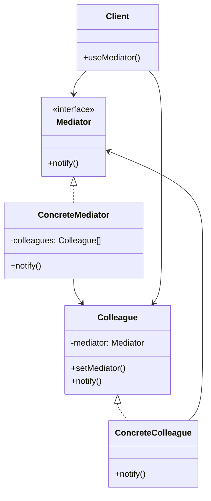

# Mediator Pattern

## Introduction
The Mediator pattern defines an object that encapsulates how a set of objects interact. This pattern promotes loose coupling by keeping objects from referring to each other explicitly, and it lets you vary their interaction independently.

## Why Mediator?
- Reduces coupling between components
- Centralizes complex communications
- Simplifies object protocols
- Makes components more reusable
- Improves maintainability

## Structure


## Implementation Example: Chat Room
```cpp
// Mediator interface
class ChatMediator {
public:
    virtual void sendMessage(const string& message, class User* sender) = 0;
    virtual void addUser(class User* user) = 0;
    virtual ~ChatMediator() = default;
};

// Colleague
class User {
protected:
    ChatMediator* mediator;
    string name;
    
public:
    User(const string& name) : name(name), mediator(nullptr) {}
    
    void setMediator(ChatMediator* mediator) {
        this->mediator = mediator;
    }
    
    string getName() const { return name; }
    
    virtual void send(const string& message) {
        if (mediator) {
            mediator->sendMessage(message, this);
        }
    }
    
    virtual void receive(const string& message, User* sender) {
        cout << name << " received from " << sender->getName() 
             << ": " << message << endl;
    }
};

// Concrete mediator
class ChatRoom : public ChatMediator {
private:
    vector<User*> users;
    
public:
    void addUser(User* user) override {
        users.push_back(user);
        user->setMediator(this);
    }
    
    void sendMessage(const string& message, User* sender) override {
        for (auto user : users) {
            if (user != sender) {
                user->receive(message, sender);
            }
        }
    }
};

// Concrete colleague
class ChatUser : public User {
public:
    ChatUser(const string& name) : User(name) {}
    
    void receive(const string& message, User* sender) override {
        cout << "[" << name << "] Message from " << sender->getName() 
             << ": " << message << endl;
    }
};
```

## Usage Example
```cpp
void demonstrateChatRoom() {
    // Create mediator
    ChatRoom chatRoom;
    
    // Create users
    ChatUser alice("Alice");
    ChatUser bob("Bob");
    ChatUser charlie("Charlie");
    
    // Add users to chat room
    chatRoom.addUser(&alice);
    chatRoom.addUser(&bob);
    chatRoom.addUser(&charlie);
    
    // Send messages
    alice.send("Hello everyone!");
    bob.send("Hi Alice!");
    charlie.send("Hey there!");
}
```

## Real-World Example: Air Traffic Control
```cpp
// Aircraft types
enum class AircraftType {
    PASSENGER,
    CARGO,
    MILITARY
};

// Mediator interface
class AirTrafficControl {
public:
    virtual void registerAircraft(class Aircraft* aircraft) = 0;
    virtual void requestLanding(class Aircraft* aircraft) = 0;
    virtual void requestTakeoff(class Aircraft* aircraft) = 0;
    virtual void notifyAircraft(const string& message, class Aircraft* sender) = 0;
    virtual ~AirTrafficControl() = default;
};

// Colleague
class Aircraft {
protected:
    AirTrafficControl* atc;
    string callsign;
    AircraftType type;
    bool isLanded;
    
public:
    Aircraft(const string& callsign, AircraftType type)
        : callsign(callsign), type(type), atc(nullptr), isLanded(true) {}
    
    void setATC(AirTrafficControl* atc) {
        this->atc = atc;
    }
    
    string getCallsign() const { return callsign; }
    AircraftType getType() const { return type; }
    bool getIsLanded() const { return isLanded; }
    
    virtual void requestLanding() {
        if (atc) {
            atc->requestLanding(this);
        }
    }
    
    virtual void requestTakeoff() {
        if (atc) {
            atc->requestTakeoff(this);
        }
    }
    
    virtual void receiveMessage(const string& message) {
        cout << callsign << " received: " << message << endl;
    }
};

// Concrete mediator
class Tower : public AirTrafficControl {
private:
    vector<Aircraft*> aircraft;
    vector<Aircraft*> landingQueue;
    vector<Aircraft*> takeoffQueue;
    
public:
    void registerAircraft(Aircraft* aircraft) override {
        this->aircraft.push_back(aircraft);
        aircraft->setATC(this);
    }
    
    void requestLanding(Aircraft* aircraft) override {
        if (!aircraft->getIsLanded()) {
            landingQueue.push_back(aircraft);
            processLandingQueue();
        }
    }
    
    void requestTakeoff(Aircraft* aircraft) override {
        if (aircraft->getIsLanded()) {
            takeoffQueue.push_back(aircraft);
            processTakeoffQueue();
        }
    }
    
    void notifyAircraft(const string& message, Aircraft* sender) override {
        for (auto aircraft : this->aircraft) {
            if (aircraft != sender) {
                aircraft->receiveMessage(message);
            }
        }
    }
    
private:
    void processLandingQueue() {
        if (!landingQueue.empty()) {
            auto aircraft = landingQueue.front();
            landingQueue.erase(landingQueue.begin());
            
            // Simulate landing
            cout << aircraft->getCallsign() << " is landing" << endl;
            notifyAircraft(aircraft->getCallsign() + " is landing", aircraft);
        }
    }
    
    void processTakeoffQueue() {
        if (!takeoffQueue.empty()) {
            auto aircraft = takeoffQueue.front();
            takeoffQueue.erase(takeoffQueue.begin());
            
            // Simulate takeoff
            cout << aircraft->getCallsign() << " is taking off" << endl;
            notifyAircraft(aircraft->getCallsign() + " is taking off", aircraft);
        }
    }
};

// Concrete colleague
class PassengerAircraft : public Aircraft {
public:
    PassengerAircraft(const string& callsign)
        : Aircraft(callsign, AircraftType::PASSENGER) {}
    
    void receiveMessage(const string& message) override {
        cout << "Passenger aircraft " << callsign << " received: " 
             << message << endl;
    }
};

// Usage
void demonstrateATC() {
    // Create tower
    Tower tower;
    
    // Create aircraft
    PassengerAircraft flight1("FLIGHT1");
    PassengerAircraft flight2("FLIGHT2");
    PassengerAircraft flight3("FLIGHT3");
    
    // Register aircraft
    tower.registerAircraft(&flight1);
    tower.registerAircraft(&flight2);
    tower.registerAircraft(&flight3);
    
    // Simulate air traffic
    flight1.requestTakeoff();
    flight2.requestLanding();
    flight3.requestTakeoff();
}
```

## Best Practices
1. Use when objects communicate in complex ways
2. Apply when you want to reduce coupling
3. Consider when you need to centralize control
4. Use for complex event handling
5. Keep mediator focused and simple

## Common Pitfalls
1. Creating a god object
2. Violating the Single Responsibility Principle
3. Making mediator too complex
4. Not handling errors properly
5. Over-engineering simple scenarios

## Practice Problems
1. Implement a GUI event system
2. Create a multiplayer game mediator
3. Design a workflow management system

## Interview Questions
1. What is the Mediator pattern?
2. When should you use Mediator?
3. How does Mediator differ from Observer?
4. What are the advantages of using Mediator?
5. How do you handle complex interactions?

## Summary
- Mediator centralizes complex communications
- It reduces coupling between components
- Simplifies object protocols
- Makes components more reusable
- Can be combined with other patterns effectively 