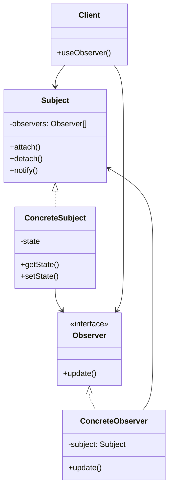

# Observer Pattern

## Introduction
The Observer pattern defines a one-to-many dependency between objects so that when one object changes state, all its dependents are notified and updated automatically. This pattern is fundamental for implementing event handling systems and maintaining consistency between related objects.

## Why Observer?
- Decouples subject from observers
- Supports broadcast communication
- Enables event handling
- Maintains consistency
- Facilitates loose coupling

## Structure


## Implementation Example: Weather Station
```cpp
// Observer interface
class Observer {
public:
    virtual void update(float temperature, float humidity, float pressure) = 0;
    virtual ~Observer() = default;
};

// Subject interface
class Subject {
public:
    virtual void registerObserver(Observer* observer) = 0;
    virtual void removeObserver(Observer* observer) = 0;
    virtual void notifyObservers() = 0;
    virtual ~Subject() = default;
};

// Concrete subject
class WeatherStation : public Subject {
private:
    vector<Observer*> observers;
    float temperature;
    float humidity;
    float pressure;
    
public:
    void registerObserver(Observer* observer) override {
        observers.push_back(observer);
    }
    
    void removeObserver(Observer* observer) override {
        auto it = find(observers.begin(), observers.end(), observer);
        if (it != observers.end()) {
            observers.erase(it);
        }
    }
    
    void notifyObservers() override {
        for (auto observer : observers) {
            observer->update(temperature, humidity, pressure);
        }
    }
    
    void setMeasurements(float temperature, float humidity, float pressure) {
        this->temperature = temperature;
        this->humidity = humidity;
        this->pressure = pressure;
        notifyObservers();
    }
};

// Concrete observers
class CurrentConditionsDisplay : public Observer {
private:
    float temperature;
    float humidity;
    Subject* weatherStation;
    
public:
    CurrentConditionsDisplay(Subject* weatherStation) 
        : weatherStation(weatherStation) {
        weatherStation->registerObserver(this);
    }
    
    void update(float temperature, float humidity, float pressure) override {
        this->temperature = temperature;
        this->humidity = humidity;
        display();
    }
    
    void display() const {
        cout << "Current conditions: " << temperature 
             << "F degrees and " << humidity << "% humidity" << endl;
    }
};

class StatisticsDisplay : public Observer {
private:
    float maxTemp;
    float minTemp;
    float tempSum;
    int numReadings;
    Subject* weatherStation;
    
public:
    StatisticsDisplay(Subject* weatherStation) 
        : weatherStation(weatherStation), maxTemp(0), minTemp(200),
          tempSum(0), numReadings(0) {
        weatherStation->registerObserver(this);
    }
    
    void update(float temperature, float humidity, float pressure) override {
        tempSum += temperature;
        numReadings++;
        
        if (temperature > maxTemp) {
            maxTemp = temperature;
        }
        
        if (temperature < minTemp) {
            minTemp = temperature;
        }
        
        display();
    }
    
    void display() const {
        cout << "Avg/Max/Min temperature = " << (tempSum / numReadings)
             << "/" << maxTemp << "/" << minTemp << endl;
    }
};
```

## Usage Example
```cpp
void demonstrateWeatherStation() {
    WeatherStation weatherStation;
    
    CurrentConditionsDisplay currentDisplay(&weatherStation);
    StatisticsDisplay statisticsDisplay(&weatherStation);
    
    // Simulate new weather measurements
    weatherStation.setMeasurements(80, 65, 30.4f);
    weatherStation.setMeasurements(82, 70, 29.2f);
    weatherStation.setMeasurements(78, 90, 29.2f);
}
```

## Real-World Example: Stock Market
```cpp
// Stock data
struct StockData {
    string symbol;
    double price;
    double change;
    
    StockData(const string& symbol, double price, double change)
        : symbol(symbol), price(price), change(change) {}
};

// Observer interface
class StockObserver {
public:
    virtual void update(const StockData& data) = 0;
    virtual ~StockObserver() = default;
};

// Subject interface
class StockSubject {
public:
    virtual void registerObserver(StockObserver* observer) = 0;
    virtual void removeObserver(StockObserver* observer) = 0;
    virtual void notifyObservers() = 0;
    virtual ~StockSubject() = default;
};

// Concrete subject
class StockMarket : public StockSubject {
private:
    vector<StockObserver*> observers;
    map<string, StockData> stocks;
    
public:
    void registerObserver(StockObserver* observer) override {
        observers.push_back(observer);
    }
    
    void removeObserver(StockObserver* observer) override {
        auto it = find(observers.begin(), observers.end(), observer);
        if (it != observers.end()) {
            observers.erase(it);
        }
    }
    
    void notifyObservers() override {
        for (const auto& stock : stocks) {
            for (auto observer : observers) {
                observer->update(stock.second);
            }
        }
    }
    
    void updateStock(const string& symbol, double price, double change) {
        stocks[symbol] = StockData(symbol, price, change);
        notifyObservers();
    }
};

// Concrete observers
class StockTrader : public StockObserver {
private:
    string name;
    set<string> watchList;
    
public:
    StockTrader(const string& name) : name(name) {}
    
    void addToWatchList(const string& symbol) {
        watchList.insert(symbol);
    }
    
    void update(const StockData& data) override {
        if (watchList.find(data.symbol) != watchList.end()) {
            cout << name << " received update for " << data.symbol << ":" << endl;
            cout << "Price: " << data.price << ", Change: " << data.change << "%" << endl;
            
            // Simple trading logic
            if (data.change > 5.0) {
                cout << name << " is selling " << data.symbol << endl;
            } else if (data.change < -5.0) {
                cout << name << " is buying " << data.symbol << endl;
            }
        }
    }
};

class StockAnalyst : public StockObserver {
private:
    map<string, vector<double>> priceHistory;
    
public:
    void update(const StockData& data) override {
        priceHistory[data.symbol].push_back(data.price);
        
        // Simple analysis
        if (priceHistory[data.symbol].size() >= 3) {
            const auto& history = priceHistory[data.symbol];
            double avg = accumulate(history.end() - 3, history.end(), 0.0) / 3;
            
            cout << "Analyst report for " << data.symbol << ":" << endl;
            cout << "Current price: " << data.price << endl;
            cout << "3-day average: " << avg << endl;
            
            if (data.price > avg * 1.1) {
                cout << "Recommendation: Overvalued" << endl;
            } else if (data.price < avg * 0.9) {
                cout << "Recommendation: Undervalued" << endl;
            } else {
                cout << "Recommendation: Hold" << endl;
            }
        }
    }
};

// Usage
void demonstrateStockMarket() {
    StockMarket market;
    
    // Create observers
    StockTrader trader1("John");
    StockTrader trader2("Alice");
    StockAnalyst analyst;
    
    // Register observers
    market.registerObserver(&trader1);
    market.registerObserver(&trader2);
    market.registerObserver(&analyst);
    
    // Set up watch lists
    trader1.addToWatchList("AAPL");
    trader1.addToWatchList("GOOGL");
    trader2.addToWatchList("MSFT");
    trader2.addToWatchList("AAPL");
    
    // Simulate stock updates
    market.updateStock("AAPL", 150.0, 2.5);
    market.updateStock("GOOGL", 2800.0, 6.2);
    market.updateStock("MSFT", 300.0, -1.5);
    
    market.updateStock("AAPL", 155.0, 3.3);
    market.updateStock("GOOGL", 2750.0, -1.8);
    market.updateStock("MSFT", 305.0, 1.7);
}
```

## Best Practices
1. Use when you need to notify multiple objects
2. Apply when you want to decouple subjects and observers
3. Consider when you need event handling
4. Use for maintaining consistency
5. Keep observers focused and simple

## Common Pitfalls
1. Creating too many observers
2. Violating the Single Responsibility Principle
3. Making observers too complex
4. Not handling observer lifecycle
5. Over-engineering simple scenarios

## Practice Problems
1. Implement a chat application
2. Create a logging system
3. Design a notification system

## Interview Questions
1. What is the Observer pattern?
2. When should you use Observer?
3. How does Observer differ from Mediator?
4. What are the advantages of using Observer?
5. How do you handle observer lifecycle?

## Summary
- Observer decouples subject from observers
- It supports broadcast communication
- Enables event handling
- Maintains consistency
- Can be combined with other patterns effectively 