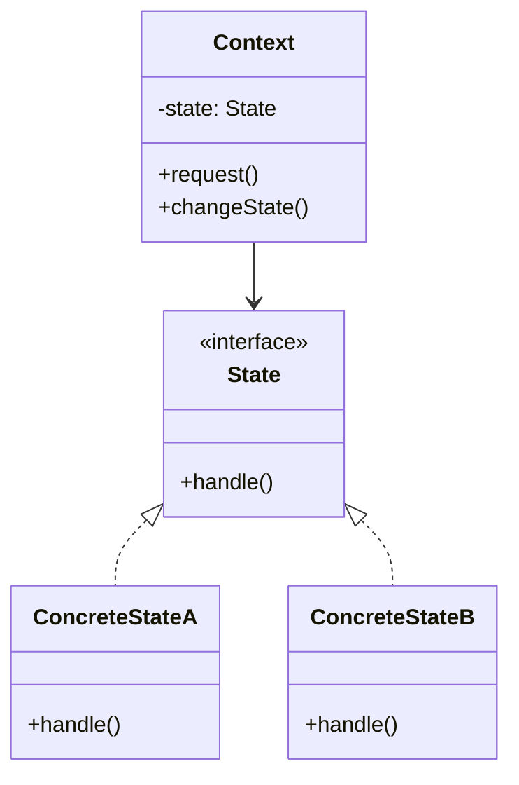

# State Pattern

## Introduction
The State pattern allows an object to alter its behavior when its internal state changes. The object will appear to change its class. This pattern is particularly useful when an object's behavior depends on its state, and the number of states is large or the state-specific behavior is complex.

## Why State?
- Encapsulates state-specific behavior
- Makes state transitions explicit
- Eliminates conditional statements
- Simplifies state management
- Improves code maintainability

## Structure


## Implementation Example: Vending Machine
```cpp
// State interface
class VendingMachineState {
public:
    virtual void insertCoin() = 0;
    virtual void ejectCoin() = 0;
    virtual void selectItem() = 0;
    virtual void dispense() = 0;
    virtual ~VendingMachineState() = default;
};

// Context
class VendingMachine {
private:
    VendingMachineState* state;
    int itemCount;
    int coinCount;
    
public:
    VendingMachine(int itemCount) 
        : itemCount(itemCount), coinCount(0) {
        state = new NoCoinState(this);
    }
    
    void setState(VendingMachineState* newState) {
        delete state;
        state = newState;
    }
    
    void insertCoin() {
        state->insertCoin();
    }
    
    void ejectCoin() {
        state->ejectCoin();
    }
    
    void selectItem() {
        state->selectItem();
    }
    
    void dispense() {
        state->dispense();
    }
    
    int getItemCount() const { return itemCount; }
    int getCoinCount() const { return coinCount; }
    
    void incrementCoinCount() { coinCount++; }
    void decrementCoinCount() { coinCount--; }
    void decrementItemCount() { itemCount--; }
};

// Concrete states
class NoCoinState : public VendingMachineState {
private:
    VendingMachine* machine;
    
public:
    NoCoinState(VendingMachine* machine) : machine(machine) {}
    
    void insertCoin() override {
        cout << "Coin inserted" << endl;
        machine->incrementCoinCount();
        machine->setState(new HasCoinState(machine));
    }
    
    void ejectCoin() override {
        cout << "No coin to eject" << endl;
    }
    
    void selectItem() override {
        cout << "Please insert a coin first" << endl;
    }
    
    void dispense() override {
        cout << "Please insert a coin first" << endl;
    }
};

class HasCoinState : public VendingMachineState {
private:
    VendingMachine* machine;
    
public:
    HasCoinState(VendingMachine* machine) : machine(machine) {}
    
    void insertCoin() override {
        cout << "Coin already inserted" << endl;
    }
    
    void ejectCoin() override {
        cout << "Coin ejected" << endl;
        machine->decrementCoinCount();
        machine->setState(new NoCoinState(machine));
    }
    
    void selectItem() override {
        if (machine->getItemCount() > 0) {
            cout << "Item selected" << endl;
            machine->setState(new SoldState(machine));
        } else {
            cout << "Item out of stock" << endl;
            machine->setState(new SoldOutState(machine));
        }
    }
    
    void dispense() override {
        cout << "Please select an item first" << endl;
    }
};

class SoldState : public VendingMachineState {
private:
    VendingMachine* machine;
    
public:
    SoldState(VendingMachine* machine) : machine(machine) {}
    
    void insertCoin() override {
        cout << "Please wait, item is being dispensed" << endl;
    }
    
    void ejectCoin() override {
        cout << "Sorry, item is being dispensed" << endl;
    }
    
    void selectItem() override {
        cout << "Please wait, item is being dispensed" << endl;
    }
    
    void dispense() override {
        cout << "Item dispensed" << endl;
        machine->decrementItemCount();
        machine->decrementCoinCount();
        
        if (machine->getItemCount() > 0) {
            machine->setState(new NoCoinState(machine));
        } else {
            machine->setState(new SoldOutState(machine));
        }
    }
};

class SoldOutState : public VendingMachineState {
private:
    VendingMachine* machine;
    
public:
    SoldOutState(VendingMachine* machine) : machine(machine) {}
    
    void insertCoin() override {
        cout << "Machine is sold out" << endl;
    }
    
    void ejectCoin() override {
        cout << "No coin to eject" << endl;
    }
    
    void selectItem() override {
        cout << "Machine is sold out" << endl;
    }
    
    void dispense() override {
        cout << "Machine is sold out" << endl;
    }
};
```

## Usage Example
```cpp
void demonstrateVendingMachine() {
    VendingMachine machine(2);  // Start with 2 items
    
    // Normal flow
    machine.insertCoin();
    machine.selectItem();
    machine.dispense();
    
    // Try to get item without coin
    machine.selectItem();
    
    // Get last item
    machine.insertCoin();
    machine.selectItem();
    machine.dispense();
    
    // Try to get item when sold out
    machine.insertCoin();
    machine.selectItem();
}
```

## Real-World Example: Document Editor
```cpp
// Document states
class DocumentState {
public:
    virtual void edit() = 0;
    virtual void review() = 0;
    virtual void approve() = 0;
    virtual void publish() = 0;
    virtual ~DocumentState() = default;
};

// Context
class Document {
private:
    DocumentState* state;
    string content;
    
public:
    Document() {
        state = new DraftState(this);
    }
    
    void setState(DocumentState* newState) {
        delete state;
        state = newState;
    }
    
    void edit() {
        state->edit();
    }
    
    void review() {
        state->review();
    }
    
    void approve() {
        state->approve();
    }
    
    void publish() {
        state->publish();
    }
    
    void setContent(const string& content) {
        this->content = content;
    }
    
    string getContent() const {
        return content;
    }
};

// Concrete states
class DraftState : public DocumentState {
private:
    Document* document;
    
public:
    DraftState(Document* document) : document(document) {}
    
    void edit() override {
        cout << "Document is being edited" << endl;
    }
    
    void review() override {
        cout << "Document is being reviewed" << endl;
        document->setState(new ReviewState(document));
    }
    
    void approve() override {
        cout << "Document must be reviewed first" << endl;
    }
    
    void publish() override {
        cout << "Document must be approved first" << endl;
    }
};

class ReviewState : public DocumentState {
private:
    Document* document;
    
public:
    ReviewState(Document* document) : document(document) {}
    
    void edit() override {
        cout << "Document is being edited after review" << endl;
        document->setState(new DraftState(document));
    }
    
    void review() override {
        cout << "Document is already under review" << endl;
    }
    
    void approve() override {
        cout << "Document is being approved" << endl;
        document->setState(new ApprovedState(document));
    }
    
    void publish() override {
        cout << "Document must be approved first" << endl;
    }
};

class ApprovedState : public DocumentState {
private:
    Document* document;
    
public:
    ApprovedState(Document* document) : document(document) {}
    
    void edit() override {
        cout << "Document is being edited after approval" << endl;
        document->setState(new DraftState(document));
    }
    
    void review() override {
        cout << "Document is already approved" << endl;
    }
    
    void approve() override {
        cout << "Document is already approved" << endl;
    }
    
    void publish() override {
        cout << "Document is being published" << endl;
        document->setState(new PublishedState(document));
    }
};

class PublishedState : public DocumentState {
private:
    Document* document;
    
public:
    PublishedState(Document* document) : document(document) {}
    
    void edit() override {
        cout << "Published document cannot be edited" << endl;
    }
    
    void review() override {
        cout << "Published document cannot be reviewed" << endl;
    }
    
    void approve() override {
        cout << "Published document cannot be approved" << endl;
    }
    
    void publish() override {
        cout << "Document is already published" << endl;
    }
};

// Usage
void demonstrateDocumentWorkflow() {
    Document doc;
    
    // Normal workflow
    doc.edit();
    doc.review();
    doc.approve();
    doc.publish();
    
    // Try to edit published document
    doc.edit();
    
    // Start new version
    doc.setContent("New version");
    doc.edit();
}
```

## Best Practices
1. Use when object behavior depends on state
2. Apply when you have many conditional statements
3. Consider when state transitions are complex
4. Use for state-specific behavior
5. Keep states focused and simple

## Common Pitfalls
1. Creating too many states
2. Making states too complex
3. Not handling state transitions properly
4. Violating the Single Responsibility Principle
5. Over-engineering simple state changes

## Practice Problems
1. Implement a traffic light system
2. Create a game character state machine
3. Design a network connection handler

## Interview Questions
1. What is the State pattern?
2. When should you use State?
3. How does State differ from Strategy?
4. What are the advantages of using State?
5. How do you handle state transitions?

## Summary
- State encapsulates state-specific behavior
- It makes state transitions explicit
- Eliminates conditional statements
- Simplifies state management
- Can be combined with other patterns effectively 