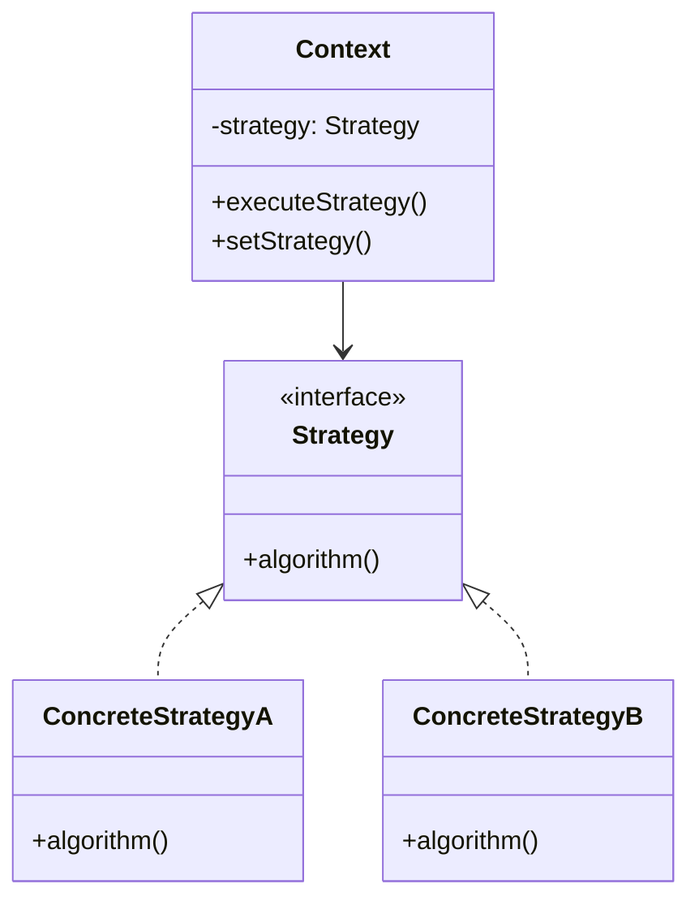

# Strategy Pattern

## Introduction
The Strategy pattern defines a family of algorithms, encapsulates each one, and makes them interchangeable. It lets the algorithm vary independently from clients that use it. This pattern is particularly useful when you need to select an algorithm at runtime or when you have a family of related algorithms.

## Why Strategy?
- Encapsulates algorithms
- Makes algorithms interchangeable
- Eliminates conditional statements
- Supports the Open/Closed Principle
- Improves code maintainability

## Structure


## Implementation Example: Payment Processing
```cpp
// Strategy interface
class PaymentStrategy {
public:
    virtual void pay(int amount) = 0;
    virtual ~PaymentStrategy() = default;
};

// Context
class PaymentProcessor {
private:
    PaymentStrategy* strategy;
    
public:
    void setStrategy(PaymentStrategy* newStrategy) {
        strategy = newStrategy;
    }
    
    void processPayment(int amount) {
        strategy->pay(amount);
    }
};

// Concrete strategies
class CreditCardPayment : public PaymentStrategy {
private:
    string cardNumber;
    string cvv;
    
public:
    CreditCardPayment(const string& cardNumber, const string& cvv)
        : cardNumber(cardNumber), cvv(cvv) {}
    
    void pay(int amount) override {
        cout << "Processing credit card payment of $" << amount << endl;
        cout << "Card number: " << cardNumber << endl;
        // Process credit card payment
    }
};

class PayPalPayment : public PaymentStrategy {
private:
    string email;
    
public:
    PayPalPayment(const string& email) : email(email) {}
    
    void pay(int amount) override {
        cout << "Processing PayPal payment of $" << amount << endl;
        cout << "Email: " << email << endl;
        // Process PayPal payment
    }
};

class BitcoinPayment : public PaymentStrategy {
private:
    string walletAddress;
    
public:
    BitcoinPayment(const string& walletAddress) : walletAddress(walletAddress) {}
    
    void pay(int amount) override {
        cout << "Processing Bitcoin payment of $" << amount << endl;
        cout << "Wallet address: " << walletAddress << endl;
        // Process Bitcoin payment
    }
};
```

## Usage Example
```cpp
void demonstratePaymentProcessing() {
    PaymentProcessor processor;
    
    // Process credit card payment
    processor.setStrategy(new CreditCardPayment("1234-5678-9012-3456", "123"));
    processor.processPayment(100);
    
    // Switch to PayPal
    processor.setStrategy(new PayPalPayment("user@example.com"));
    processor.processPayment(200);
    
    // Switch to Bitcoin
    processor.setStrategy(new BitcoinPayment("1A1zP1eP5QGefi2DMPTfTL5SLmv7DivfNa"));
    processor.processPayment(300);
}
```

## Real-World Example: Sorting Algorithms
```cpp
// Strategy interface
class SortStrategy {
public:
    virtual void sort(vector<int>& data) = 0;
    virtual ~SortStrategy() = default;
};

// Context
class Sorter {
private:
    SortStrategy* strategy;
    
public:
    void setStrategy(SortStrategy* newStrategy) {
        strategy = newStrategy;
    }
    
    void sort(vector<int>& data) {
        strategy->sort(data);
    }
};

// Concrete strategies
class BubbleSort : public SortStrategy {
public:
    void sort(vector<int>& data) override {
        cout << "Sorting using Bubble Sort" << endl;
        int n = data.size();
        for (int i = 0; i < n-1; i++) {
            for (int j = 0; j < n-i-1; j++) {
                if (data[j] > data[j+1]) {
                    swap(data[j], data[j+1]);
                }
            }
        }
    }
};

class QuickSort : public SortStrategy {
private:
    int partition(vector<int>& data, int low, int high) {
        int pivot = data[high];
        int i = (low - 1);
        
        for (int j = low; j <= high - 1; j++) {
            if (data[j] < pivot) {
                i++;
                swap(data[i], data[j]);
            }
        }
        swap(data[i + 1], data[high]);
        return (i + 1);
    }
    
    void quickSort(vector<int>& data, int low, int high) {
        if (low < high) {
            int pi = partition(data, low, high);
            quickSort(data, low, pi - 1);
            quickSort(data, pi + 1, high);
        }
    }
    
public:
    void sort(vector<int>& data) override {
        cout << "Sorting using Quick Sort" << endl;
        quickSort(data, 0, data.size() - 1);
    }
};

class MergeSort : public SortStrategy {
private:
    void merge(vector<int>& data, int left, int mid, int right) {
        vector<int> temp(right - left + 1);
        int i = left, j = mid + 1, k = 0;
        
        while (i <= mid && j <= right) {
            if (data[i] <= data[j]) {
                temp[k++] = data[i++];
            } else {
                temp[k++] = data[j++];
            }
        }
        
        while (i <= mid) {
            temp[k++] = data[i++];
        }
        
        while (j <= right) {
            temp[k++] = data[j++];
        }
        
        for (i = 0; i < k; i++) {
            data[left + i] = temp[i];
        }
    }
    
    void mergeSort(vector<int>& data, int left, int right) {
        if (left < right) {
            int mid = left + (right - left) / 2;
            mergeSort(data, left, mid);
            mergeSort(data, mid + 1, right);
            merge(data, left, mid, right);
        }
    }
    
public:
    void sort(vector<int>& data) override {
        cout << "Sorting using Merge Sort" << endl;
        mergeSort(data, 0, data.size() - 1);
    }
};

// Usage
void demonstrateSorting() {
    Sorter sorter;
    vector<int> data = {64, 34, 25, 12, 22, 11, 90};
    
    // Sort using different strategies
    sorter.setStrategy(new BubbleSort());
    sorter.sort(data);
    printVector(data);
    
    data = {64, 34, 25, 12, 22, 11, 90};
    sorter.setStrategy(new QuickSort());
    sorter.sort(data);
    printVector(data);
    
    data = {64, 34, 25, 12, 22, 11, 90};
    sorter.setStrategy(new MergeSort());
    sorter.sort(data);
    printVector(data);
}

void printVector(const vector<int>& data) {
    for (int value : data) {
        cout << value << " ";
    }
    cout << endl;
}
```

## Best Practices
1. Use when you need to select an algorithm at runtime
2. Apply when you have a family of related algorithms
3. Consider when you want to avoid conditional statements
4. Use for algorithm encapsulation
5. Keep strategies focused and simple

## Common Pitfalls
1. Creating too many strategies
2. Making strategies too complex
3. Not handling strategy selection properly
4. Violating the Single Responsibility Principle
5. Over-engineering simple scenarios

## Practice Problems
1. Implement different compression algorithms
2. Create various validation strategies
3. Design multiple notification methods

## Interview Questions
1. What is the Strategy pattern?
2. When should you use Strategy?
3. How does Strategy differ from State?
4. What are the advantages of using Strategy?
5. How do you handle strategy selection?

## Summary
- Strategy encapsulates algorithms
- It makes algorithms interchangeable
- Eliminates conditional statements
- Supports the Open/Closed Principle
- Can be combined with other patterns effectively 