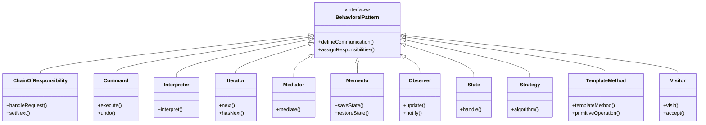

# Behavioral Design Patterns Summary

## Overview
Behavioral patterns focus on algorithms and the assignment of responsibilities between objects. They describe not just patterns of objects or classes but also the patterns of communication between them. These patterns characterize complex control flow that's difficult to follow at run-time.

## Pattern Relationships

## Pattern Descriptions

### 1. Chain of Responsibility
- **Purpose**: Avoids coupling the sender of a request to its receiver by giving more than one object a chance to handle the request
- **Use Cases**: 
  - Event handling systems
  - Logging systems
  - Exception handling
  - Request processing pipelines
- **Key Components**:
  - Handler interface
  - Concrete handlers
  - Client

### 2. Command
- **Purpose**: Encapsulates a request as an object, allowing parameterization of clients with different requests
- **Use Cases**:
  - GUI buttons and menu items
  - Macro recording
  - Multi-level undo/redo
  - Job queuing
- **Key Components**:
  - Command interface
  - Concrete commands
  - Invoker
  - Receiver

### 3. Interpreter
- **Purpose**: Defines a grammatical representation for a language and provides an interpreter
- **Use Cases**:
  - SQL parsers
  - Regular expressions
  - Mathematical expressions
  - Domain-specific languages
- **Key Components**:
  - Abstract expression
  - Terminal expression
  - Non-terminal expression
  - Context

### 4. Iterator
- **Purpose**: Provides a way to access elements of a collection sequentially without exposing its underlying representation
- **Use Cases**:
  - Collection traversal
  - Custom data structures
  - File system navigation
  - Database result sets
- **Key Components**:
  - Iterator interface
  - Concrete iterator
  - Aggregate interface
  - Concrete aggregate

### 5. Mediator
- **Purpose**: Defines an object that encapsulates how a set of objects interact
- **Use Cases**:
  - GUI components
  - Chat applications
  - Air traffic control
  - Event-driven systems
- **Key Components**:
  - Mediator interface
  - Concrete mediator
  - Colleague classes

### 6. Memento
- **Purpose**: Captures and externalizes an object's internal state for later restoration
- **Use Cases**:
  - Undo/redo functionality
  - Game save states
  - Transaction rollback
  - Checkpoint systems
- **Key Components**:
  - Originator
  - Memento
  - Caretaker

### 7. Observer
- **Purpose**: Defines a one-to-many dependency between objects
- **Use Cases**:
  - Event handling
  - Model-View-Controller
  - Publish-subscribe systems
  - Real-time data updates
- **Key Components**:
  - Subject
  - Observer
  - Concrete subject
  - Concrete observer

### 8. State
- **Purpose**: Allows an object to alter its behavior when its internal state changes
- **Use Cases**:
  - Workflow engines
  - Game state management
  - Document editing
  - Network protocols
- **Key Components**:
  - Context
  - State interface
  - Concrete states

### 9. Strategy
- **Purpose**: Defines a family of algorithms, encapsulates each one, and makes them interchangeable
- **Use Cases**:
  - Payment processing
  - Sorting algorithms
  - Compression algorithms
  - Validation strategies
- **Key Components**:
  - Strategy interface
  - Concrete strategies
  - Context

### 10. Template Method
- **Purpose**: Defines the skeleton of an algorithm in a method, deferring some steps to subclasses
- **Use Cases**:
  - Framework design
  - Build processes
  - Data processing pipelines
  - Algorithm customization
- **Key Components**:
  - Abstract class
  - Concrete classes
  - Template method
  - Primitive operations

### 11. Visitor
- **Purpose**: Represents an operation to be performed on elements of an object structure
- **Use Cases**:
  - Document processing
  - Compiler design
  - Report generation
  - Data validation
- **Key Components**:
  - Visitor interface
  - Concrete visitors
  - Element interface
  - Concrete elements

## Relationships Between Patterns

### Complementary Patterns
1. **Command and Memento**
   - Command for action encapsulation
   - Memento for state restoration
   - Together they enable undo/redo functionality

2. **Observer and Mediator**
   - Observer for loose coupling
   - Mediator for centralized communication
   - Together they manage complex interactions

3. **State and Strategy**
   - State for behavior changes
   - Strategy for algorithm selection
   - Both involve behavior variation

4. **Template Method and Strategy**
   - Template Method for algorithm structure
   - Strategy for algorithm variation
   - Different approaches to algorithm customization

### Pattern Combinations
1. **Chain of Responsibility + Command**
   - Command objects passed through chain
   - Enables complex request processing

2. **Observer + Mediator**
   - Mediator as subject
   - Components as observers
   - Manages complex component interactions

3. **State + Strategy**
   - State determines strategy
   - Strategy implements state behavior
   - Flexible behavior management

## Best Practices

### When to Use Each Pattern
1. **Chain of Responsibility**
   - Multiple objects can handle a request
   - Handler is not known a priori
   - Request should be processed by multiple objects

2. **Command**
   - Need to parameterize objects with operations
   - Need to queue operations
   - Need to support undo/redo

3. **Interpreter**
   - Need to interpret a language
   - Grammar is simple
   - Performance is not critical

4. **Iterator**
   - Need to access collection elements
   - Want to hide collection implementation
   - Need multiple traversal methods

5. **Mediator**
   - Objects communicate in complex ways
   - Need to reduce coupling
   - Need centralized communication

6. **Memento**
   - Need to save object state
   - Direct state access is not desirable
   - Need to support undo/redo

7. **Observer**
   - Need to maintain consistency
   - Change in one object affects others
   - Need loose coupling

8. **State**
   - Object behavior depends on state
   - States are well-defined
   - State transitions are clear

9. **Strategy**
   - Need to define a family of algorithms
   - Algorithms are interchangeable
   - Need to hide algorithm implementation

10. **Template Method**
    - Have an algorithm with invariant steps
    - Want to let subclasses customize steps
    - Need to control algorithm flow

11. **Visitor**
    - Need to perform operations across objects
    - Want to add new operations
    - Operations are related

### Implementation Tips
1. Keep patterns focused and simple
2. Consider pattern combinations carefully
3. Document pattern usage and relationships
4. Use patterns to solve real problems
5. Consider maintenance and evolution

## Real-World Applications

### Software Development
1. **IDE Features**
   - Command for actions
   - Observer for UI updates
   - Memento for undo/redo

2. **Build Systems**
   - Template Method for build steps
   - Strategy for build configurations
   - Chain of Responsibility for build tasks

3. **Testing Frameworks**
   - Observer for test results
   - Command for test cases
   - Strategy for test runners

### Enterprise Applications
1. **Workflow Systems**
   - State for process states
   - Command for actions
   - Observer for notifications

2. **Event Processing**
   - Chain of Responsibility for event handling
   - Observer for event distribution
   - Command for event actions

3. **Reporting Systems**
   - Template Method for report generation
   - Strategy for output formats
   - Visitor for data processing

## Interview Preparation

### Key Points to Remember
1. Pattern purposes and use cases
2. Pattern relationships and combinations
3. Implementation considerations
4. Real-world applications
5. Trade-offs and alternatives

### Common Questions
1. When to use each pattern?
2. How patterns relate to each other?
3. Pattern implementation details
4. Pattern combinations and trade-offs
5. Real-world examples and applications

## Conclusion
Behavioral patterns provide powerful solutions for managing complex object interactions and algorithms. Understanding these patterns and their relationships helps in designing flexible, maintainable, and extensible systems. The key is to apply patterns judiciously, considering the specific problem context and system requirements. 