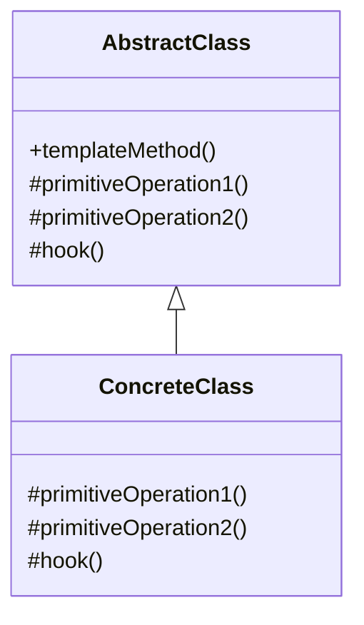

# Template Method Pattern

## Introduction
The Template Method pattern defines the skeleton of an algorithm in a method, deferring some steps to subclasses. It lets subclasses redefine certain steps of an algorithm without changing the algorithm's structure. This pattern is particularly useful when you have an algorithm with invariant steps and variant steps that can be customized by subclasses.

## Why Template Method?
- Defines algorithm structure
- Allows step customization
- Promotes code reuse
- Controls algorithm flow
- Supports the Hollywood Principle

## Structure


## Implementation Example: Data Processing Pipeline
```cpp
// Abstract class with template method
class DataProcessor {
protected:
    virtual void loadData() = 0;
    virtual void processData() = 0;
    virtual void saveData() = 0;
    virtual void cleanup() {}  // Hook method
    
public:
    // Template method
    void process() {
        loadData();
        processData();
        saveData();
        cleanup();
    }
    
    virtual ~DataProcessor() = default;
};

// Concrete implementation
class CSVProcessor : public DataProcessor {
protected:
    void loadData() override {
        cout << "Loading CSV data..." << endl;
        // Load CSV file
    }
    
    void processData() override {
        cout << "Processing CSV data..." << endl;
        // Process CSV data
    }
    
    void saveData() override {
        cout << "Saving processed CSV data..." << endl;
        // Save processed data
    }
    
    void cleanup() override {
        cout << "Cleaning up CSV resources..." << endl;
        // Clean up CSV resources
    }
};

class JSONProcessor : public DataProcessor {
protected:
    void loadData() override {
        cout << "Loading JSON data..." << endl;
        // Load JSON file
    }
    
    void processData() override {
        cout << "Processing JSON data..." << endl;
        // Process JSON data
    }
    
    void saveData() override {
        cout << "Saving processed JSON data..." << endl;
        // Save processed data
    }
    // No cleanup override - using default implementation
};
```

## Usage Example
```cpp
void demonstrateDataProcessing() {
    // Process CSV data
    DataProcessor* csvProcessor = new CSVProcessor();
    csvProcessor->process();
    delete csvProcessor;
    
    // Process JSON data
    DataProcessor* jsonProcessor = new JSONProcessor();
    jsonProcessor->process();
    delete jsonProcessor;
}
```

## Real-World Example: Build Process
```cpp
// Abstract class with template method
class BuildProcess {
protected:
    virtual void fetchSource() = 0;
    virtual void installDependencies() = 0;
    virtual void compile() = 0;
    virtual void test() = 0;
    virtual void package() = 0;
    virtual void notifyTeam() {}  // Hook method
    
public:
    // Template method
    void build() {
        fetchSource();
        installDependencies();
        compile();
        test();
        package();
        notifyTeam();
    }
    
    virtual ~BuildProcess() = default;
};

// Concrete implementation
class JavaBuildProcess : public BuildProcess {
protected:
    void fetchSource() override {
        cout << "Fetching Java source code from repository..." << endl;
        // Fetch Java source
    }
    
    void installDependencies() override {
        cout << "Installing Maven dependencies..." << endl;
        // Install Maven dependencies
    }
    
    void compile() override {
        cout << "Compiling Java code..." << endl;
        // Compile Java code
    }
    
    void test() override {
        cout << "Running JUnit tests..." << endl;
        // Run JUnit tests
    }
    
    void package() override {
        cout << "Creating JAR file..." << endl;
        // Create JAR file
    }
    
    void notifyTeam() override {
        cout << "Sending email notification to Java team..." << endl;
        // Send email notification
    }
};

class PythonBuildProcess : public BuildProcess {
protected:
    void fetchSource() override {
        cout << "Fetching Python source code from repository..." << endl;
        // Fetch Python source
    }
    
    void installDependencies() override {
        cout << "Installing pip dependencies..." << endl;
        // Install pip dependencies
    }
    
    void compile() override {
        cout << "Compiling Python code..." << endl;
        // Compile Python code
    }
    
    void test() override {
        cout << "Running pytest..." << endl;
        // Run pytest
    }
    
    void package() override {
        cout << "Creating wheel package..." << endl;
        // Create wheel package
    }
    // No notifyTeam override - using default implementation
};

// Usage
void demonstrateBuildProcess() {
    // Build Java project
    BuildProcess* javaBuild = new JavaBuildProcess();
    javaBuild->build();
    delete javaBuild;
    
    // Build Python project
    BuildProcess* pythonBuild = new PythonBuildProcess();
    pythonBuild->build();
    delete pythonBuild;
}
```

## Best Practices
1. Use when you have an algorithm with invariant steps
2. Apply when you want to let subclasses customize specific steps
3. Consider using hook methods for optional steps
4. Keep the template method simple
5. Make primitive operations protected

## Common Pitfalls
1. Making the template method too complex
2. Violating the Liskov Substitution Principle
3. Not using hook methods when appropriate
4. Making primitive operations public
5. Over-engineering simple scenarios

## Practice Problems
1. Implement different report generation processes
2. Create various data validation workflows
3. Design multiple deployment pipelines

## Interview Questions
1. What is the Template Method pattern?
2. When should you use Template Method?
3. How does Template Method differ from Strategy?
4. What are the advantages of using Template Method?
5. What is a hook method?

## Summary
- Template Method defines algorithm structure
- It allows step customization
- Promotes code reuse
- Controls algorithm flow
- Can be combined with other patterns effectively 