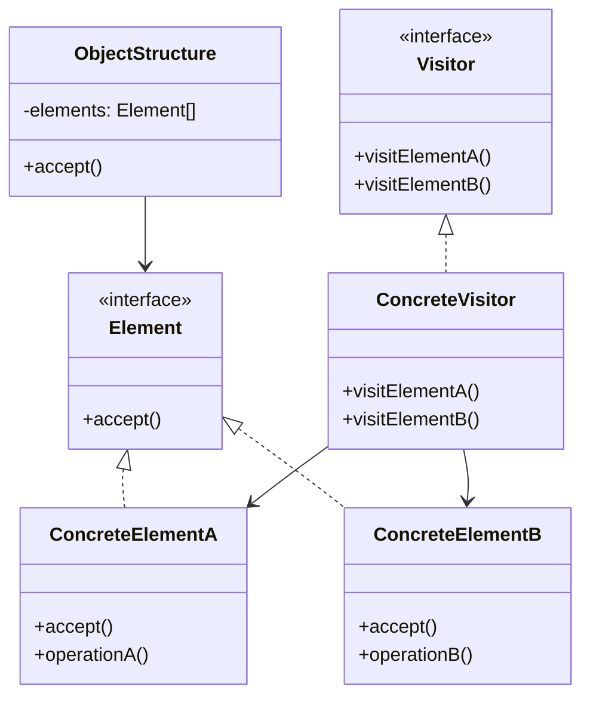

# Visitor Pattern

## Introduction
The Visitor pattern represents an operation to be performed on the elements of an object structure. It lets you define a new operation without changing the classes of the elements on which it operates. This pattern is particularly useful when you need to perform operations across a set of different objects without modifying their classes.

## Why Visitor?
- Separates algorithms from object structure
- Adds new operations easily
- Groups related operations
- Maintains Single Responsibility Principle
- Supports Open/Closed Principle

## Structure


## Implementation Example: Document Elements
```cpp
// Forward declarations
class Paragraph;
class Image;
class Table;

// Visitor interface
class DocumentVisitor {
public:
    virtual void visitParagraph(Paragraph* paragraph) = 0;
    virtual void visitImage(Image* image) = 0;
    virtual void visitTable(Table* table) = 0;
    virtual ~DocumentVisitor() = default;
};

// Element interface
class DocumentElement {
public:
    virtual void accept(DocumentVisitor* visitor) = 0;
    virtual ~DocumentElement() = default;
};

// Concrete elements
class Paragraph : public DocumentElement {
private:
    string text;
    
public:
    Paragraph(const string& text) : text(text) {}
    
    void accept(DocumentVisitor* visitor) override {
        visitor->visitParagraph(this);
    }
    
    string getText() const { return text; }
};

class Image : public DocumentElement {
private:
    string path;
    int width;
    int height;
    
public:
    Image(const string& path, int width, int height)
        : path(path), width(width), height(height) {}
    
    void accept(DocumentVisitor* visitor) override {
        visitor->visitImage(this);
    }
    
    string getPath() const { return path; }
    int getWidth() const { return width; }
    int getHeight() const { return height; }
};

class Table : public DocumentElement {
private:
    vector<vector<string>> data;
    
public:
    Table(const vector<vector<string>>& data) : data(data) {}
    
    void accept(DocumentVisitor* visitor) override {
        visitor->visitTable(this);
    }
    
    const vector<vector<string>>& getData() const { return data; }
};

// Concrete visitors
class HTMLExportVisitor : public DocumentVisitor {
public:
    void visitParagraph(Paragraph* paragraph) override {
        cout << "<p>" << paragraph->getText() << "</p>" << endl;
    }
    
    void visitImage(Image* image) override {
        cout << "getPath() 
             << "\" width=\"" << image->getWidth()
             << "\" height=\"" << image->getHeight()
             << "\">" << endl;
    }
    
    void visitTable(Table* table) override {
        cout << "<table>" << endl;
        for (const auto& row : table->getData()) {
            cout << "  <tr>" << endl;
            for (const auto& cell : row) {
                cout << "    <td>" << cell << "</td>" << endl;
            }
            cout << "  </tr>" << endl;
        }
        cout << "</table>" << endl;
    }
};

class MarkdownExportVisitor : public DocumentVisitor {
public:
    void visitParagraph(Paragraph* paragraph) override {
        cout << paragraph->getText() << endl << endl;
    }
    
    void visitImage(Image* image) override {
        cout << " << ")" << endl;
    }
    
    void visitTable(Table* table) override {
        for (const auto& row : table->getData()) {
            cout << "| ";
            for (const auto& cell : row) {
                cout << cell << " | ";
            }
            cout << endl;
        }
    }
};

// Object structure
class Document {
private:
    vector<DocumentElement*> elements;
    
public:
    void addElement(DocumentElement* element) {
        elements.push_back(element);
    }
    
    void accept(DocumentVisitor* visitor) {
        for (auto element : elements) {
            element->accept(visitor);
        }
    }
    
    ~Document() {
        for (auto element : elements) {
            delete element;
        }
    }
};
```

## Usage Example
```cpp
void demonstrateDocumentExport() {
    Document doc;
    
    // Add elements
    doc.addElement(new Paragraph("This is a paragraph."));
    doc.addElement(new Image("image.jpg", 800, 600));
    doc.addElement(new Table({
        {"Header 1", "Header 2"},
        {"Cell 1", "Cell 2"},
        {"Cell 3", "Cell 4"}
    }));
    
    // Export to HTML
    cout << "Exporting to HTML:" << endl;
    doc.accept(new HTMLExportVisitor());
    
    // Export to Markdown
    cout << "\nExporting to Markdown:" << endl;
    doc.accept(new MarkdownExportVisitor());
}
```

## Real-World Example: Expression Evaluator
```cpp
// Forward declarations
class Number;
class Addition;
class Subtraction;
class Multiplication;

// Visitor interface
class ExpressionVisitor {
public:
    virtual void visitNumber(Number* number) = 0;
    virtual void visitAddition(Addition* addition) = 0;
    virtual void visitSubtraction(Subtraction* subtraction) = 0;
    virtual void visitMultiplication(Multiplication* multiplication) = 0;
    virtual ~ExpressionVisitor() = default;
};

// Element interface
class Expression {
public:
    virtual void accept(ExpressionVisitor* visitor) = 0;
    virtual ~Expression() = default;
};

// Concrete elements
class Number : public Expression {
private:
    double value;
    
public:
    Number(double value) : value(value) {}
    
    void accept(ExpressionVisitor* visitor) override {
        visitor->visitNumber(this);
    }
    
    double getValue() const { return value; }
};

class Addition : public Expression {
private:
    Expression* left;
    Expression* right;
    
public:
    Addition(Expression* left, Expression* right)
        : left(left), right(right) {}
    
    void accept(ExpressionVisitor* visitor) override {
        visitor->visitAddition(this);
    }
    
    Expression* getLeft() const { return left; }
    Expression* getRight() const { return right; }
};

class Subtraction : public Expression {
private:
    Expression* left;
    Expression* right;
    
public:
    Subtraction(Expression* left, Expression* right)
        : left(left), right(right) {}
    
    void accept(ExpressionVisitor* visitor) override {
        visitor->visitSubtraction(this);
    }
    
    Expression* getLeft() const { return left; }
    Expression* getRight() const { return right; }
};

class Multiplication : public Expression {
private:
    Expression* left;
    Expression* right;
    
public:
    Multiplication(Expression* left, Expression* right)
        : left(left), right(right) {}
    
    void accept(ExpressionVisitor* visitor) override {
        visitor->visitMultiplication(this);
    }
    
    Expression* getLeft() const { return left; }
    Expression* getRight() const { return right; }
};

// Concrete visitors
class Evaluator : public ExpressionVisitor {
private:
    double result;
    
public:
    Evaluator() : result(0) {}
    
    void visitNumber(Number* number) override {
        result = number->getValue();
    }
    
    void visitAddition(Addition* addition) override {
        Evaluator leftEval, rightEval;
        addition->getLeft()->accept(&leftEval);
        addition->getRight()->accept(&rightEval);
        result = leftEval.getResult() + rightEval.getResult();
    }
    
    void visitSubtraction(Subtraction* subtraction) override {
        Evaluator leftEval, rightEval;
        subtraction->getLeft()->accept(&leftEval);
        subtraction->getRight()->accept(&rightEval);
        result = leftEval.getResult() - rightEval.getResult();
    }
    
    void visitMultiplication(Multiplication* multiplication) override {
        Evaluator leftEval, rightEval;
        multiplication->getLeft()->accept(&leftEval);
        multiplication->getRight()->accept(&rightEval);
        result = leftEval.getResult() * rightEval.getResult();
    }
    
    double getResult() const { return result; }
};

class Printer : public ExpressionVisitor {
private:
    string result;
    
public:
    Printer() : result("") {}
    
    void visitNumber(Number* number) override {
        result = to_string(number->getValue());
    }
    
    void visitAddition(Addition* addition) override {
        Printer leftPrint, rightPrint;
        addition->getLeft()->accept(&leftPrint);
        addition->getRight()->accept(&rightPrint);
        result = "(" + leftPrint.getResult() + " + " + rightPrint.getResult() + ")";
    }
    
    void visitSubtraction(Subtraction* subtraction) override {
        Printer leftPrint, rightPrint;
        subtraction->getLeft()->accept(&leftPrint);
        subtraction->getRight()->accept(&rightPrint);
        result = "(" + leftPrint.getResult() + " - " + rightPrint.getResult() + ")";
    }
    
    void visitMultiplication(Multiplication* multiplication) override {
        Printer leftPrint, rightPrint;
        multiplication->getLeft()->accept(&leftPrint);
        multiplication->getRight()->accept(&rightPrint);
        result = "(" + leftPrint.getResult() + " * " + rightPrint.getResult() + ")";
    }
    
    string getResult() const { return result; }
};

// Usage
void demonstrateExpressionEvaluation() {
    // Create expression: (2 + 3) * (4 - 1)
    Expression* expr = new Multiplication(
        new Addition(new Number(2), new Number(3)),
        new Subtraction(new Number(4), new Number(1))
    );
    
    // Evaluate expression
    Evaluator evaluator;
    expr->accept(&evaluator);
    cout << "Result: " << evaluator.getResult() << endl;
    
    // Print expression
    Printer printer;
    expr->accept(&printer);
    cout << "Expression: " << printer.getResult() << endl;
    
    delete expr;
}
```

## Best Practices
1. Use when you need to perform operations across different objects
2. Apply when you want to add new operations without changing classes
3. Consider when operations are related
4. Use for complex object structures
5. Keep visitors focused and simple

## Common Pitfalls
1. Breaking encapsulation
2. Making visitors too complex
3. Not handling all element types
4. Violating the Single Responsibility Principle
5. Over-engineering simple scenarios

## Practice Problems
1. Implement different report generators
2. Create various data validators
3. Design multiple format exporters

## Interview Questions
1. What is the Visitor pattern?
2. When should you use Visitor?
3. How does Visitor differ from Strategy?
4. What are the advantages of using Visitor?
5. How do you handle new element types?

## Summary
- Visitor separates algorithms from object structure
- It adds new operations easily
- Groups related operations
- Maintains Single Responsibility Principle
- Can be combined with other patterns effectively 