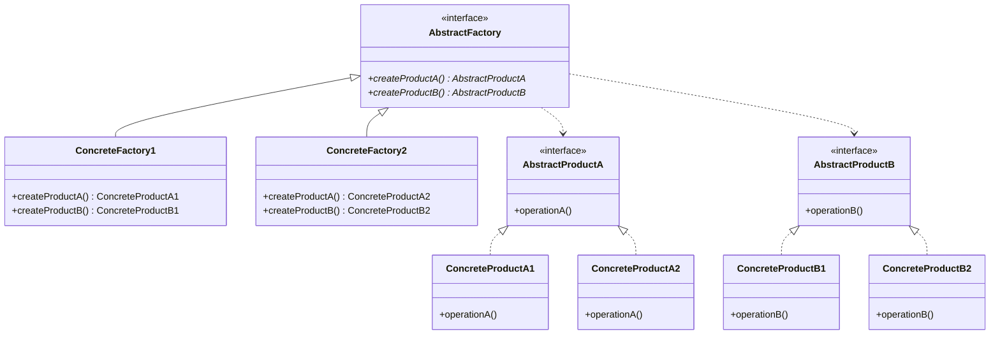

# Abstract Factory Pattern

## Introduction
The Abstract Factory pattern provides an interface for creating families of related or dependent objects without specifying their concrete classes. It's particularly useful when a system needs to be independent of how its products are created, composed, and represented.

## Why Abstract Factory?
- Ensures compatibility between related objects
- Encapsulates product creation
- Supports the Open/Closed Principle
- Provides a consistent interface
- Isolates concrete classes

## Structure


## Implementation Example: UI Components
```cpp
// Abstract products
class Button {
public:
    virtual void render() = 0;
    virtual void onClick() = 0;
    virtual ~Button() = default;
};

class TextBox {
public:
    virtual void render() = 0;
    virtual void onInput() = 0;
    virtual ~TextBox() = default;
};

// Concrete products for Windows
class WindowsButton : public Button {
public:
    void render() override {
        cout << "Rendering Windows button..." << endl;
    }
    
    void onClick() override {
        cout << "Windows button clicked!" << endl;
    }
};

class WindowsTextBox : public TextBox {
public:
    void render() override {
        cout << "Rendering Windows text box..." << endl;
    }
    
    void onInput() override {
        cout << "Windows text box input received!" << endl;
    }
};

// Concrete products for Mac
class MacButton : public Button {
public:
    void render() override {
        cout << "Rendering Mac button..." << endl;
    }
    
    void onClick() override {
        cout << "Mac button clicked!" << endl;
    }
};

class MacTextBox : public TextBox {
public:
    void render() override {
        cout << "Rendering Mac text box..." << endl;
    }
    
    void onInput() override {
        cout << "Mac text box input received!" << endl;
    }
};

// Abstract factory
class UIFactory {
public:
    virtual unique_ptr<Button> createButton() = 0;
    virtual unique_ptr<TextBox> createTextBox() = 0;
    virtual ~UIFactory() = default;
};

// Concrete factories
class WindowsUIFactory : public UIFactory {
public:
    unique_ptr<Button> createButton() override {
        return make_unique<WindowsButton>();
    }
    
    unique_ptr<TextBox> createTextBox() override {
        return make_unique<WindowsTextBox>();
    }
};

class MacUIFactory : public UIFactory {
public:
    unique_ptr<Button> createButton() override {
        return make_unique<MacButton>();
    }
    
    unique_ptr<TextBox> createTextBox() override {
        return make_unique<MacTextBox>();
    }
};
```

## Usage Example
```cpp
class Application {
private:
    unique_ptr<UIFactory> factory;
    
public:
    Application(unique_ptr<UIFactory> uiFactory) : factory(move(uiFactory)) {}
    
    void createUI() {
        auto button = factory->createButton();
        auto textBox = factory->createTextBox();
        
        button->render();
        textBox->render();
        
        button->onClick();
        textBox->onInput();
    }
};

void demonstrateAbstractFactory() {
    // Create Windows UI
    auto windowsFactory = make_unique<WindowsUIFactory>();
    Application windowsApp(move(windowsFactory));
    windowsApp.createUI();
    
    // Create Mac UI
    auto macFactory = make_unique<MacUIFactory>();
    Application macApp(move(macFactory));
    macApp.createUI();
}
```

## Real-World Example: Database Factory
```cpp
// Abstract products
class Connection {
public:
    virtual void connect() = 0;
    virtual void disconnect() = 0;
    virtual ~Connection() = default;
};

class Command {
public:
    virtual void execute(const string& query) = 0;
    virtual ~Command() = default;
};

// MySQL products
class MySQLConnection : public Connection {
public:
    void connect() override {
        cout << "Connecting to MySQL database..." << endl;
    }
    
    void disconnect() override {
        cout << "Disconnecting from MySQL database..." << endl;
    }
};

class MySQLCommand : public Command {
public:
    void execute(const string& query) override {
        cout << "Executing MySQL query: " << query << endl;
    }
};

// PostgreSQL products
class PostgreSQLConnection : public Connection {
public:
    void connect() override {
        cout << "Connecting to PostgreSQL database..." << endl;
    }
    
    void disconnect() override {
        cout << "Disconnecting from PostgreSQL database..." << endl;
    }
};

class PostgreSQLCommand : public Command {
public:
    void execute(const string& query) override {
        cout << "Executing PostgreSQL query: " << query << endl;
    }
};

// Abstract factory
class DatabaseFactory {
public:
    virtual unique_ptr<Connection> createConnection() = 0;
    virtual unique_ptr<Command> createCommand() = 0;
    virtual ~DatabaseFactory() = default;
};

// Concrete factories
class MySQLFactory : public DatabaseFactory {
public:
    unique_ptr<Connection> createConnection() override {
        return make_unique<MySQLConnection>();
    }
    
    unique_ptr<Command> createCommand() override {
        return make_unique<MySQLCommand>();
    }
};

class PostgreSQLFactory : public DatabaseFactory {
public:
    unique_ptr<Connection> createConnection() override {
        return make_unique<PostgreSQLConnection>();
    }
    
    unique_ptr<Command> createCommand() override {
        return make_unique<PostgreSQLCommand>();
    }
};

// Database client
class DatabaseClient {
private:
    unique_ptr<DatabaseFactory> factory;
    unique_ptr<Connection> connection;
    unique_ptr<Command> command;
    
public:
    DatabaseClient(unique_ptr<DatabaseFactory> dbFactory)
        : factory(move(dbFactory)) {
        connection = factory->createConnection();
        command = factory->createCommand();
    }
    
    void executeQuery(const string& query) {
        connection->connect();
        command->execute(query);
        connection->disconnect();
    }
};

// Usage
void demonstrateDatabaseFactory() {
    // Use MySQL
    auto mysqlFactory = make_unique<MySQLFactory>();
    DatabaseClient mysqlClient(move(mysqlFactory));
    mysqlClient.executeQuery("SELECT * FROM users");
    
    // Use PostgreSQL
    auto postgresFactory = make_unique<PostgreSQLFactory>();
    DatabaseClient postgresClient(move(postgresFactory));
    postgresClient.executeQuery("SELECT * FROM users");
}
```

## Best Practices
1. Use when you need to create families of related objects
2. Apply when you want to ensure product compatibility
3. Consider when you need to switch between product families
4. Use with dependency injection
5. Keep factories focused on specific product families

## Common Pitfalls
1. Creating too many product families
2. Mixing unrelated products
3. Not handling errors properly
4. Violating the Interface Segregation Principle
5. Over-engineering simple scenarios

## Practice Problems
1. Implement a cross-platform UI framework
2. Create a database abstraction layer
3. Design a game engine with different rendering systems

## Interview Questions
1. What is the Abstract Factory pattern?
2. When should you use Abstract Factory?
3. How does Abstract Factory differ from Factory Method?
4. What are the advantages of using Abstract Factory?
5. How do you handle product family changes?

## Summary
- Abstract Factory creates families of related objects
- It ensures product compatibility
- Supports the Open/Closed Principle
- Useful for complex object creation scenarios
- Can be combined with other patterns effectively 