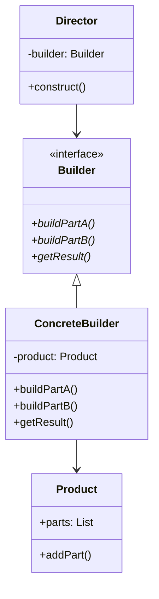

# Builder Pattern

## Introduction
The Builder pattern separates the construction of a complex object from its representation. It allows the same construction process to create different representations, making it easier to create complex objects step by step.

## Why Builder?
- Separates object construction from representation
- Provides fine-grained control over construction process
- Supports immutable objects
- Makes code more readable and maintainable
- Allows for different object representations

## Structure


## Implementation Example: Computer Builder
```cpp
// Product
class Computer {
private:
    string cpu;
    string ram;
    string storage;
    string gpu;
    
public:
    void setCPU(const string& cpu) { this->cpu = cpu; }
    void setRAM(const string& ram) { this->ram = ram; }
    void setStorage(const string& storage) { this->storage = storage; }
    void setGPU(const string& gpu) { this->gpu = gpu; }
    
    void display() const {
        cout << "Computer Configuration:" << endl;
        cout << "CPU: " << cpu << endl;
        cout << "RAM: " << ram << endl;
        cout << "Storage: " << storage << endl;
        cout << "GPU: " << gpu << endl;
    }
};

// Abstract Builder
class ComputerBuilder {
public:
    virtual void buildCPU() = 0;
    virtual void buildRAM() = 0;
    virtual void buildStorage() = 0;
    virtual void buildGPU() = 0;
    virtual Computer getResult() = 0;
    virtual ~ComputerBuilder() = default;
};

// Concrete Builder
class GamingComputerBuilder : public ComputerBuilder {
private:
    Computer computer;
    
public:
    void buildCPU() override {
        computer.setCPU("Intel i9-13900K");
    }
    
    void buildRAM() override {
        computer.setRAM("32GB DDR5");
    }
    
    void buildStorage() override {
        computer.setStorage("2TB NVMe SSD");
    }
    
    void buildGPU() override {
        computer.setGPU("NVIDIA RTX 4090");
    }
    
    Computer getResult() override {
        return computer;
    }
};

class OfficeComputerBuilder : public ComputerBuilder {
private:
    Computer computer;
    
public:
    void buildCPU() override {
        computer.setCPU("Intel i5-12400");
    }
    
    void buildRAM() override {
        computer.setRAM("16GB DDR4");
    }
    
    void buildStorage() override {
        computer.setStorage("512GB SSD");
    }
    
    void buildGPU() override {
        computer.setGPU("Intel UHD Graphics");
    }
    
    Computer getResult() override {
        return computer;
    }
};

// Director
class ComputerDirector {
public:
    void constructGamingComputer(ComputerBuilder& builder) {
        builder.buildCPU();
        builder.buildRAM();
        builder.buildStorage();
        builder.buildGPU();
    }
    
    void constructOfficeComputer(ComputerBuilder& builder) {
        builder.buildCPU();
        builder.buildRAM();
        builder.buildStorage();
        builder.buildGPU();
    }
};
```

## Usage Example
```cpp
void demonstrateBuilder() {
    ComputerDirector director;
    
    // Build a gaming computer
    GamingComputerBuilder gamingBuilder;
    director.constructGamingComputer(gamingBuilder);
    Computer gamingPC = gamingBuilder.getResult();
    cout << "\nGaming Computer:" << endl;
    gamingPC.display();
    
    // Build an office computer
    OfficeComputerBuilder officeBuilder;
    director.constructOfficeComputer(officeBuilder);
    Computer officePC = officeBuilder.getResult();
    cout << "\nOffice Computer:" << endl;
    officePC.display();
}
```

## Real-World Example: HTML Builder
```cpp
// Product
class HTMLDocument {
private:
    string content;
    
public:
    void addLine(const string& line) {
        content += line + "\n";
    }
    
    string getContent() const {
        return content;
    }
};

// Abstract Builder
class HTMLBuilder {
public:
    virtual void buildHeader() = 0;
    virtual void buildBody() = 0;
    virtual void buildFooter() = 0;
    virtual HTMLDocument getResult() = 0;
    virtual ~HTMLBuilder() = default;
};

// Concrete Builder
class SimpleHTMLBuilder : public HTMLBuilder {
private:
    HTMLDocument document;
    
public:
    void buildHeader() override {
        document.addLine("<!DOCTYPE html>");
        document.addLine("<html>");
        document.addLine("<head>");
        document.addLine("<title>Simple Page</title>");
        document.addLine("</head>");
    }
    
    void buildBody() override {
        document.addLine("<body>");
        document.addLine("<h1>Welcome</h1>");
        document.addLine("<p>This is a simple HTML page.</p>");
        document.addLine("</body>");
    }
    
    void buildFooter() override {
        document.addLine("<footer>");
        document.addLine("<p>&copy; 2024</p>");
        document.addLine("</footer>");
        document.addLine("</html>");
    }
    
    HTMLDocument getResult() override {
        return document;
    }
};

// Director
class HTMLDirector {
public:
    void constructSimplePage(HTMLBuilder& builder) {
        builder.buildHeader();
        builder.buildBody();
        builder.buildFooter();
    }
};

// Usage
void demonstrateHTMLBuilder() {
    HTMLDirector director;
    SimpleHTMLBuilder builder;
    
    director.constructSimplePage(builder);
    HTMLDocument document = builder.getResult();
    
    cout << "Generated HTML:" << endl;
    cout << document.getContent();
}
```

## Best Practices
1. Use when object construction is complex
2. Apply when you need different object representations
3. Consider when you want to create immutable objects
4. Use with fluent interfaces
5. Keep builders focused on specific object types

## Common Pitfalls
1. Creating too many builder classes
2. Not handling validation properly
3. Mixing construction and business logic
4. Violating the Single Responsibility Principle
5. Over-engineering simple objects

## Practice Problems
1. Implement a pizza builder
2. Create a report generator
3. Design a form builder

## Interview Questions
1. What is the Builder pattern?
2. When should you use Builder?
3. How does Builder differ from Factory?
4. What are the advantages of using Builder?
5. How do you handle validation in Builder?

## Summary
- Builder separates construction from representation
- It provides step-by-step object creation
- Supports different object representations
- Useful for complex object construction
- Can be combined with other patterns effectively 