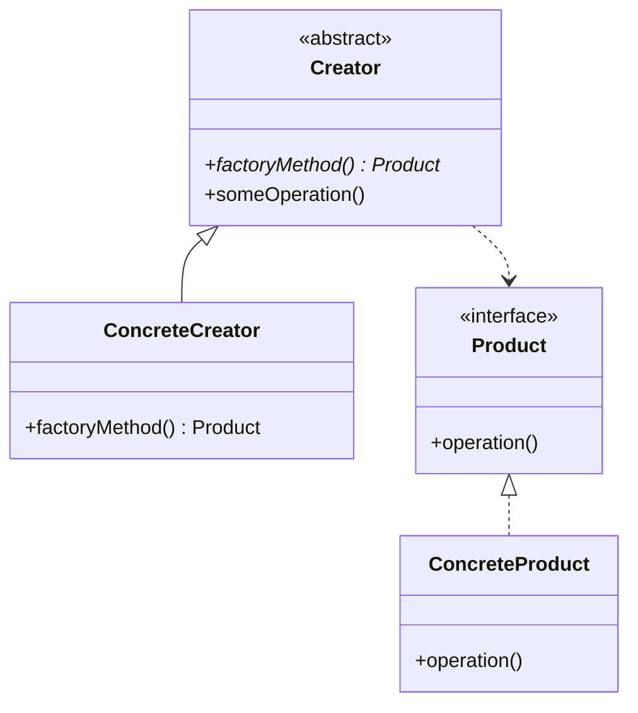

# Factory Method Pattern

## Introduction
The Factory Method pattern defines an interface for creating objects but lets subclasses decide which class to instantiate. It allows a class to defer instantiation to subclasses, promoting loose coupling and flexibility in object creation.

## Why Factory Method?
- Encapsulates object creation
- Promotes loose coupling
- Supports the Open/Closed Principle
- Enables runtime flexibility
- Simplifies object creation logic

## Structure


## Implementation Example
```cpp
// Product interface
class Document {
public:
    virtual void open() = 0;
    virtual void close() = 0;
    virtual void save() = 0;
    virtual ~Document() = default;
};

// Concrete products
class TextDocument : public Document {
public:
    void open() override {
        cout << "Opening text document..." << endl;
    }
    
    void close() override {
        cout << "Closing text document..." << endl;
    }
    
    void save() override {
        cout << "Saving text document..." << endl;
    }
};

class SpreadsheetDocument : public Document {
public:
    void open() override {
        cout << "Opening spreadsheet document..." << endl;
    }
    
    void close() override {
        cout << "Closing spreadsheet document..." << endl;
    }
    
    void save() override {
        cout << "Saving spreadsheet document..." << endl;
    }
};

// Creator abstract class
class DocumentCreator {
public:
    // Factory method
    virtual unique_ptr<Document> createDocument() = 0;
    
    // Template method
    void processDocument() {
        auto doc = createDocument();
        doc->open();
        doc->save();
        doc->close();
    }
    
    virtual ~DocumentCreator() = default;
};

// Concrete creators
class TextDocumentCreator : public DocumentCreator {
public:
    unique_ptr<Document> createDocument() override {
        return make_unique<TextDocument>();
    }
};

class SpreadsheetDocumentCreator : public DocumentCreator {
public:
    unique_ptr<Document> createDocument() override {
        return make_unique<SpreadsheetDocument>();
    }
};
```

## Usage Example
```cpp
void demonstrateFactoryMethod() {
    // Create a text document
    unique_ptr<DocumentCreator> textCreator = make_unique<TextDocumentCreator>();
    textCreator->processDocument();
    
    // Create a spreadsheet document
    unique_ptr<DocumentCreator> spreadsheetCreator = make_unique<SpreadsheetDocumentCreator>();
    spreadsheetCreator->processDocument();
}
```

## Real-World Example: Logger Factory
```cpp
// Log levels
enum class LogLevel {
    INFO,
    WARNING,
    ERROR
};

// Abstract logger
class Logger {
public:
    virtual void log(LogLevel level, const string& message) = 0;
    virtual ~Logger() = default;
};

// Concrete loggers
class FileLogger : public Logger {
private:
    string filename;
    
public:
    FileLogger(const string& filename) : filename(filename) {}
    
    void log(LogLevel level, const string& message) override {
        cout << "Logging to file " << filename << ": ";
        switch (level) {
            case LogLevel::INFO:
                cout << "[INFO] " << message << endl;
                break;
            case LogLevel::WARNING:
                cout << "[WARNING] " << message << endl;
                break;
            case LogLevel::ERROR:
                cout << "[ERROR] " << message << endl;
                break;
        }
    }
};

class ConsoleLogger : public Logger {
public:
    void log(LogLevel level, const string& message) override {
        switch (level) {
            case LogLevel::INFO:
                cout << "\033[32m[INFO]\033[0m " << message << endl;
                break;
            case LogLevel::WARNING:
                cout << "\033[33m[WARNING]\033[0m " << message << endl;
                break;
            case LogLevel::ERROR:
                cout << "\033[31m[ERROR]\033[0m " << message << endl;
                break;
        }
    }
};

// Logger factory
class LoggerFactory {
public:
    static unique_ptr<Logger> createLogger(const string& type, const string& filename = "") {
        if (type == "file") {
            return make_unique<FileLogger>(filename);
        } else if (type == "console") {
            return make_unique<ConsoleLogger>();
        }
        throw runtime_error("Unknown logger type");
    }
};

// Usage
void demonstrateLoggerFactory() {
    auto fileLogger = LoggerFactory::createLogger("file", "app.log");
    fileLogger->log(LogLevel::INFO, "Application started");
    fileLogger->log(LogLevel::ERROR, "Failed to connect to database");
    
    auto consoleLogger = LoggerFactory::createLogger("console");
    consoleLogger->log(LogLevel::WARNING, "Disk space low");
}
```

## Best Practices
1. Use when object creation logic is complex
2. Apply when you need to defer instantiation to subclasses
3. Consider when you want to localize object creation
4. Use with template methods
5. Keep factory methods focused

## Common Pitfalls
1. Overusing the pattern for simple object creation
2. Creating too many factory classes
3. Mixing factory logic with business logic
4. Not using proper error handling
5. Violating the Single Responsibility Principle

## Practice Problems
1. Implement a shape factory for different geometric shapes
2. Create a database connection factory
3. Design a UI component factory

## Interview Questions
1. What is the Factory Method pattern?
2. When should you use the Factory Method pattern?
3. What are the advantages of using Factory Method?
4. How does Factory Method differ from Simple Factory?
5. How do you handle errors in Factory Method?

## Summary
- Factory Method encapsulates object creation
- It promotes loose coupling and flexibility
- Supports the Open/Closed Principle
- Useful for complex object creation scenarios
- Can be combined with other patterns effectively 