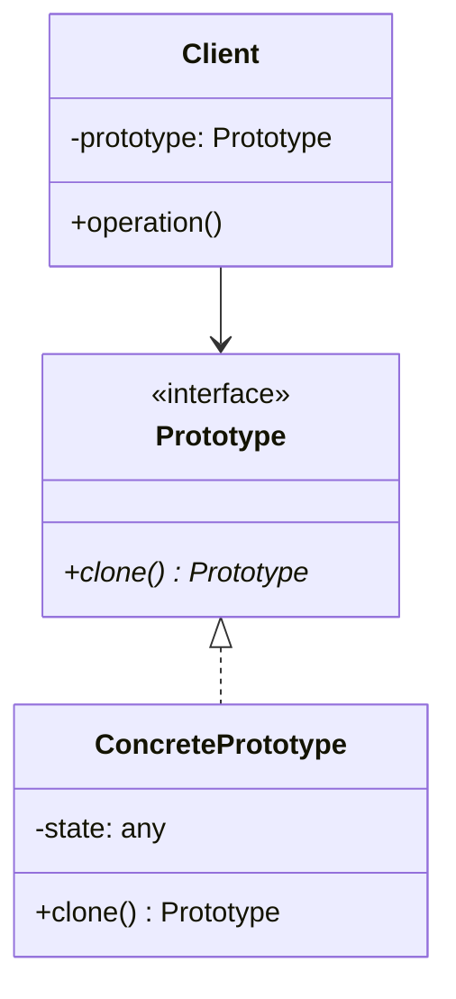

# Prototype Pattern

## Introduction
The Prototype pattern creates new objects by cloning an existing object, known as the prototype, instead of creating new instances from scratch. This pattern is particularly useful when object creation is expensive or when you want to avoid building a class hierarchy of factories.

## Why Prototype?
- Reduces subclassing
- Hides complexity of object creation
- Provides an alternative to inheritance
- Reduces initialization overhead
- Allows for dynamic object creation

## Structure


## Implementation Example: Shape Prototypes
```cpp
// Abstract Prototype
class Shape {
public:
    virtual unique_ptr<Shape> clone() const = 0;
    virtual void draw() const = 0;
    virtual ~Shape() = default;
};

// Concrete Prototypes
class Circle : public Shape {
private:
    int x, y;
    int radius;
    string color;
    
public:
    Circle(int x, int y, int radius, const string& color)
        : x(x), y(y), radius(radius), color(color) {}
    
    unique_ptr<Shape> clone() const override {
        return make_unique<Circle>(*this);
    }
    
    void draw() const override {
        cout << "Drawing " << color << " circle at (" 
             << x << "," << y << ") with radius " << radius << endl;
    }
};

class Rectangle : public Shape {
private:
    int x, y;
    int width, height;
    string color;
    
public:
    Rectangle(int x, int y, int width, int height, const string& color)
        : x(x), y(y), width(width), height(height), color(color) {}
    
    unique_ptr<Shape> clone() const override {
        return make_unique<Rectangle>(*this);
    }
    
    void draw() const override {
        cout << "Drawing " << color << " rectangle at (" 
             << x << "," << y << ") with size " 
             << width << "x" << height << endl;
    }
};

// Shape Registry (Prototype Manager)
class ShapeRegistry {
private:
    static unordered_map<string, unique_ptr<Shape>> shapes;
    
public:
    static void registerShape(const string& name, unique_ptr<Shape> shape) {
        shapes[name] = move(shape);
    }
    
    static unique_ptr<Shape> getShape(const string& name) {
        auto it = shapes.find(name);
        if (it != shapes.end()) {
            return it->second->clone();
        }
        throw runtime_error("Shape not found: " + name);
    }
};

// Initialize static member
unordered_map<string, unique_ptr<Shape>> ShapeRegistry::shapes;
```

## Usage Example
```cpp
void demonstratePrototype() {
    // Register prototype shapes
    ShapeRegistry::registerShape("red_circle", 
        make_unique<Circle>(0, 0, 10, "red"));
    ShapeRegistry::registerShape("blue_rectangle", 
        make_unique<Rectangle>(0, 0, 20, 30, "blue"));
    
    // Create new shapes by cloning
    auto circle1 = ShapeRegistry::getShape("red_circle");
    auto circle2 = ShapeRegistry::getShape("red_circle");
    auto rectangle = ShapeRegistry::getShape("blue_rectangle");
    
    // Draw the shapes
    circle1->draw();
    circle2->draw();
    rectangle->draw();
}
```

## Real-World Example: Document Editor
```cpp
// Abstract Prototype
class Document {
public:
    virtual unique_ptr<Document> clone() const = 0;
    virtual void print() const = 0;
    virtual ~Document() = default;
};

// Concrete Prototypes
class TextDocument : public Document {
private:
    string content;
    string font;
    int fontSize;
    
public:
    TextDocument(const string& content, const string& font, int fontSize)
        : content(content), font(font), fontSize(fontSize) {}
    
    unique_ptr<Document> clone() const override {
        return make_unique<TextDocument>(*this);
    }
    
    void print() const override {
        cout << "Text Document:" << endl;
        cout << "Content: " << content << endl;
        cout << "Font: " << font << endl;
        cout << "Font Size: " << fontSize << endl;
    }
};

class SpreadsheetDocument : public Document {
private:
    vector<vector<string>> data;
    string title;
    
public:
    SpreadsheetDocument(const vector<vector<string>>& data, const string& title)
        : data(data), title(title) {}
    
    unique_ptr<Document> clone() const override {
        return make_unique<SpreadsheetDocument>(*this);
    }
    
    void print() const override {
        cout << "Spreadsheet Document: " << title << endl;
        for (const auto& row : data) {
            for (const auto& cell : row) {
                cout << cell << "\t";
            }
            cout << endl;
        }
    }
};

// Document Manager
class DocumentManager {
private:
    static unordered_map<string, unique_ptr<Document>> templates;
    
public:
    static void registerTemplate(const string& name, unique_ptr<Document> doc) {
        templates[name] = move(doc);
    }
    
    static unique_ptr<Document> createDocument(const string& name) {
        auto it = templates.find(name);
        if (it != templates.end()) {
            return it->second->clone();
        }
        throw runtime_error("Template not found: " + name);
    }
};

// Initialize static member
unordered_map<string, unique_ptr<Document>> DocumentManager::templates;

// Usage
void demonstrateDocumentPrototype() {
    // Register document templates
    DocumentManager::registerTemplate("blank_text",
        make_unique<TextDocument>("", "Arial", 12));
    DocumentManager::registerTemplate("monthly_report",
        make_unique<SpreadsheetDocument>(
            {{"Month", "Revenue", "Expenses"},
             {"January", "$1000", "$500"},
             {"February", "$1200", "$600"}},
            "Monthly Report"
        ));
    
    // Create new documents
    auto doc1 = DocumentManager::createDocument("blank_text");
    auto doc2 = DocumentManager::createDocument("monthly_report");
    
    // Print the documents
    doc1->print();
    cout << "\n";
    doc2->print();
}
```

## Best Practices
1. Use when object creation is expensive
2. Apply when you want to avoid factory hierarchies
3. Consider when objects have many shared properties
4. Use with prototype registry
5. Implement deep copy when necessary

## Common Pitfalls
1. Not implementing proper deep copy
2. Creating too many prototypes
3. Not handling circular references
4. Violating encapsulation
5. Over-engineering simple scenarios

## Practice Problems
1. Implement a game object system
2. Create a form template system
3. Design a configuration manager

## Interview Questions
1. What is the Prototype pattern?
2. When should you use Prototype?
3. How does Prototype differ from Factory?
4. What are the advantages of using Prototype?
5. How do you handle deep copying in Prototype?

## Summary
- Prototype creates objects by cloning
- It reduces subclassing and initialization overhead
- Supports dynamic object creation
- Useful for expensive object creation
- Can be combined with other patterns effectively 