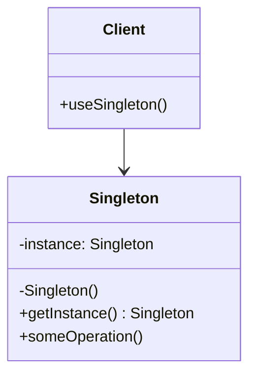

# Singleton Pattern

## Introduction
The Singleton pattern ensures a class has only one instance and provides a global point of access to it. This pattern is useful when exactly one object is needed to coordinate actions across the system, such as managing configuration settings, database connections, or logging.

## Why Singleton?
- Ensures single instance
- Provides global access point
- Controls resource sharing
- Manages global state
- Reduces memory usage

## Structure


## Implementation Example: Logger Singleton
```cpp
// Thread-safe Singleton Logger
class Logger {
private:
    static mutex mtx;
    static unique_ptr<Logger> instance;
    
    // Private constructor
    Logger() {
        cout << "Logger initialized" << endl;
    }
    
    // Delete copy constructor and assignment operator
    Logger(const Logger&) = delete;
    Logger& operator=(const Logger&) = delete;
    
public:
    // Thread-safe getInstance method
    static Logger& getInstance() {
        if (!instance) {
            lock_guard<mutex> lock(mtx);
            if (!instance) {
                instance = make_unique<Logger>();
            }
        }
        return *instance;
    }
    
    void log(const string& message) {
        cout << "Log: " << message << endl;
    }
    
    // Destructor
    ~Logger() {
        cout << "Logger destroyed" << endl;
    }
};

// Initialize static members
mutex Logger::mtx;
unique_ptr<Logger> Logger::instance;
```

## Usage Example
```cpp
void demonstrateLogger() {
    // Get logger instance
    Logger& logger1 = Logger::getInstance();
    Logger& logger2 = Logger::getInstance();
    
    // Both references point to the same instance
    cout << "Are instances same? " 
         << (&logger1 == &logger2 ? "Yes" : "No") << endl;
    
    // Use logger
    logger1.log("Application started");
    logger2.log("User logged in");
}
```

## Real-World Example: Configuration Manager
```cpp
// Thread-safe Configuration Manager
class ConfigManager {
private:
    static mutex mtx;
    static unique_ptr<ConfigManager> instance;
    
    unordered_map<string, string> config;
    
    // Private constructor
    ConfigManager() {
        // Load default configuration
        config["database_url"] = "localhost:5432";
        config["max_connections"] = "100";
        config["timeout"] = "30";
    }
    
    // Delete copy constructor and assignment operator
    ConfigManager(const ConfigManager&) = delete;
    ConfigManager& operator=(const ConfigManager&) = delete;
    
public:
    // Thread-safe getInstance method
    static ConfigManager& getInstance() {
        if (!instance) {
            lock_guard<mutex> lock(mtx);
            if (!instance) {
                instance = make_unique<ConfigManager>();
            }
        }
        return *instance;
    }
    
    // Configuration methods
    string getValue(const string& key) const {
        auto it = config.find(key);
        if (it != config.end()) {
            return it->second;
        }
        throw runtime_error("Configuration key not found: " + key);
    }
    
    void setValue(const string& key, const string& value) {
        lock_guard<mutex> lock(mtx);
        config[key] = value;
    }
    
    void loadFromFile(const string& filename) {
        lock_guard<mutex> lock(mtx);
        // Implementation for loading configuration from file
        cout << "Loading configuration from " << filename << endl;
    }
    
    void saveToFile(const string& filename) const {
        lock_guard<mutex> lock(mtx);
        // Implementation for saving configuration to file
        cout << "Saving configuration to " << filename << endl;
    }
};

// Initialize static members
mutex ConfigManager::mtx;
unique_ptr<ConfigManager> ConfigManager::instance;

// Usage
void demonstrateConfigManager() {
    // Get configuration manager instance
    ConfigManager& config1 = ConfigManager::getInstance();
    ConfigManager& config2 = ConfigManager::getInstance();
    
    // Both references point to the same instance
    cout << "Are instances same? " 
         << (&config1 == &config2 ? "Yes" : "No") << endl;
    
    // Use configuration manager
    cout << "Database URL: " << config1.getValue("database_url") << endl;
    config1.setValue("timeout", "60");
    cout << "New timeout: " << config2.getValue("timeout") << endl;
    
    // Load and save configuration
    config1.loadFromFile("config.json");
    config1.saveToFile("config_backup.json");
}
```

## Best Practices
1. Use when exactly one instance is needed
2. Implement thread-safe initialization
3. Consider lazy initialization
4. Use for resource management
5. Keep singleton focused and simple

## Common Pitfalls
1. Not handling thread safety
2. Creating too many singletons
3. Violating Single Responsibility Principle
4. Making testing difficult
5. Creating global state

## Practice Problems
1. Implement a cache manager
2. Create a database connection pool
3. Design a print spooler

## Interview Questions
1. What is the Singleton pattern?
2. When should you use Singleton?
3. How do you make Singleton thread-safe?
4. What are the advantages of using Singleton?
5. How do you test Singleton classes?

## Summary
- Singleton ensures single instance
- It provides global access point
- Supports resource management
- Useful for shared resources
- Should be used carefully and sparingly 