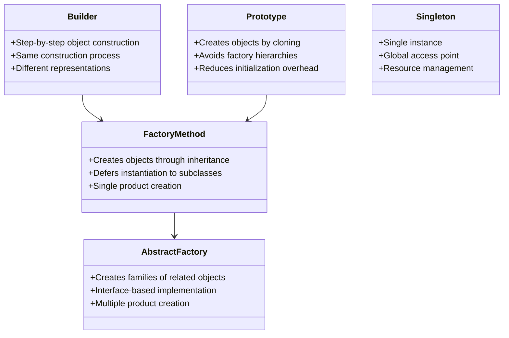

# Creational Design Patterns Summary

## Overview
Creational patterns deal with object creation mechanisms, trying to create objects in a manner suitable to the situation. They help make a system independent of how its objects are created, composed, and represented.

## Pattern Comparison

## Pattern Details

### Factory Method
- **Purpose**: Define an interface for creating objects, but let subclasses decide which class to instantiate
- **When to Use**:
  - When a class can't anticipate the class of objects it must create
  - When a class wants its subclasses to specify the objects it creates
  - When classes delegate responsibility to one of several helper subclasses
- **Example**: Document creation in a document editor

### Abstract Factory
- **Purpose**: Provide an interface for creating families of related or dependent objects
- **When to Use**:
  - When a system should be independent of how its products are created
  - When a system should be configured with multiple families of products
  - When a family of related product objects is designed to be used together
- **Example**: UI components for different platforms

### Builder
- **Purpose**: Separate the construction of a complex object from its representation
- **When to Use**:
  - When the algorithm for creating a complex object should be independent of the parts
  - When the construction process must allow different representations
  - When you need to create complex objects step by step
- **Example**: Computer configuration builder

### Prototype
- **Purpose**: Specify the kinds of objects to create using a prototypical instance
- **When to Use**:
  - When a system should be independent of how its products are created
  - When the classes to instantiate are specified at run-time
  - When avoiding building a class hierarchy of factories
- **Example**: Document template system

### Singleton
- **Purpose**: Ensure a class has only one instance and provide a global point of access
- **When to Use**:
  - When exactly one instance of a class is needed
  - When the instance must be accessible to clients from a well-known access point
  - When the sole instance should be extensible by subclassing
- **Example**: Configuration manager

## Relationships Between Patterns

1. **Abstract Factory vs Factory Method**
   - Abstract Factory often uses Factory Methods to implement its creation methods
   - Abstract Factory creates families of objects, while Factory Method creates single objects

2. **Builder vs Factory**
   - Builder focuses on constructing a complex object step by step
   - Factory focuses on creating a single object in one go

3. **Prototype vs Factory**
   - Prototype creates objects by cloning an existing instance
   - Factory creates objects by instantiating a class

4. **Singleton vs Factory**
   - Singleton ensures single instance
   - Factory creates multiple instances

## Best Practices

1. **Choosing the Right Pattern**
   - Use Factory Method for simple object creation
   - Use Abstract Factory for families of related objects
   - Use Builder for complex object construction
   - Use Prototype for object cloning
   - Use Singleton for global access

2. **Implementation Guidelines**
   - Keep patterns focused and simple
   - Consider thread safety where needed
   - Use dependency injection when possible
   - Follow SOLID principles
   - Document pattern usage

3. **Common Pitfalls to Avoid**
   - Over-engineering simple scenarios
   - Creating too many patterns
   - Violating encapsulation
   - Ignoring thread safety
   - Making testing difficult

## Real-World Applications

1. **GUI Frameworks**
   - Abstract Factory for platform-specific components
   - Builder for complex UI layouts
   - Prototype for widget templates

2. **Database Systems**
   - Factory Method for connection creation
   - Singleton for connection pools
   - Builder for query construction

3. **Game Development**
   - Prototype for game objects
   - Builder for level construction
   - Factory for enemy creation

## Interview Preparation

### Key Points to Remember
1. Each pattern's purpose and use cases
2. Relationships between patterns
3. Implementation considerations
4. Common pitfalls and solutions
5. Real-world applications

### Common Questions
1. How do you choose between Factory Method and Abstract Factory?
2. When would you use Builder instead of Factory?
3. How do you implement thread-safe Singleton?
4. What are the advantages of Prototype over Factory?
5. How do you test classes using these patterns?

## Summary
Creational patterns provide various object creation mechanisms that increase flexibility and reuse of existing code. They help make a system independent of how its objects are created, composed, and represented. Understanding these patterns and their relationships is crucial for designing maintainable and flexible software systems. 