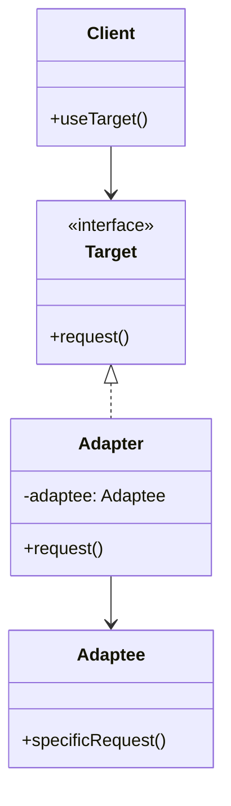

# Adapter Pattern

## Introduction
The Adapter pattern allows objects with incompatible interfaces to collaborate. It acts as a bridge between two incompatible interfaces by converting the interface of one class into another interface that clients expect.

## Why Adapter?
- Enables collaboration between incompatible interfaces
- Promotes code reusability
- Follows the Open/Closed Principle
- Simplifies client code
- Maintains single responsibility

## Structure


## Implementation Example: Payment System
```cpp
// Target interface
class PaymentProcessor {
public:
    virtual void processPayment(double amount) = 0;
    virtual ~PaymentProcessor() = default;
};

// Adaptee (Legacy system)
class LegacyPaymentSystem {
public:
    void makePayment(const string& currency, double amount) {
        cout << "Processing payment of " << amount << " " << currency << endl;
    }
};

// Adapter
class LegacyPaymentAdapter : public PaymentProcessor {
private:
    unique_ptr<LegacyPaymentSystem> legacySystem;
    string currency;
    
public:
    LegacyPaymentAdapter(const string& currency) 
        : legacySystem(make_unique<LegacyPaymentSystem>()), currency(currency) {}
    
    void processPayment(double amount) override {
        legacySystem->makePayment(currency, amount);
    }
};

// Modern payment system (implements Target directly)
class ModernPaymentSystem : public PaymentProcessor {
public:
    void processPayment(double amount) override {
        cout << "Processing payment of $" << amount << " using modern system" << endl;
    }
};
```

## Usage Example
```cpp
void demonstrateAdapter() {
    // Use modern payment system
    unique_ptr<PaymentProcessor> modernSystem = make_unique<ModernPaymentSystem>();
    modernSystem->processPayment(100.0);
    
    // Use legacy payment system through adapter
    unique_ptr<PaymentProcessor> legacyAdapter = make_unique<LegacyPaymentAdapter>("USD");
    legacyAdapter->processPayment(100.0);
}
```

## Real-World Example: File System Adapter
```cpp
// Target interface
class FileSystem {
public:
    virtual void readFile(const string& path) = 0;
    virtual void writeFile(const string& path, const string& content) = 0;
    virtual ~FileSystem() = default;
};

// Adaptee (Third-party library)
class ThirdPartyFileSystem {
public:
    void openFile(const string& path) {
        cout << "Opening file: " << path << endl;
    }
    
    void saveFile(const string& path, const string& data) {
        cout << "Saving data to file: " << path << endl;
    }
    
    string readContent() {
        return "File content from third-party system";
    }
};

// Adapter
class ThirdPartyFileSystemAdapter : public FileSystem {
private:
    unique_ptr<ThirdPartyFileSystem> thirdPartySystem;
    
public:
    ThirdPartyFileSystemAdapter() 
        : thirdPartySystem(make_unique<ThirdPartyFileSystem>()) {}
    
    void readFile(const string& path) override {
        thirdPartySystem->openFile(path);
        string content = thirdPartySystem->readContent();
        cout << "Content: " << content << endl;
    }
    
    void writeFile(const string& path, const string& content) override {
        thirdPartySystem->saveFile(path, content);
    }
};

// Modern file system (implements Target directly)
class ModernFileSystem : public FileSystem {
public:
    void readFile(const string& path) override {
        cout << "Reading file using modern system: " << path << endl;
    }
    
    void writeFile(const string& path, const string& content) override {
        cout << "Writing to file using modern system: " << path << endl;
    }
};

// File manager using the adapter
class FileManager {
private:
    unique_ptr<FileSystem> fileSystem;
    
public:
    FileManager(unique_ptr<FileSystem> fs) : fileSystem(move(fs)) {}
    
    void processFile(const string& path) {
        fileSystem->readFile(path);
        fileSystem->writeFile(path, "Updated content");
    }
};

// Usage
void demonstrateFileSystemAdapter() {
    // Use modern file system
    auto modernSystem = make_unique<ModernFileSystem>();
    FileManager modernManager(move(modernSystem));
    modernManager.processFile("document.txt");
    
    // Use third-party file system through adapter
    auto thirdPartyAdapter = make_unique<ThirdPartyFileSystemAdapter>();
    FileManager legacyManager(move(thirdPartyAdapter));
    legacyManager.processFile("legacy.txt");
}
```

## Best Practices
1. Use when integrating incompatible interfaces
2. Apply when reusing existing classes
3. Consider when working with third-party libraries
4. Use with dependency injection
5. Keep adapters focused and simple

## Common Pitfalls
1. Creating too many adapters
2. Violating the Single Responsibility Principle
3. Not handling errors properly
4. Making adapters too complex
5. Over-engineering simple scenarios

## Practice Problems
1. Implement a database adapter
2. Create a logging system adapter
3. Design a messaging system adapter

## Interview Questions
1. What is the Adapter pattern?
2. When should you use Adapter?
3. How does Adapter differ from Facade?
4. What are the advantages of using Adapter?
5. How do you handle multiple adapters?

## Summary
- Adapter enables collaboration between incompatible interfaces
- It promotes code reusability
- Supports the Open/Closed Principle
- Useful for integrating legacy systems
- Can be combined with other patterns effectively 