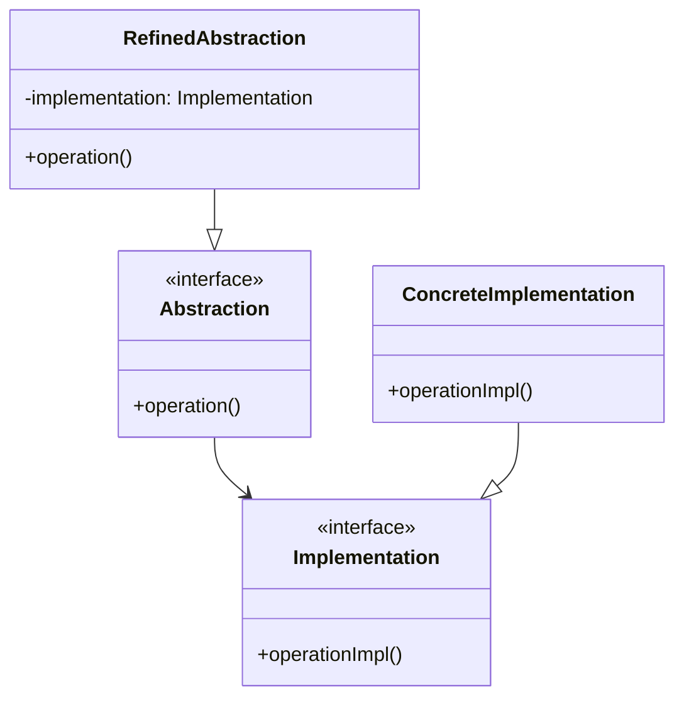

# Bridge Pattern

## Introduction
The Bridge pattern decouples an abstraction from its implementation, allowing both to vary independently. It separates the interface hierarchy from the implementation hierarchy, enabling them to evolve independently.

## Why Bridge?
- Separates interface from implementation
- Allows both to vary independently
- Prevents inheritance explosion
- Improves code organization
- Enables runtime flexibility

## Structure


## Implementation Example: Drawing System
```cpp
// Implementation interface
class DrawingAPI {
public:
    virtual void drawCircle(double x, double y, double radius) = 0;
    virtual void drawRectangle(double x, double y, double width, double height) = 0;
    virtual ~DrawingAPI() = default;
};

// Concrete implementations
class OpenGLDrawingAPI : public DrawingAPI {
public:
    void drawCircle(double x, double y, double radius) override {
        cout << "OpenGL: Drawing circle at (" << x << "," << y << ") with radius " << radius << endl;
    }
    
    void drawRectangle(double x, double y, double width, double height) override {
        cout << "OpenGL: Drawing rectangle at (" << x << "," << y << ") with size " 
             << width << "x" << height << endl;
    }
};

class DirectXDrawingAPI : public DrawingAPI {
public:
    void drawCircle(double x, double y, double radius) override {
        cout << "DirectX: Drawing circle at (" << x << "," << y << ") with radius " << radius << endl;
    }
    
    void drawRectangle(double x, double y, double width, double height) override {
        cout << "DirectX: Drawing rectangle at (" << x << "," << y << ") with size " 
             << width << "x" << height << endl;
    }
};

// Abstraction
class Shape {
protected:
    unique_ptr<DrawingAPI> drawingAPI;
    
public:
    Shape(unique_ptr<DrawingAPI> api) : drawingAPI(move(api)) {}
    virtual void draw() = 0;
    virtual ~Shape() = default;
};

// Refined abstractions
class Circle : public Shape {
private:
    double x, y, radius;
    
public:
    Circle(double x, double y, double radius, unique_ptr<DrawingAPI> api)
        : Shape(move(api)), x(x), y(y), radius(radius) {}
    
    void draw() override {
        drawingAPI->drawCircle(x, y, radius);
    }
};

class Rectangle : public Shape {
private:
    double x, y, width, height;
    
public:
    Rectangle(double x, double y, double width, double height, unique_ptr<DrawingAPI> api)
        : Shape(move(api)), x(x), y(y), width(width), height(height) {}
    
    void draw() override {
        drawingAPI->drawRectangle(x, y, width, height);
    }
};
```

## Usage Example
```cpp
void demonstrateBridge() {
    // Create shapes with different drawing APIs
    auto circle = make_unique<Circle>(10, 10, 5, make_unique<OpenGLDrawingAPI>());
    auto rectangle = make_unique<Rectangle>(20, 20, 10, 15, make_unique<DirectXDrawingAPI>());
    
    // Draw shapes
    circle->draw();
    rectangle->draw();
    
    // Switch implementation at runtime
    circle = make_unique<Circle>(10, 10, 5, make_unique<DirectXDrawingAPI>());
    circle->draw();
}
```

## Real-World Example: Message System
```cpp
// Implementation interface
class MessageSender {
public:
    virtual void sendMessage(const string& message) = 0;
    virtual ~MessageSender() = default;
};

// Concrete implementations
class EmailSender : public MessageSender {
public:
    void sendMessage(const string& message) override {
        cout << "Sending email: " << message << endl;
    }
};

class SMSSender : public MessageSender {
public:
    void sendMessage(const string& message) override {
        cout << "Sending SMS: " << message << endl;
    }
};

// Abstraction
class Message {
protected:
    unique_ptr<MessageSender> sender;
    string content;
    
public:
    Message(const string& content, unique_ptr<MessageSender> sender)
        : content(content), sender(move(sender)) {}
    
    virtual void send() = 0;
    virtual ~Message() = default;
};

// Refined abstractions
class TextMessage : public Message {
public:
    TextMessage(const string& content, unique_ptr<MessageSender> sender)
        : Message(content, move(sender)) {}
    
    void send() override {
        sender->sendMessage("Text: " + content);
    }
};

class HTMLMessage : public Message {
public:
    HTMLMessage(const string& content, unique_ptr<MessageSender> sender)
        : Message(content, move(sender)) {}
    
    void send() override {
        sender->sendMessage("HTML: " + content);
    }
};

// Message service using the bridge
class MessageService {
private:
    unique_ptr<Message> message;
    
public:
    MessageService(unique_ptr<Message> msg) : message(move(msg)) {}
    
    void sendMessage() {
        message->send();
    }
    
    void changeSender(unique_ptr<MessageSender> newSender) {
        // Create new message with same content but different sender
        if (auto textMsg = dynamic_cast<TextMessage*>(message.get())) {
            message = make_unique<TextMessage>(textMsg->content, move(newSender));
        } else if (auto htmlMsg = dynamic_cast<HTMLMessage*>(message.get())) {
            message = make_unique<HTMLMessage>(htmlMsg->content, move(newSender));
        }
    }
};

// Usage
void demonstrateMessageBridge() {
    // Create message service with text message and email sender
    auto service = make_unique<MessageService>(
        make_unique<TextMessage>("Hello", make_unique<EmailSender>())
    );
    
    // Send message
    service->sendMessage();
    
    // Change sender to SMS
    service->changeSender(make_unique<SMSSender>());
    service->sendMessage();
    
    // Create HTML message with SMS sender
    auto htmlService = make_unique<MessageService>(
        make_unique<HTMLMessage>("<h1>Hello</h1>", make_unique<SMSSender>())
    );
    htmlService->sendMessage();
}
```

## Best Practices
1. Use when you want to separate interface from implementation
2. Apply when both interface and implementation can vary
3. Consider when you want to avoid inheritance explosion
4. Use with dependency injection
5. Keep abstractions and implementations focused

## Common Pitfalls
1. Over-engineering simple scenarios
2. Creating too many abstractions
3. Violating the Single Responsibility Principle
4. Making the bridge too complex
5. Not handling implementation changes properly

## Practice Problems
1. Implement a device driver bridge
2. Create a database access bridge
3. Design a UI component bridge

## Interview Questions
1. What is the Bridge pattern?
2. When should you use Bridge?
3. How does Bridge differ from Adapter?
4. What are the advantages of using Bridge?
5. How do you handle multiple implementations?

## Summary
- Bridge separates interface from implementation
- It allows both to vary independently
- Prevents inheritance explosion
- Enables runtime flexibility
- Can be combined with other patterns effectively 