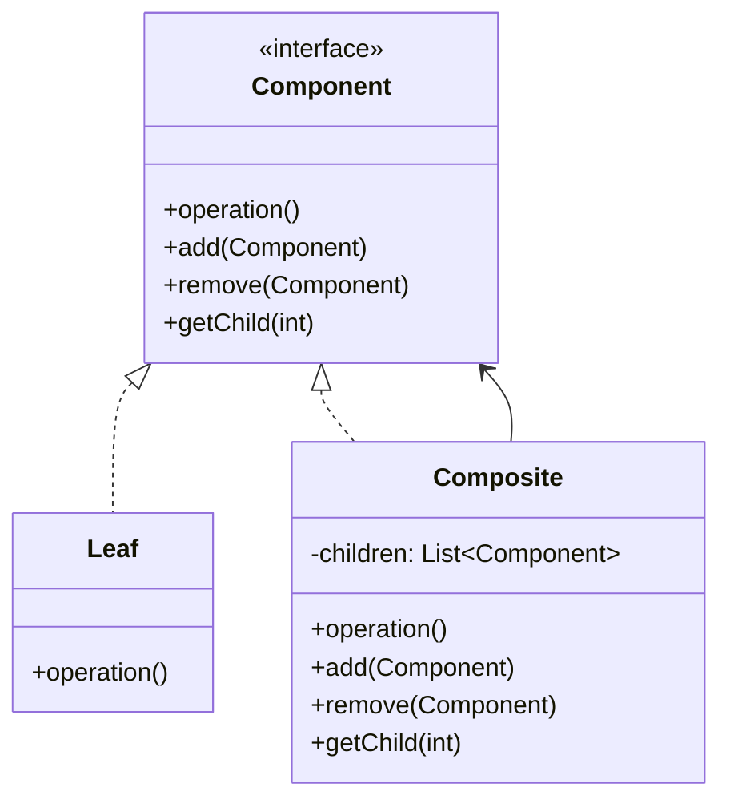

# Composite Pattern

## Introduction
The Composite pattern composes objects into tree structures to represent part-whole hierarchies. It allows clients to treat individual objects and compositions of objects uniformly.

## Why Composite?
- Represents part-whole hierarchies
- Treats individual and composite objects uniformly
- Simplifies client code
- Makes it easy to add new components
- Maintains consistency in object handling

## Structure


## Implementation Example: File System
```cpp
// Component interface
class FileSystemComponent {
public:
    virtual void display(int depth = 0) = 0;
    virtual void add(unique_ptr<FileSystemComponent> component) {
        throw runtime_error("Cannot add to leaf component");
    }
    virtual void remove(FileSystemComponent* component) {
        throw runtime_error("Cannot remove from leaf component");
    }
    virtual FileSystemComponent* getChild(int index) {
        throw runtime_error("Leaf component has no children");
    }
    virtual ~FileSystemComponent() = default;
};

// Leaf component
class File : public FileSystemComponent {
private:
    string name;
    int size;
    
public:
    File(const string& name, int size) : name(name), size(size) {}
    
    void display(int depth = 0) override {
        cout << string(depth * 2, ' ') << "File: " << name << " (" << size << " bytes)" << endl;
    }
};

// Composite component
class Directory : public FileSystemComponent {
private:
    string name;
    vector<unique_ptr<FileSystemComponent>> children;
    
public:
    Directory(const string& name) : name(name) {}
    
    void display(int depth = 0) override {
        cout << string(depth * 2, ' ') << "Directory: " << name << endl;
        for (const auto& child : children) {
            child->display(depth + 1);
        }
    }
    
    void add(unique_ptr<FileSystemComponent> component) override {
        children.push_back(move(component));
    }
    
    void remove(FileSystemComponent* component) override {
        auto it = find_if(children.begin(), children.end(),
            [component](const unique_ptr<FileSystemComponent>& child) {
                return child.get() == component;
            });
        if (it != children.end()) {
            children.erase(it);
        }
    }
    
    FileSystemComponent* getChild(int index) override {
        if (index >= 0 && index < children.size()) {
            return children[index].get();
        }
        return nullptr;
    }
};
```

## Usage Example
```cpp
void demonstrateComposite() {
    // Create file system structure
    auto root = make_unique<Directory>("root");
    
    // Add files to root
    root->add(make_unique<File>("file1.txt", 100));
    root->add(make_unique<File>("file2.txt", 200));
    
    // Create and add subdirectory
    auto docs = make_unique<Directory>("docs");
    docs->add(make_unique<File>("doc1.pdf", 1000));
    docs->add(make_unique<File>("doc2.pdf", 2000));
    root->add(move(docs));
    
    // Display structure
    root->display();
}
```

## Real-World Example: Menu System
```cpp
// Component interface
class MenuComponent {
public:
    virtual void display() = 0;
    virtual void add(unique_ptr<MenuComponent> component) {
        throw runtime_error("Cannot add to leaf component");
    }
    virtual void remove(MenuComponent* component) {
        throw runtime_error("Cannot remove from leaf component");
    }
    virtual MenuComponent* getChild(int index) {
        throw runtime_error("Leaf component has no children");
    }
    virtual ~MenuComponent() = default;
};

// Leaf component
class MenuItem : public MenuComponent {
private:
    string name;
    string description;
    double price;
    
public:
    MenuItem(const string& name, const string& description, double price)
        : name(name), description(description), price(price) {}
    
    void display() override {
        cout << "  " << name << " - " << description << " ($" << price << ")" << endl;
    }
};

// Composite component
class Menu : public MenuComponent {
private:
    string name;
    string description;
    vector<unique_ptr<MenuComponent>> items;
    
public:
    Menu(const string& name, const string& description)
        : name(name), description(description) {}
    
    void display() override {
        cout << "\n" << name << " - " << description << endl;
        cout << "-------------------" << endl;
        for (const auto& item : items) {
            item->display();
        }
    }
    
    void add(unique_ptr<MenuComponent> component) override {
        items.push_back(move(component));
    }
    
    void remove(MenuComponent* component) override {
        auto it = find_if(items.begin(), items.end(),
            [component](const unique_ptr<MenuComponent>& item) {
                return item.get() == component;
            });
        if (it != items.end()) {
            items.erase(it);
        }
    }
    
    MenuComponent* getChild(int index) override {
        if (index >= 0 && index < items.size()) {
            return items[index].get();
        }
        return nullptr;
    }
};

// Menu system using composite
class MenuSystem {
private:
    unique_ptr<MenuComponent> rootMenu;
    
public:
    MenuSystem(unique_ptr<MenuComponent> menu) : rootMenu(move(menu)) {}
    
    void displayMenu() {
        rootMenu->display();
    }
    
    void addItem(unique_ptr<MenuComponent> item) {
        rootMenu->add(move(item));
    }
};

// Usage
void demonstrateMenuComposite() {
    // Create main menu
    auto mainMenu = make_unique<Menu>("Main Menu", "Restaurant Menu");
    
    // Create breakfast menu
    auto breakfastMenu = make_unique<Menu>("Breakfast", "Breakfast Menu");
    breakfastMenu->add(make_unique<MenuItem>("Pancakes", "Fluffy pancakes with syrup", 8.99));
    breakfastMenu->add(make_unique<MenuItem>("Omelette", "Three-egg omelette with cheese", 9.99));
    
    // Create lunch menu
    auto lunchMenu = make_unique<Menu>("Lunch", "Lunch Menu");
    lunchMenu->add(make_unique<MenuItem>("Burger", "Classic beef burger with fries", 12.99));
    lunchMenu->add(make_unique<MenuItem>("Salad", "Fresh garden salad", 7.99));
    
    // Add submenus to main menu
    mainMenu->add(move(breakfastMenu));
    mainMenu->add(move(lunchMenu));
    
    // Create and use menu system
    MenuSystem menuSystem(move(mainMenu));
    menuSystem.displayMenu();
}
```

## Best Practices
1. Use when representing part-whole hierarchies
2. Apply when treating individual and composite objects uniformly
3. Consider when adding new components is common
4. Use with iterator pattern for traversal
5. Keep component interface simple

## Common Pitfalls
1. Over-complicating the component interface
2. Not handling leaf operations properly
3. Violating the Single Responsibility Principle
4. Making the composite too complex
5. Not considering performance for large structures

## Practice Problems
1. Implement a document structure
2. Create a UI component hierarchy
3. Design a company organization chart

## Interview Questions
1. What is the Composite pattern?
2. When should you use Composite?
3. How does Composite handle leaf operations?
4. What are the advantages of using Composite?
5. How do you traverse a composite structure?

## Summary
- Composite represents part-whole hierarchies
- It treats individual and composite objects uniformly
- Simplifies client code
- Makes it easy to add new components
- Can be combined with other patterns effectively 