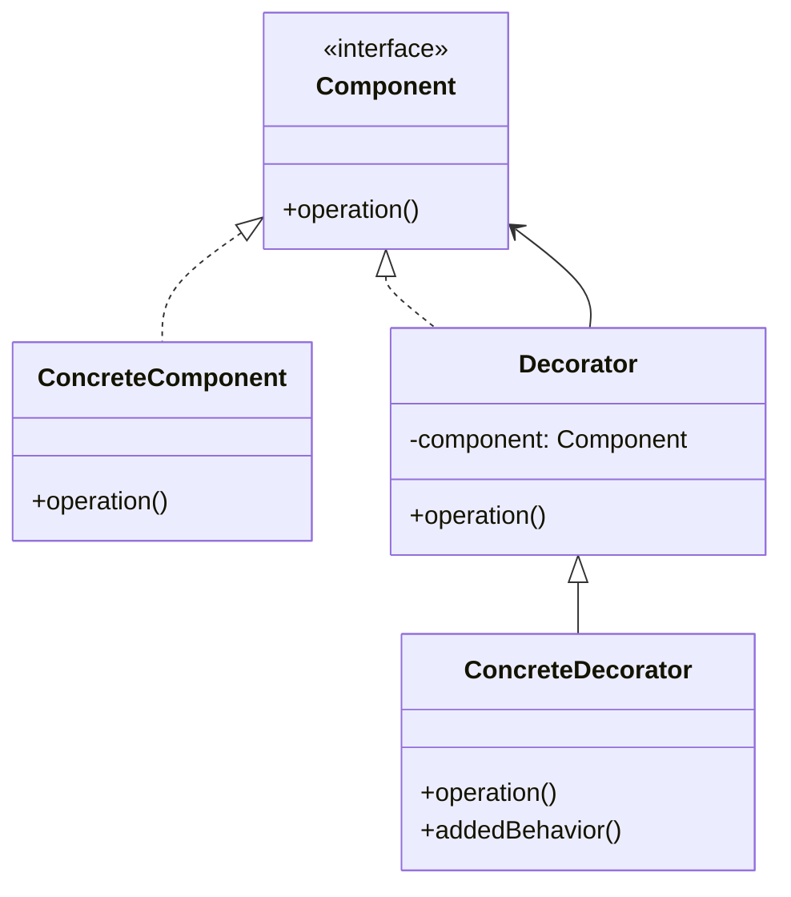

# Decorator Pattern

## Introduction
The Decorator pattern attaches additional responsibilities to objects dynamically. It provides a flexible alternative to subclassing for extending functionality.

## Why Decorator?
- Adds responsibilities to objects dynamically
- Provides flexible alternative to inheritance
- Follows the Open/Closed Principle
- Maintains single responsibility
- Allows for multiple decorators

## Structure


## Implementation Example: Coffee Shop
```cpp
// Component interface
class Beverage {
public:
    virtual string getDescription() const = 0;
    virtual double cost() const = 0;
    virtual ~Beverage() = default;
};

// Concrete component
class Espresso : public Beverage {
public:
    string getDescription() const override {
        return "Espresso";
    }
    
    double cost() const override {
        return 1.99;
    }
};

// Decorator base class
class BeverageDecorator : public Beverage {
protected:
    unique_ptr<Beverage> beverage;
    
public:
    BeverageDecorator(unique_ptr<Beverage> b) : beverage(move(b)) {}
    
    string getDescription() const override {
        return beverage->getDescription();
    }
    
    double cost() const override {
        return beverage->cost();
    }
};

// Concrete decorators
class MilkDecorator : public BeverageDecorator {
public:
    MilkDecorator(unique_ptr<Beverage> b) : BeverageDecorator(move(b)) {}
    
    string getDescription() const override {
        return beverage->getDescription() + " with Milk";
    }
    
    double cost() const override {
        return beverage->cost() + 0.50;
    }
};

class SugarDecorator : public BeverageDecorator {
public:
    SugarDecorator(unique_ptr<Beverage> b) : BeverageDecorator(move(b)) {}
    
    string getDescription() const override {
        return beverage->getDescription() + " with Sugar";
    }
    
    double cost() const override {
        return beverage->cost() + 0.20;
    }
};
```

## Usage Example
```cpp
void demonstrateDecorator() {
    // Create base beverage
    auto beverage = make_unique<Espresso>();
    cout << beverage->getDescription() << " $" << beverage->cost() << endl;
    
    // Add milk
    beverage = make_unique<MilkDecorator>(move(beverage));
    cout << beverage->getDescription() << " $" << beverage->cost() << endl;
    
    // Add sugar
    beverage = make_unique<SugarDecorator>(move(beverage));
    cout << beverage->getDescription() << " $" << beverage->cost() << endl;
}
```

## Real-World Example: Text Editor
```cpp
// Component interface
class TextComponent {
public:
    virtual string getText() const = 0;
    virtual void setText(const string& text) = 0;
    virtual ~TextComponent() = default;
};

// Concrete component
class SimpleText : public TextComponent {
private:
    string text;
    
public:
    string getText() const override {
        return text;
    }
    
    void setText(const string& newText) override {
        text = newText;
    }
};

// Decorator base class
class TextDecorator : public TextComponent {
protected:
    unique_ptr<TextComponent> component;
    
public:
    TextDecorator(unique_ptr<TextComponent> c) : component(move(c)) {}
    
    string getText() const override {
        return component->getText();
    }
    
    void setText(const string& text) override {
        component->setText(text);
    }
};

// Concrete decorators
class BoldDecorator : public TextDecorator {
public:
    BoldDecorator(unique_ptr<TextComponent> c) : TextDecorator(move(c)) {}
    
    string getText() const override {
        return "<b>" + component->getText() + "</b>";
    }
};

class ItalicDecorator : public TextDecorator {
public:
    ItalicDecorator(unique_ptr<TextComponent> c) : TextDecorator(move(c)) {}
    
    string getText() const override {
        return "<i>" + component->getText() + "</i>";
    }
};

class UnderlineDecorator : public TextDecorator {
public:
    UnderlineDecorator(unique_ptr<TextComponent> c) : TextDecorator(move(c)) {}
    
    string getText() const override {
        return "<u>" + component->getText() + "</u>";
    }
};

// Text editor using decorators
class TextEditor {
private:
    unique_ptr<TextComponent> text;
    
public:
    TextEditor(unique_ptr<TextComponent> t) : text(move(t)) {}
    
    void setText(const string& newText) {
        text->setText(newText);
    }
    
    string getFormattedText() const {
        return text->getText();
    }
    
    void makeBold() {
        text = make_unique<BoldDecorator>(move(text));
    }
    
    void makeItalic() {
        text = make_unique<ItalicDecorator>(move(text));
    }
    
    void makeUnderline() {
        text = make_unique<UnderlineDecorator>(move(text));
    }
};

// Usage
void demonstrateTextDecorator() {
    // Create text editor with simple text
    auto editor = make_unique<TextEditor>(make_unique<SimpleText>());
    editor->setText("Hello, World!");
    
    // Apply formatting
    editor->makeBold();
    cout << editor->getFormattedText() << endl;
    
    editor->makeItalic();
    cout << editor->getFormattedText() << endl;
    
    editor->makeUnderline();
    cout << editor->getFormattedText() << endl;
}
```

## Best Practices
1. Use when adding responsibilities dynamically
2. Apply when inheritance is not feasible
3. Consider when multiple decorators are needed
4. Use with dependency injection
5. Keep decorators focused and simple

## Common Pitfalls
1. Creating too many decorators
2. Violating the Single Responsibility Principle
3. Making decorators too complex
4. Not handling decorator order properly
5. Over-engineering simple scenarios

## Practice Problems
1. Implement a logging decorator
2. Create a caching decorator
3. Design a validation decorator

## Interview Questions
1. What is the Decorator pattern?
2. When should you use Decorator?
3. How does Decorator differ from inheritance?
4. What are the advantages of using Decorator?
5. How do you handle multiple decorators?

## Summary
- Decorator adds responsibilities dynamically
- It provides flexible alternative to inheritance
- Follows the Open/Closed Principle
- Maintains single responsibility
- Can be combined with other patterns effectively 