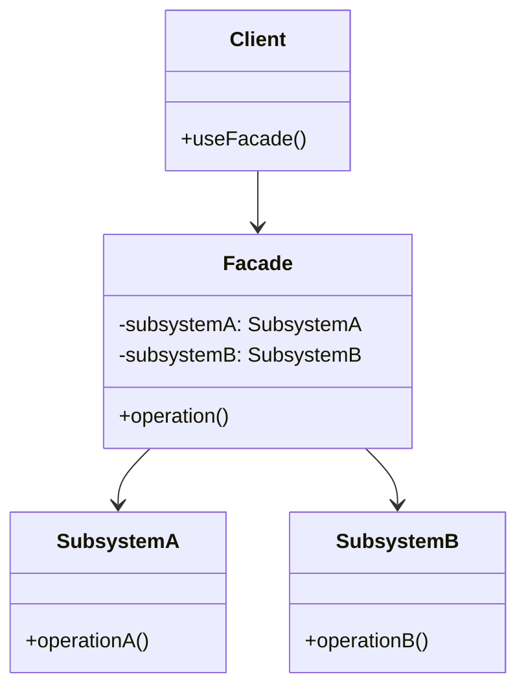

# Facade Pattern

## Introduction
The Facade pattern provides a unified interface to a set of interfaces in a subsystem. It defines a higher-level interface that makes the subsystem easier to use.

## Why Facade?
- Simplifies complex subsystems
- Reduces coupling between clients and subsystems
- Provides a single entry point
- Improves code readability
- Makes subsystems more maintainable

## Structure


## Implementation Example: Home Theater System
```cpp
// Subsystem classes
class Amplifier {
public:
    void turnOn() {
        cout << "Amplifier turning on..." << endl;
    }
    
    void setVolume(int level) {
        cout << "Setting volume to " << level << endl;
    }
    
    void turnOff() {
        cout << "Amplifier turning off..." << endl;
    }
};

class DVDPlayer {
public:
    void turnOn() {
        cout << "DVD player turning on..." << endl;
    }
    
    void play(const string& movie) {
        cout << "Playing movie: " << movie << endl;
    }
    
    void stop() {
        cout << "Stopping movie..." << endl;
    }
    
    void turnOff() {
        cout << "DVD player turning off..." << endl;
    }
};

class Projector {
public:
    void turnOn() {
        cout << "Projector turning on..." << endl;
    }
    
    void setInput(const string& input) {
        cout << "Setting input to " << input << endl;
    }
    
    void turnOff() {
        cout << "Projector turning off..." << endl;
    }
};

// Facade
class HomeTheaterFacade {
private:
    unique_ptr<Amplifier> amplifier;
    unique_ptr<DVDPlayer> dvdPlayer;
    unique_ptr<Projector> projector;
    
public:
    HomeTheaterFacade() 
        : amplifier(make_unique<Amplifier>()),
          dvdPlayer(make_unique<DVDPlayer>()),
          projector(make_unique<Projector>()) {}
    
    void watchMovie(const string& movie) {
        cout << "Get ready to watch a movie..." << endl;
        
        amplifier->turnOn();
        amplifier->setVolume(5);
        
        projector->turnOn();
        projector->setInput("DVD");
        
        dvdPlayer->turnOn();
        dvdPlayer->play(movie);
    }
    
    void endMovie() {
        cout << "Shutting down the home theater..." << endl;
        
        dvdPlayer->stop();
        dvdPlayer->turnOff();
        
        projector->turnOff();
        
        amplifier->turnOff();
    }
};
```

## Usage Example
```cpp
void demonstrateFacade() {
    auto homeTheater = make_unique<HomeTheaterFacade>();
    
    // Watch a movie
    homeTheater->watchMovie("The Matrix");
    
    // End the movie
    homeTheater->endMovie();
}
```

## Real-World Example: Order Processing System
```cpp
// Subsystem classes
class InventorySystem {
public:
    bool checkStock(const string& productId, int quantity) {
        cout << "Checking stock for product " << productId << endl;
        return true; // Simplified for example
    }
    
    void updateStock(const string& productId, int quantity) {
        cout << "Updating stock for product " << productId << endl;
    }
};

class PaymentSystem {
public:
    bool processPayment(double amount, const string& paymentMethod) {
        cout << "Processing payment of $" << amount << " via " << paymentMethod << endl;
        return true; // Simplified for example
    }
    
    void refundPayment(double amount, const string& paymentMethod) {
        cout << "Refunding payment of $" << amount << " via " << paymentMethod << endl;
    }
};

class ShippingSystem {
public:
    void createShipment(const string& orderId, const string& address) {
        cout << "Creating shipment for order " << orderId << " to " << address << endl;
    }
    
    void trackShipment(const string& orderId) {
        cout << "Tracking shipment for order " << orderId << endl;
    }
};

// Facade
class OrderProcessingFacade {
private:
    unique_ptr<InventorySystem> inventory;
    unique_ptr<PaymentSystem> payment;
    unique_ptr<ShippingSystem> shipping;
    
public:
    OrderProcessingFacade() 
        : inventory(make_unique<InventorySystem>()),
          payment(make_unique<PaymentSystem>()),
          shipping(make_unique<ShippingSystem>()) {}
    
    bool placeOrder(const string& orderId, const string& productId, 
                   int quantity, double amount, const string& paymentMethod,
                   const string& address) {
        cout << "Processing order " << orderId << "..." << endl;
        
        // Check inventory
        if (!inventory->checkStock(productId, quantity)) {
            cout << "Order failed: Insufficient stock" << endl;
            return false;
        }
        
        // Process payment
        if (!payment->processPayment(amount, paymentMethod)) {
            cout << "Order failed: Payment processing error" << endl;
            return false;
        }
        
        // Update inventory
        inventory->updateStock(productId, quantity);
        
        // Create shipment
        shipping->createShipment(orderId, address);
        
        cout << "Order " << orderId << " processed successfully" << endl;
        return true;
    }
    
    void cancelOrder(const string& orderId, double amount, const string& paymentMethod) {
        cout << "Cancelling order " << orderId << "..." << endl;
        
        // Process refund
        payment->refundPayment(amount, paymentMethod);
        
        cout << "Order " << orderId << " cancelled successfully" << endl;
    }
    
    void trackOrder(const string& orderId) {
        cout << "Tracking order " << orderId << "..." << endl;
        shipping->trackShipment(orderId);
    }
};

// Usage
void demonstrateOrderFacade() {
    auto orderSystem = make_unique<OrderProcessingFacade>();
    
    // Place an order
    orderSystem->placeOrder("ORD001", "PROD001", 2, 99.99, "Credit Card", 
                          "123 Main St, City, Country");
    
    // Track the order
    orderSystem->trackOrder("ORD001");
    
    // Cancel the order
    orderSystem->cancelOrder("ORD001", 99.99, "Credit Card");
}
```

## Best Practices
1. Use when simplifying complex subsystems
2. Apply when reducing coupling between clients and subsystems
3. Consider when providing a unified interface
4. Use with dependency injection
5. Keep the facade focused and simple

## Common Pitfalls
1. Creating too many facades
2. Violating the Single Responsibility Principle
3. Making the facade too complex
4. Not handling subsystem errors properly
5. Over-engineering simple scenarios

## Practice Problems
1. Implement a file system facade
2. Create a database access facade
3. Design a network communication facade

## Interview Questions
1. What is the Facade pattern?
2. When should you use Facade?
3. How does Facade differ from Adapter?
4. What are the advantages of using Facade?
5. How do you handle subsystem changes?

## Summary
- Facade simplifies complex subsystems
- It reduces coupling between clients and subsystems
- Provides a single entry point
- Improves code readability
- Can be combined with other patterns effectively 