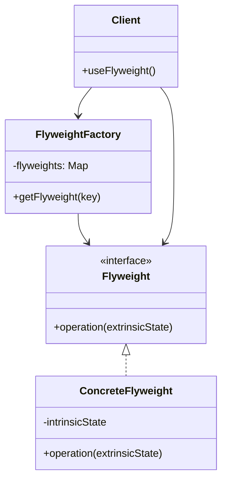

# Flyweight Pattern

## Introduction
The Flyweight pattern minimizes memory usage by sharing as much data as possible with similar objects. It is used when a large number of similar objects need to be created, and memory usage is a concern.

## Why Flyweight?
- Reduces memory usage
- Improves performance
- Shares common data
- Separates intrinsic and extrinsic state
- Supports large numbers of objects

## Structure


## Implementation Example: Text Editor
```cpp
// Flyweight interface
class Character {
public:
    virtual void display(int x, int y) = 0;
    virtual ~Character() = default;
};

// Concrete flyweight
class CharacterImpl : public Character {
private:
    char symbol;
    string font;
    int size;
    
public:
    CharacterImpl(char symbol, const string& font, int size)
        : symbol(symbol), font(font), size(size) {}
    
    void display(int x, int y) override {
        cout << "Displaying character '" << symbol 
             << "' at position (" << x << "," << y 
             << ") with font " << font 
             << " and size " << size << endl;
    }
};

// Flyweight factory
class CharacterFactory {
private:
    map<string, unique_ptr<Character>> characters;
    
    string getKey(char symbol, const string& font, int size) {
        return string(1, symbol) + "_" + font + "_" + to_string(size);
    }
    
public:
    Character* getCharacter(char symbol, const string& font, int size) {
        string key = getKey(symbol, font, size);
        
        if (characters.find(key) == characters.end()) {
            characters[key] = make_unique<CharacterImpl>(symbol, font, size);
        }
        
        return characters[key].get();
    }
    
    int getCharacterCount() const {
        return characters.size();
    }
};

// Client
class TextEditor {
private:
    CharacterFactory* factory;
    vector<pair<Character*, pair<int, int>>> characters;
    
public:
    TextEditor(CharacterFactory* f) : factory(f) {}
    
    void addCharacter(char symbol, const string& font, int size, int x, int y) {
        Character* character = factory->getCharacter(symbol, font, size);
        characters.push_back({character, {x, y}});
    }
    
    void display() {
        for (const auto& [character, position] : characters) {
            character->display(position.first, position.second);
        }
    }
};
```

## Usage Example
```cpp
void demonstrateFlyweight() {
    CharacterFactory factory;
    TextEditor editor(&factory);
    
    // Add characters with same properties
    editor.addCharacter('H', "Arial", 12, 0, 0);
    editor.addCharacter('e', "Arial", 12, 1, 0);
    editor.addCharacter('l', "Arial", 12, 2, 0);
    editor.addCharacter('l', "Arial", 12, 3, 0);
    editor.addCharacter('o', "Arial", 12, 4, 0);
    
    // Display text
    editor.display();
    
    // Show number of unique characters
    cout << "Number of unique characters: " << factory.getCharacterCount() << endl;
}
```

## Real-World Example: Game Map
```cpp
// Flyweight interface
class Terrain {
public:
    virtual void render(int x, int y) = 0;
    virtual ~Terrain() = default;
};

// Concrete flyweight
class TerrainType : public Terrain {
private:
    string texture;
    bool walkable;
    int movementCost;
    
public:
    TerrainType(const string& texture, bool walkable, int movementCost)
        : texture(texture), walkable(walkable), movementCost(movementCost) {}
    
    void render(int x, int y) override {
        cout << "Rendering " << texture << " terrain at (" << x << "," << y << ")" << endl;
    }
    
    bool isWalkable() const { return walkable; }
    int getMovementCost() const { return movementCost; }
};

// Flyweight factory
class TerrainFactory {
private:
    map<string, unique_ptr<Terrain>> terrains;
    
public:
    Terrain* getTerrain(const string& type) {
        if (terrains.find(type) == terrains.end()) {
            if (type == "grass") {
                terrains[type] = make_unique<TerrainType>("grass", true, 1);
            } else if (type == "water") {
                terrains[type] = make_unique<TerrainType>("water", false, 2);
            } else if (type == "mountain") {
                terrains[type] = make_unique<TerrainType>("mountain", true, 3);
            }
        }
        return terrains[type].get();
    }
};

// Client
class GameMap {
private:
    TerrainFactory* factory;
    vector<vector<Terrain*>> map;
    int width;
    int height;
    
public:
    GameMap(TerrainFactory* f, int w, int h) 
        : factory(f), width(w), height(h) {
        map.resize(height, vector<Terrain*>(width));
    }
    
    void setTerrain(int x, int y, const string& type) {
        if (x >= 0 && x < width && y >= 0 && y < height) {
            map[y][x] = factory->getTerrain(type);
        }
    }
    
    void render() {
        for (int y = 0; y < height; y++) {
            for (int x = 0; x < width; x++) {
                if (map[y][x]) {
                    map[y][x]->render(x, y);
                }
            }
        }
    }
    
    bool isWalkable(int x, int y) const {
        if (x >= 0 && x < width && y >= 0 && y < height && map[y][x]) {
            return dynamic_cast<TerrainType*>(map[y][x])->isWalkable();
        }
        return false;
    }
    
    int getMovementCost(int x, int y) const {
        if (x >= 0 && x < width && y >= 0 && y < height && map[y][x]) {
            return dynamic_cast<TerrainType*>(map[y][x])->getMovementCost();
        }
        return 0;
    }
};

// Usage
void demonstrateGameMap() {
    TerrainFactory factory;
    GameMap map(&factory, 5, 5);
    
    // Create a simple map
    for (int y = 0; y < 5; y++) {
        for (int x = 0; x < 5; x++) {
            if (x == 2 && y == 2) {
                map.setTerrain(x, y, "mountain");
            } else if (x == 1 && y == 1) {
                map.setTerrain(x, y, "water");
            } else {
                map.setTerrain(x, y, "grass");
            }
        }
    }
    
    // Render the map
    map.render();
    
    // Check terrain properties
    cout << "Is (1,1) walkable? " << (map.isWalkable(1, 1) ? "Yes" : "No") << endl;
    cout << "Movement cost at (2,2): " << map.getMovementCost(2, 2) << endl;
}
```

## Best Practices
1. Use when a large number of similar objects is needed
2. Apply when memory usage is a concern
3. Consider when objects can be shared
4. Use with factory pattern
5. Keep extrinsic state separate

## Common Pitfalls
1. Not properly separating intrinsic and extrinsic state
2. Creating too many flyweights
3. Violating the Single Responsibility Principle
4. Making flyweights too complex
5. Not considering thread safety

## Practice Problems
1. Implement a document formatter
2. Create a particle system
3. Design a tile-based game

## Interview Questions
1. What is the Flyweight pattern?
2. When should you use Flyweight?
3. How does Flyweight differ from Singleton?
4. What are the advantages of using Flyweight?
5. How do you handle thread safety in Flyweight?

## Summary
- Flyweight reduces memory usage
- It improves performance
- Shares common data
- Separates intrinsic and extrinsic state
- Can be combined with other patterns effectively 