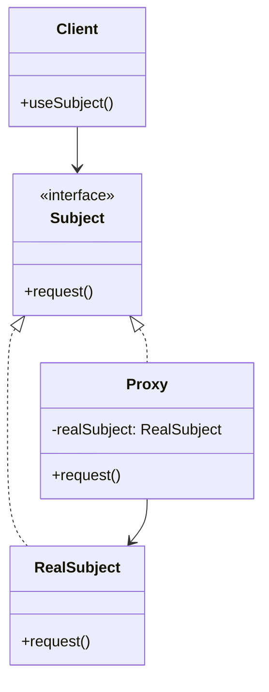

# Proxy Pattern

## Introduction
The Proxy pattern provides a surrogate or placeholder for another object to control access to it. It is used when you want to add a wrapper and delegation to protect the real component from undue complexity.

## Why Proxy?
- Controls access to another object
- Adds functionality without changing the original
- Implements lazy initialization
- Provides security and caching
- Simplifies client code

## Structure


## Implementation Example: Image Loading
```cpp
// Subject interface
class Image {
public:
    virtual void display() = 0;
    virtual ~Image() = default;
};

// Real subject
class RealImage : public Image {
private:
    string filename;
    
public:
    RealImage(const string& filename) : filename(filename) {
        loadFromDisk();
    }
    
    void display() override {
        cout << "Displaying image: " << filename << endl;
    }
    
private:
    void loadFromDisk() {
        cout << "Loading image from disk: " << filename << endl;
    }
};

// Proxy
class ProxyImage : public Image {
private:
    string filename;
    unique_ptr<RealImage> realImage;
    
public:
    ProxyImage(const string& filename) : filename(filename) {}
    
    void display() override {
        if (!realImage) {
            realImage = make_unique<RealImage>(filename);
        }
        realImage->display();
    }
};

// Client
class ImageViewer {
private:
    vector<unique_ptr<Image>> images;
    
public:
    void addImage(const string& filename) {
        images.push_back(make_unique<ProxyImage>(filename));
    }
    
    void displayImage(int index) {
        if (index >= 0 && index < images.size()) {
            images[index]->display();
        }
    }
};
```

## Usage Example
```cpp
void demonstrateProxy() {
    ImageViewer viewer;
    
    // Add images (not loaded yet)
    viewer.addImage("photo1.jpg");
    viewer.addImage("photo2.jpg");
    viewer.addImage("photo3.jpg");
    
    // Display images (loaded on demand)
    viewer.displayImage(0);  // Loads and displays photo1.jpg
    viewer.displayImage(0);  // Displays photo1.jpg (already loaded)
    viewer.displayImage(1);  // Loads and displays photo2.jpg
}
```

## Real-World Example: Database Access
```cpp
// Subject interface
class Database {
public:
    virtual string query(const string& sql) = 0;
    virtual ~Database() = default;
};

// Real subject
class RealDatabase : public Database {
private:
    string connectionString;
    
public:
    RealDatabase(const string& connStr) : connectionString(connStr) {
        connect();
    }
    
    string query(const string& sql) override {
        cout << "Executing query: " << sql << endl;
        return "Query results for: " + sql;
    }
    
private:
    void connect() {
        cout << "Connecting to database: " << connectionString << endl;
    }
};

// Proxy
class DatabaseProxy : public Database {
private:
    string connectionString;
    unique_ptr<RealDatabase> realDatabase;
    map<string, string> cache;
    
public:
    DatabaseProxy(const string& connStr) : connectionString(connStr) {}
    
    string query(const string& sql) override {
        // Check cache first
        if (cache.find(sql) != cache.end()) {
            cout << "Returning cached results for: " << sql << endl;
            return cache[sql];
        }
        
        // Create real database if needed
        if (!realDatabase) {
            realDatabase = make_unique<RealDatabase>(connectionString);
        }
        
        // Execute query and cache results
        string results = realDatabase->query(sql);
        cache[sql] = results;
        return results;
    }
    
    void clearCache() {
        cache.clear();
        cout << "Cache cleared" << endl;
    }
};

// Client
class DatabaseClient {
private:
    unique_ptr<Database> db;
    
public:
    DatabaseClient(const string& connectionString) {
        db = make_unique<DatabaseProxy>(connectionString);
    }
    
    string executeQuery(const string& sql) {
        return db->query(sql);
    }
    
    void clearCache() {
        if (auto proxy = dynamic_cast<DatabaseProxy*>(db.get())) {
            proxy->clearCache();
        }
    }
};

// Usage
void demonstrateDatabaseProxy() {
    DatabaseClient client("server=localhost;database=mydb");
    
    // First query (not cached)
    cout << client.executeQuery("SELECT * FROM users") << endl;
    
    // Same query (cached)
    cout << client.executeQuery("SELECT * FROM users") << endl;
    
    // Different query (not cached)
    cout << client.executeQuery("SELECT * FROM orders") << endl;
    
    // Clear cache
    client.clearCache();
    
    // Query again (not cached)
    cout << client.executeQuery("SELECT * FROM users") << endl;
}
```

## Best Practices
1. Use when you need to control access to an object
2. Apply when you want to add functionality without changing the original
3. Consider for lazy initialization
4. Use for caching and security
5. Keep the proxy interface identical to the subject

## Common Pitfalls
1. Creating too many proxies
2. Violating the Single Responsibility Principle
3. Making the proxy too complex
4. Not handling errors properly
5. Over-engineering simple scenarios

## Practice Problems
1. Implement a file access proxy
2. Create a network connection proxy
3. Design a logging proxy

## Interview Questions
1. What is the Proxy pattern?
2. When should you use Proxy?
3. How does Proxy differ from Decorator?
4. What are the advantages of using Proxy?
5. How do you handle thread safety in Proxy?

## Summary
- Proxy controls access to another object
- It adds functionality without changing the original
- Implements lazy initialization
- Provides security and caching
- Can be combined with other patterns effectively 