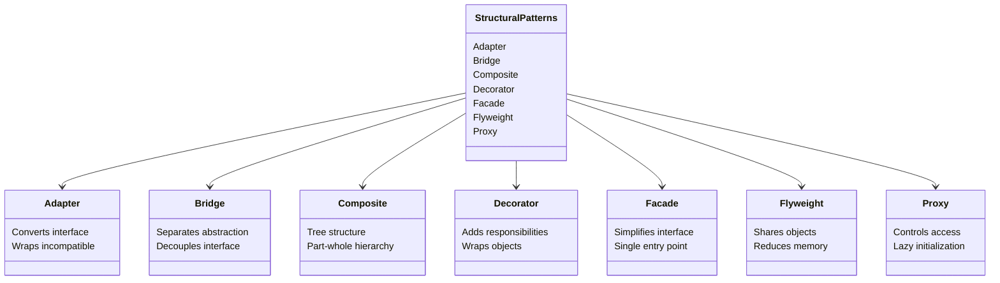

# Structural Design Patterns Summary

## Overview
Structural patterns deal with object composition and relationships between objects. They help ensure that when one part of a system changes, the entire structure doesn't need to change. These patterns focus on how classes and objects are composed to form larger structures.

## Pattern Relationships

## Pattern Descriptions

### 1. Adapter Pattern
- **Purpose**: Converts the interface of a class into another interface clients expect
- **When to Use**: 
  - When you want to use an existing class but its interface doesn't match
  - When you want to create a reusable class that cooperates with unrelated classes
- **Example**: Converting between different payment system interfaces

### 2. Bridge Pattern
- **Purpose**: Decouples an abstraction from its implementation
- **When to Use**:
  - When you want to avoid a permanent binding between abstraction and implementation
  - When both abstraction and implementation should be extensible
- **Example**: Different drawing implementations (OpenGL, DirectX)

### 3. Composite Pattern
- **Purpose**: Composes objects into tree structures to represent part-whole hierarchies
- **When to Use**:
  - When you want to represent part-whole hierarchies
  - When you want clients to treat individual objects and compositions uniformly
- **Example**: File system with files and directories

### 4. Decorator Pattern
- **Purpose**: Attaches additional responsibilities to objects dynamically
- **When to Use**:
  - When you want to add responsibilities to individual objects
  - When you want to make changes to some objects without affecting others
- **Example**: Adding formatting to text objects

### 5. Facade Pattern
- **Purpose**: Provides a unified interface to a set of interfaces in a subsystem
- **When to Use**:
  - When you want to provide a simple interface to a complex subsystem
  - When you want to decouple clients from subsystem components
- **Example**: Home theater system control

### 6. Flyweight Pattern
- **Purpose**: Uses sharing to support large numbers of fine-grained objects efficiently
- **When to Use**:
  - When a large number of similar objects is needed
  - When storage costs are high
- **Example**: Character rendering in text editors

### 7. Proxy Pattern
- **Purpose**: Provides a surrogate or placeholder for another object
- **When to Use**:
  - When you need a more sophisticated reference to an object
  - When you want to control access to an object
- **Example**: Lazy loading of images

## Relationships Between Patterns

### Similar Patterns
1. **Adapter vs Bridge**
   - Adapter makes things work after they're designed
   - Bridge makes them work before they are

2. **Composite vs Decorator**
   - Composite focuses on structure
   - Decorator focuses on behavior

3. **Facade vs Proxy**
   - Facade provides a simpler interface
   - Proxy provides the same interface

### Complementary Patterns
1. **Adapter + Bridge**
   - Adapter can use Bridge to implement multiple adapters

2. **Composite + Decorator**
   - Decorator can add behavior to Composite components

3. **Facade + Flyweight**
   - Facade can use Flyweight to manage shared objects

## Best Practices

### General Guidelines
1. Choose patterns based on the problem, not the solution
2. Consider the impact on system complexity
3. Document pattern usage and relationships
4. Keep implementations simple and focused
5. Use patterns in combination when appropriate

### Implementation Tips
1. Start with interfaces
2. Use composition over inheritance
3. Keep pattern-specific code isolated
4. Consider thread safety
5. Document pattern responsibilities

## Real-World Applications

### GUI Frameworks
- Adapter: Converting between different widget interfaces
- Bridge: Separating platform-specific implementations
- Composite: Building complex UI hierarchies
- Decorator: Adding visual effects to components

### Database Systems
- Facade: Simplifying database access
- Proxy: Implementing connection pooling
- Flyweight: Managing database connections
- Adapter: Supporting multiple database types

### Game Development
- Composite: Building game object hierarchies
- Flyweight: Managing particle systems
- Proxy: Implementing lazy loading
- Decorator: Adding game object behaviors

## Interview Preparation

### Key Points to Remember
1. Understand the problem each pattern solves
2. Know when to use each pattern
3. Be able to explain pattern relationships
4. Understand implementation trade-offs
5. Know common pitfalls and solutions

### Common Questions
1. How do you choose between similar patterns?
2. When would you combine multiple patterns?
3. How do you handle pattern-specific errors?
4. What are the performance implications?
5. How do you test pattern implementations?

## Summary
Structural patterns provide powerful ways to organize code and manage relationships between objects. They help create flexible, maintainable, and extensible systems by:
- Decoupling interfaces from implementations
- Managing object relationships
- Controlling object creation and access
- Optimizing resource usage
- Simplifying complex subsystems

Understanding these patterns and their relationships is crucial for designing robust software systems that can evolve over time. 